# Unit 1.1: From Generative AI to Agentic Control Loops

> **Core Question:**
> *"What makes a system agentic, and when should I choose an agent instead of a deterministic workflow?"*

---

## Learning Objectives

By the end of this unit, you will be able to:

1. Distinguish between deterministic software, single-turn LLM generation, compound workflows, and autonomous agents using industry definitions from Anthropic and OpenAI.
2. Apply the **"Who Determines the Next Step?"** heuristic to categorize compound AI architectures.
3. Identify, compare, and architect five common workflow patterns described by Anthropic (**Prompt Chaining, Routing, Parallelization, Orchestrator-Workers, and Evaluator-Optimizer**).
4. Understand the foundational building blocks of agentic systems (**The Augmented LLM, Model, Tools, and Instructions**).
5. Apply the **Course Design Principle: Least Agency** to select the minimal sufficient architecture (Single Call vs. Workflow vs. Agent).
6. Evaluate the architectural trade-offs between fixed, developer-defined workflows and dynamic agent control loops.

---

## 1. Traditional Software vs. Generative AI

To understand why agentic systems exist, we must analyze how software paradigms have evolved across different approaches:

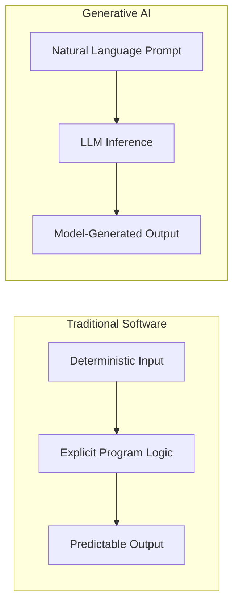

### Deterministic Programs

In classical software engineering:

* **Control flow:** Control flow is explicitly defined by the developer via `if / else`, loops, state machines, database transactions, and other program logic.
* **Predictability:** Given input $x$ and system state $S$, the system transitions to state $S'$ and produces output $y$ according to explicit logic.
  *(Note: Deterministic systems can still produce erroneous results due to bugs or invalid input data.)*
* **Strengths:** High operational consistency, typically low latency, no LLM hallucination mechanism, and can be formally verified when designed with appropriate methods.
* **Limitation:** Rigid; cannot inherently handle unstructured inputs, open-ended ambiguity, or novel edge cases outside predefined rules.

### LLM-Based Applications

Large Language Models introduce semantic understanding and transformation:

* **Control flow:** Natural Language Prompt → Model Inference → Completion.
* **Predictability:** Given prompt $p$, the system generates tokens according to the model's learned distribution and the configured decoding strategy.
* **Strengths:** Effective at summarization, translation, information extraction, semantic synthesis, and unstructured text processing.
* **Limitation:** A model invocation does not itself mutate external systems; an application must provide mechanisms such as tools or APIs for external actions.

### The Single LLM Call Paradigm

The simplest AI integration is the **single-turn (prompt-in / response-out)**:

```python
# Single-turn LLM Call: isolated model invocation
response = client.chat.completions.create(
    model="gpt-4o-mini",  # Illustrative model endpoint
    messages=[
        {"role": "system", "content": "Extract the invoice number and total amount from this receipt text."},
        {"role": "user", "content": raw_receipt_text}
    ]
)
extracted_data = response.choices[0].message.content
```

While sufficient for many text transformation tasks, an isolated single call has clear architectural boundaries:

* **No External Verification:** It cannot independently verify whether its output corresponds to live external facts.
* **No Environmental Grounding:** It has no direct environment interaction unless external data is pre-fetched and supplied to the invocation.
* **No Iterative Feedback Loop:** If an extraction or assumption is invalid, it cannot inspect external error feedback and adjust its strategy.

---

## 2. From Text Generation to Goal-Driven Execution

### Answer Generation vs. Accomplishing a Goal

A key architectural transition is **moving from informational text generation to active, goal-driven execution**.

| Dimension                   | Text Generation (Single Call)       | Goal-Driven Execution (Agentic System)                                                                       |
| --------------------------- | ----------------------------------- | ------------------------------------------------------------------------------------------------------------ |
| **Primary Objective**       | Produce a response to a prompt      | Drive a task toward a desired outcome through multi-step interaction, potentially involving external systems |
| **Execution Horizon**       | Single model invocation             | Multi-turn loop with dynamic actions ($N$ calls)                                                             |
| **Feedback Mechanism**      | No iterative environmental feedback | Observations can inform subsequent actions                                                                   |
| **Environment Interaction** | Text generation                     | May read from or write to external systems through tools                                                     |
| **Verification**            | In-context generation only          | Ground-truth feedback such as API responses or test results                                                  |

### Why Some Multi-Step Tasks Require Multiple Turns

Consider an enterprise objective:

> *"Find why customer #4029 was overcharged last month, issue the appropriate refund credit, and update their CRM record."*

While deterministic code can execute multi-step sequences without model calls, solving complex open-ended tasks with models often requires multiple turns due to four factors:

1. **Hidden & Latent State:** The model cannot know what invoices exist or what payment gateway transactions were settled without dynamic querying.
2. **Conditional Branching:** The exact sequence of calculations depends on intermediate data returned from external systems.
3. **Action Execution:** The system must interact with external systems, such as querying billing systems, executing API requests, or updating records, rather than merely generating text about refunds.
4. **Error Recovery & Ground Truth:** If an API endpoint returns an error, the system can inspect the error and formulate an alternative resolution path.

Consequently, **agentic systems typically rely on iteration, environment interaction, and dynamic decision-making when intermediate state is unknown or actions must adapt.**

---

## 3. What Is an Agent? — High-Level Definition

Anthropic and OpenAI use somewhat different terminology, but both distinguish simple LLM applications from systems that use models to make decisions and/or execute workflows with tools.

### The Foundational Building Block: The Augmented LLM

As described by Anthropic, the foundational building block of agentic systems is the **Augmented LLM**—a language model enhanced with capabilities such as:

* **Retrieval:** Dynamic context injection via search or database lookups.
* **Tools:** Defined interfaces (APIs, code interpreters, function calls) that the model can actively invoke.
* **Memory:** Context management across interactions.

> **Note:** Not all three capabilities are strictly required for every agent implementation, but they represent common augmentation primitives.

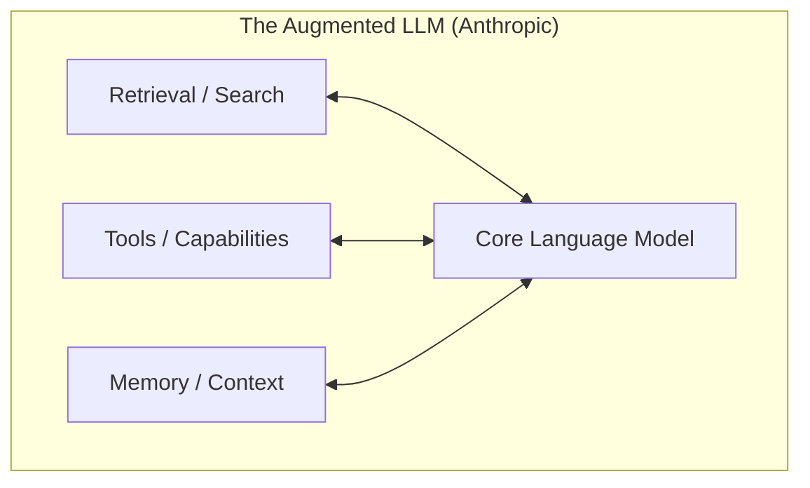

### OpenAI's Three Core Agent Components

OpenAI's guide structures an agent around three fundamental building blocks:

1. **Model:** The core model used to interpret context and generate decisions or responses.
2. **Tools:** Defined interfaces allowing the model to retrieve data or perform actions in external systems.
3. **Instructions:** System-level guidance defining the agent's behavior, goals, and constraints.

### Course Synthesis: Functional Characteristics of an Autonomous Agent

For the purpose of this course, we synthesize these concepts into five functional characteristics that describe the agent architectures taught throughout this curriculum:

1. **Goal:** An objective or desired outcome assigned to the system.
2. **Dynamic Decision-Making:** The model influences or decides what step to take next based on runtime observations.
3. **Actions (Tools):** Structured interfaces enabling environment interaction.
4. **Environment:** The external system providing feedback (APIs, shell, database, web).
5. **Iterative Control Loop:** A repeating loop where the agent proposes an action, observes the result, and updates its decision until an appropriate termination condition is reached.

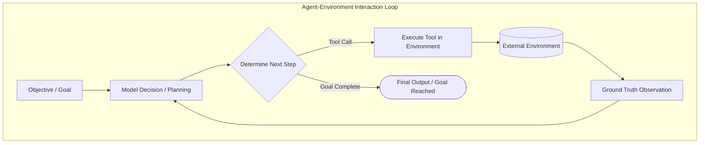

---

## 4. Workflows vs. Agents

Anthropic's research (*Building Effective Agents*) establishes the core architectural distinction:

> **Workflows:** Systems where LLMs and tools are orchestrated through **predefined, developer-governed code paths**.
>
> **Agents:** Systems where LLMs **dynamically direct their own processes and tool usage**, maintaining control over how tasks are accomplished.


### Architectural Comparison

| Dimension                | Workflows                                                                                 | Agents                                                              |
| ------------------------ | ----------------------------------------------------------------------------------------- | ------------------------------------------------------------------- |
| **Control Flow**         | Developer-defined / predefined code path                                                  | Dynamic at runtime; model influences the next step                  |
| **Execution Path**       | Execution structure is developer-defined; individual LLM outputs may remain probabilistic | Path adapts to intermediate tool outputs and may vary across runs   |
| **Tool Orchestration**   | Calls triggered by developer-defined orchestration logic                                  | Model selects tools and constructs arguments dynamically            |
| **Debugging & Tracing**  | Generally more straightforward due to bounded execution structure                         | More complex because execution trajectories can vary across runs    |
| **Cost & Latency**       | Generally more bounded when execution structure and call count are fixed                  | Variable; depends on dynamic turn count and tool latencies          |
| **Primary Failure Mode** | Unhandled edge cases breaking fixed paths                                                 | Invalid tool selection/arguments, execution errors, goal divergence |

---

## 5. The "Who Determines the Next Step?" Principle

When evaluating or designing any compound AI system, use this operational heuristic:

$$\Large \text{Who determines the next step?}$$

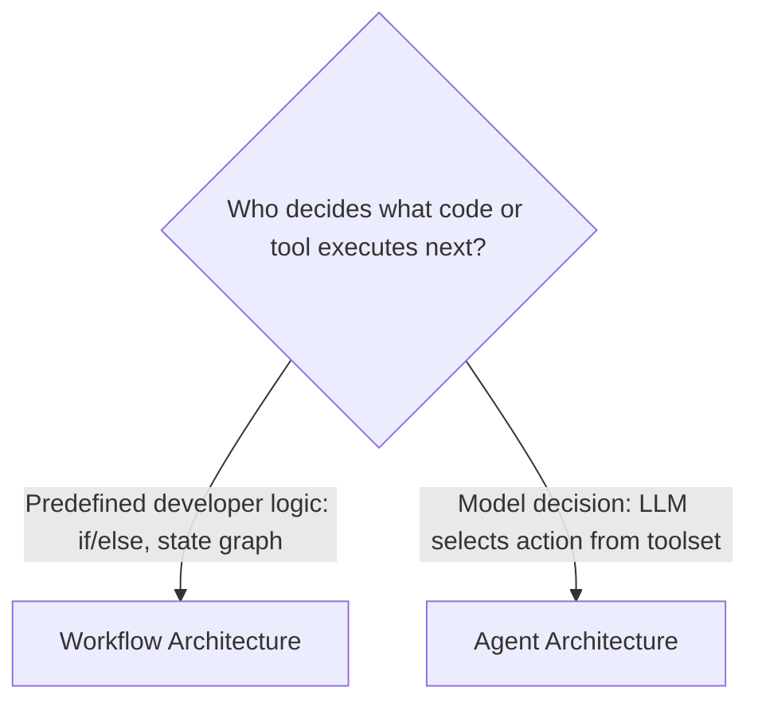

### Course Architecture Spectrum

Architectures can be viewed along a spectrum of increasing **model-directed control**:

```text
[Deterministic Code] ──► [Single LLM Call] ──► [Static Workflows] ──► [Other Workflow Patterns] ──► [Autonomous Agents]
   (Pure Logic)             (Text In/Out)        (Chaining / Routing)      (Evaluator-Opt / Orch-Workers)       (Dynamic Tool Loop)
```

> [!NOTE]
> **Course Note on Architecture Spectrum:**
> This spectrum is our course's structured synthesis to help engineers evaluate architectural complexity. It is not an industry-standard taxonomy.

1. **Deterministic Logic:** Pure Python/SQL code, zero AI.
2. **Single LLM Call:** Pure text processing, no tools, no feedback loop.
3. **Static Workflows (Chaining / Routing / Parallelization):** Systems where the developer defines the execution structure and LLMs perform discrete tasks at defined steps.
4. **Other Workflow Patterns (Evaluator-Optimizer / Orchestrator-Workers):** Structured workflows featuring dynamic subtask breakdown or iterative critique, while the overall execution harness remains governed by developer-defined logic.
5. **Autonomous Agents:** Dynamic control loop within the tools, instructions, and guardrails provided by the system; the model chooses tools, interprets results, adapts its actions, and continues until an appropriate termination condition is reached.

---

## 6. Five Common Workflow Patterns Described by Anthropic

Anthropic describes **five common workflow patterns** that it has observed being useful across many LLM applications without giving the model full control over the overall execution flow:

### 1. Prompt Chaining

Decomposes a task into a fixed linear sequence of LLM steps, where each call consumes the output of the previous one. Programmatic "gates" can validate intermediate data.

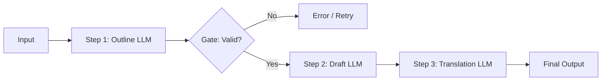

* **When to use:** Multi-stage document generation, data extraction followed by transformation, structured document synthesis.
* **Benefit:** Can improve reliability/quality by breaking a complex task into smaller, specialized steps.

### 2. Routing

Classifies an incoming query and dispatches it to a specialized downstream prompt, model tier, or deterministic tool.

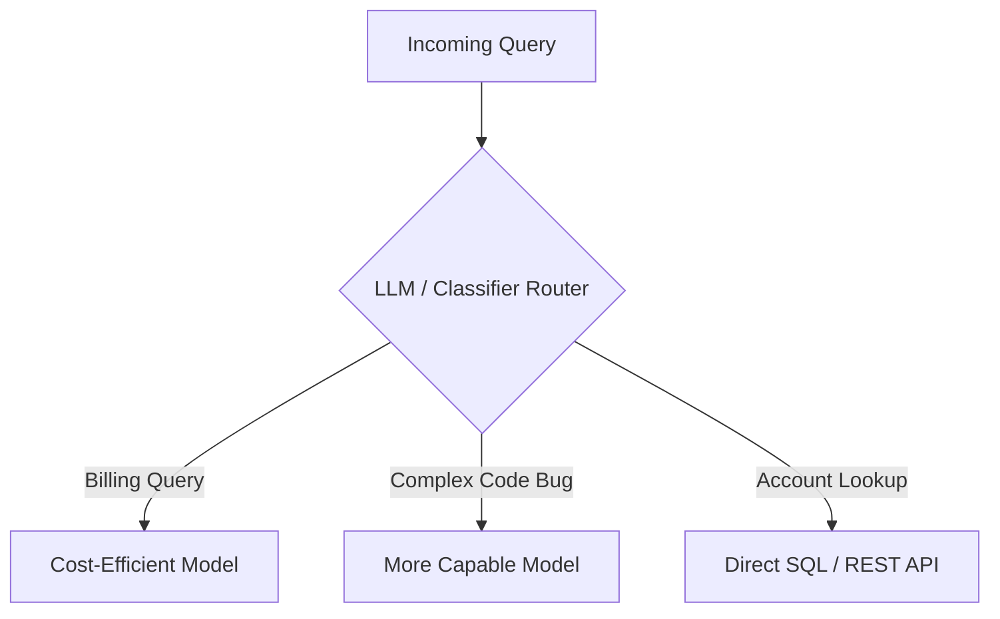

* **When to use:** Separation of concerns, optimizing cost/latency, and domain-specific prompt specialization.
* **Benefit:** Different inputs can be handled by models, prompts, or tools suited to their characteristics.

### 3. Parallelization

Executes multiple LLM calls concurrently and aggregates their outputs programmatically. Anthropic describes two primary modes:

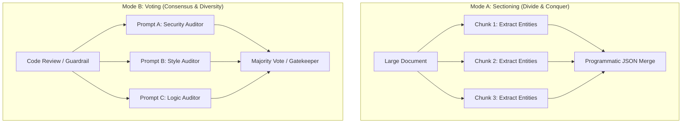

* **Sectioning:** Can reduce wall-clock latency when operations can execute concurrently.
* **Voting:** Can improve robustness by obtaining multiple independent evaluations.

### 4. Orchestrator-Workers

A central **Orchestrator LLM** analyzes a complex task, dynamically determines what subtasks are required, delegates them to independent **Worker LLMs**, and synthesizes the final result.

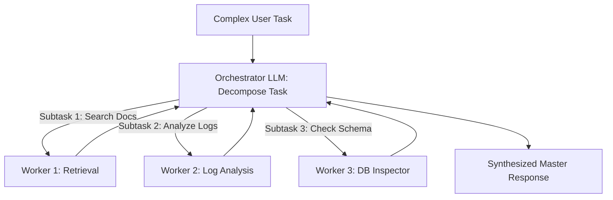

* **When to use:** Complex tasks where the exact subtasks cannot be predicted in advance, such as a coding task requiring modifications to an unknown number of files.
* **Key Characteristic:** The orchestrator dynamically determines subtasks, while the overall delegation structure remains controlled by the orchestration design.

### 5. Evaluator-Optimizer

One LLM (the **Generator**) produces a candidate response, while an **Evaluator**—which may be another model, a deterministic unit test suite, or a rubric function—assesses it against defined criteria and provides feedback in an iterative loop.

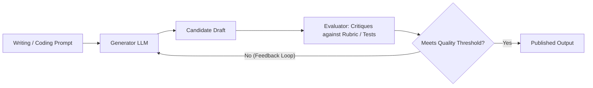

* **When to use:** Tasks with clear objective evaluation criteria, such as translation, copywriting, or code generation with test feedback.
* **Benefit:** Iterative evaluation can improve output quality when reliable evaluation criteria are available.

---

## 7. Autonomous Agents in Practice

An **Autonomous Agent** is deployed when the system must navigate an open-ended problem space through **dynamic runtime decision-making and environment interaction**:

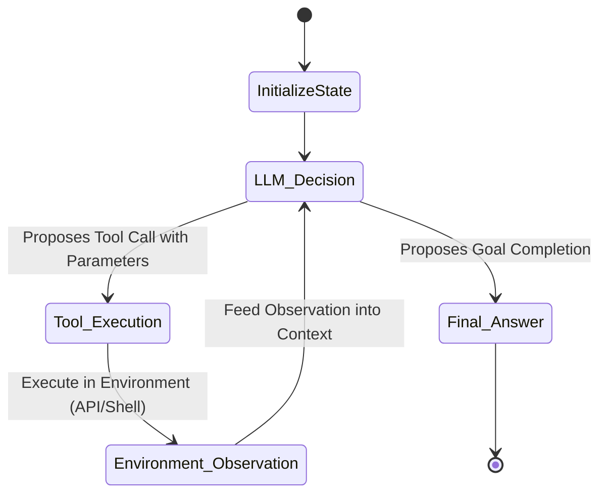

### Two Promising Production Applications Highlighted by Anthropic

Anthropic's customer research highlights two domains where autonomous agents show significant promise:

1. **Customer Support Operations:**

   * Combines natural conversational flow with structured actions such as fetching order history, issuing refunds, or modifying reservations.
   * Clear success criteria and bounded API capabilities.

2. **Coding Agents:**

   * Can inspect repository code, run unit tests, read stack traces, formulate bug fixes, and re-test.
   * **Ground-truth verification:** Automated test suites can provide objective feedback to the agent loop.

### Conceptual Trade-Off: Flexibility vs. Predictability

> **Illustrative architectural trade-off — not an empirical ranking.**

```text
   HIGH ▲
        │                                  [Autonomous Agents]
        │                                   • Dynamic exploration
        │                                   • Open-ended error recovery
F       │                                   • Variable multi-turn latency
L       │                                   • Dynamic token consumption
E       │
X       │                    [Orchestrator-Workers / Evaluator-Optimizer]
I       │                     • Semi-structured
B       │                     • Dynamic subtasks / iteration
I       │
L       │         [Prompt Chaining & Routing]
I       │          • Developer-defined pathways
T       │          • Bounded execution structure
Y       │          • More predictable cost
   LOW ▼───────────────────────────────────────────────────────────────►
       LOW                    CONTROL & PREDICTABILITY                 HIGH
```

---

## 8. Choosing the Right Architecture: Decision Framework

Engineering discipline requires adhering to the **Course Design Principle: Least Agency**:

> [!IMPORTANT]
> **Course Design Principle: Least Agency**
>
> Always select the simplest architecture that reliably accomplishes the goal. Introduce agency only when simpler workflows fail to provide the required flexibility.
> *(Grounded in Anthropic's recommendation to start simple and increase complexity only when needed.)*

### Architecture Comparison Matrix

| Architectural Tier           | Control Flow                   | Path Predictability         | Execution Horizon       | Operational Profile                            | Best For                                       |
| ---------------------------- | ------------------------------ | --------------------------- | ----------------------- | ---------------------------------------------- | ---------------------------------------------- |
| **Single LLM Call**          | Static                         | Fixed                       | Single model invocation | Lowest architectural overhead                  | Extraction, classification, summarization      |
| **Workflow (Chain / Route)** | Developer-defined control flow | Developer-defined structure | Bounded turns           | Generally more bounded when structure is fixed | Multi-stage content generation, support triage |
| **Evaluator-Optimizer**      | Fixed Loop                     | Structured Iteration        | Bounded refinement loop | Depends on iterations and evaluator type       | Polished copy, code refinement with unit tests |
| **Orchestrator-Workers**     | Dynamic Subtasks               | Bounded Delegation          | Fan-out / Fan-in        | Depends on number of spawned workers           | Multi-file edits, broad research synthesis     |
| **Autonomous Agent**         | Dynamic Tool Loop              | Model-Discovered            | Open-ended turns        | Variable; multi-turn execution and tool calls  | Open-ended investigation, complex coding       |

### 4-Question Decision Tree (Course Framework)

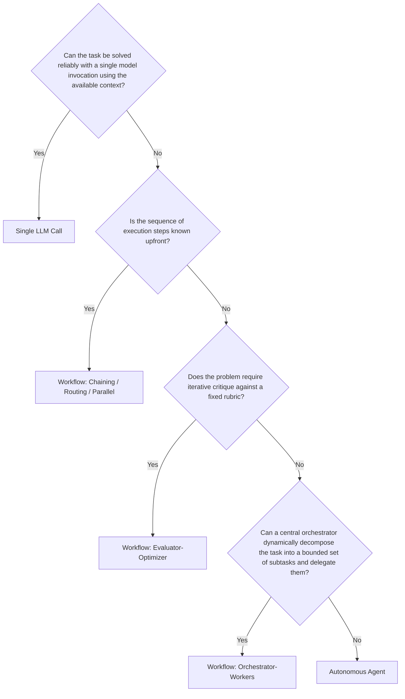

### When an Agent Is Unnecessary (Anti-Patterns)

> [!WARNING]
> **Avoid "The Agent Trap":** Building an autonomous agent when a deterministic workflow suffices can add unnecessary latency, non-determinism, and failure vectors.

* ❌ **Fixed ETL / Data Pipelines:** Prefer deterministic code; introduce structured LLM extraction only where unstructured inputs require it.
* ❌ **Strict Low-Latency APIs:** Multi-turn agent loops may be inappropriate when the system has strict, very low-latency requirements.
* ❌ **Regulated & Audit-Critical Paths:** If regulations require a fixed, auditable decision procedure, prefer deterministic control over unconstrained model-directed execution.

---

## 9. Core Engineering Principles from Industry Practice

Anthropic highlights three core engineering principles for building effective agentic systems:

*(OpenAI's guidance similarly emphasizes clear tools, robust instructions, guardrails, and observability.)*

### 1. Maintain Simplicity in Architecture

* Start with direct LLM API calls and simple prompt engineering.
* Avoid heavyweight multi-agent frameworks until you hit concrete architectural limits. Complex abstractions can obscure prompts, raw responses, and token costs, making debugging more difficult.

### 2. Prioritize Transparency & Inspectability

* Log and expose appropriate execution traces, tool calls, observations, and concise planning/decision summaries for debugging and inspection.
* Ensure operators can inspect appropriate execution traces and tool interactions when debugging, auditing, or investigating failures.

### 3. Invest in the Agent-Computer Interface (ACI)

* **Treat tools like APIs designed for models:** Just as software engineers spend significant effort designing clean Human-Computer Interfaces (HCI), AI engineers must design clean **Agent-Computer Interfaces (ACI)**.
* Document tool names, parameter schemas, and descriptions with extreme clarity.
* Ensure error responses from tools are informative and guide the model toward self-correction rather than returning opaque error codes.

---

## 10. Case Study: Customer Dispute Resolution

To ground these concepts in practice, let us examine how the same enterprise problem is approached across architectures.

> **Scenario (Illustrative):** A customer submits the ticket:
> *"I was double-billed on invoice #INV-8831 and my promo code 'FALL20' wasn't applied. Please fix this."*

### Implementation A: Deterministic Workflow (Router + Chaining)

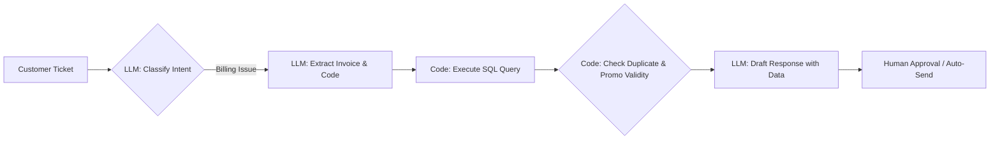

**How it works:**

1. An LLM classifies the ticket intent as `BILLING_DISPUTE`.
2. A structured LLM call extracts `{"invoice_id": "INV-8831", "promo_code": "FALL20"}`.
3. Hardcoded Python code executes queries against the billing database and applies company discount rules.
4. An LLM synthesizes the verified outcome into an email draft.

**Architectural Profile:**

* **Latency & Cost Profile:** Bounded by the small, fixed number of model calls and deterministic operations.
* **Reliability:** More predictable on cases covered by the predefined logic; unusual cases may require fallback or human review.

### Implementation B: Autonomous Agent

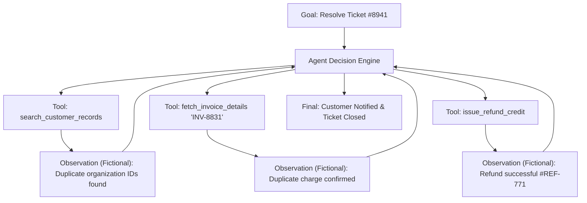

**How it works (Illustrative Example):**

1. The agent receives the high-level goal: *"Investigate ticket #8941, verify legitimacy, remediate, and notify customer."*
2. The agent queries customer records, discovers an anomaly, inspects the relevant ledgers, and identifies the duplicate charge.
3. It executes the refund tool and writes an audit note.

**Architectural Profile:**

* **Latency & Cost Profile:** Variable due to dynamic model calls and tool executions.
* **Reliability:** More adaptable to novel cases, but introduces additional failure modes and requires stronger controls, spend limits, and tool authorization.

---

## 11. Summary & Unit Cheat Sheet

```text
┌──────────────────────────────────────────────────────────────────────────────────────────┐
│                              THE SPECTRUM OF AGENCY                                      │
├────────────────────┬───────────────────────────────────────────┬─────────────────────────┤
│ Single LLM Call    │ Workflows (Anthropic Patterns)            │ Autonomous Agents      │
├────────────────────┼───────────────────────────────────────────┼─────────────────────────┤
│ • Prompt -> Output │ • Prompt Chaining (Sequential + Gates)    │ • Dynamic Tool Loop     │
│ • No direct env    │ • Routing (Classifier + Specialized paths)│ • Closed feedback loop  │
│   interaction      │ • Parallelization (Sectioning / Voting)   │ • Model decides next   │
│ • Single Turn      │ • Orchestrator-Workers (Dynamic subtasks) │   action at runtime     │
│ • Developer writes │ • Evaluator-Optimizer (Critique loop)     │ • Dynamic trajectory    │
│   entire path      │ • Developer controls execution path       │ • Open-ended problems   │
└────────────────────┴───────────────────────────────────────────┴─────────────────────────┘
```

### Core Takeaways

1. **Course Heuristic:** If developer-defined logic governs the execution path, we generally classify the system as a **Workflow**. If the model dynamically determines its next actions based on observations, we generally classify it as an **Agent**.
2. **Start Simple (Least Agency):** Optimize single-turn prompts and deterministic workflows first. Escalate to autonomous agents only when the problem space demands dynamic runtime exploration.
3. **Focus on ACI:** Clear tool definitions and informative error messages are just as critical as system prompt engineering.

---

## Research & Reference Foundations

* **Anthropic — *Building Effective Agents*:**  
  [Workflows vs. Agents & Design Principles](https://www.anthropic.com/engineering/building-effective-agents) — Foundational distinction between workflows and agents, common workflow patterns, and design principles including simplicity, transparency, and ACI.

* **OpenAI — *A Practical Guide to Building Agents*:**  
  [Agent Building Blocks & Orchestration](https://openai.com/business/guides-and-resources/a-practical-guide-to-building-ai-agents/) — Foundational building blocks including Model, Tools, Instructions, and orchestration.

