# Unit 1.1: From Generative AI to Agentic Control Loops

> **Core Question:**  
> *"What makes a system agentic, and when should I choose an agent instead of a deterministic workflow?"*

---

## Learning Objectives

By the end of this unit, you will be able to:
1. Distinguish between deterministic software, single-turn LLM generation, compound workflows, and autonomous agents.
2. Apply the **"Who Determines the Next Step?"** principle to categorize any AI system.
3. Identify and explain Anthropic's core workflow design patterns (Chaining, Routing, Parallelization, Orchestrator-Workers).
4. Evaluate system requirements to select the minimal sufficient architecture (Single Call vs. Workflow vs. Agent).
5. Understand the performance, cost, and reliability trade-offs inherent to agentic architectures.

---

## 1. Traditional Software vs. Generative AI

To understand why agentic systems exist, we must look at how software paradigms have evolved:

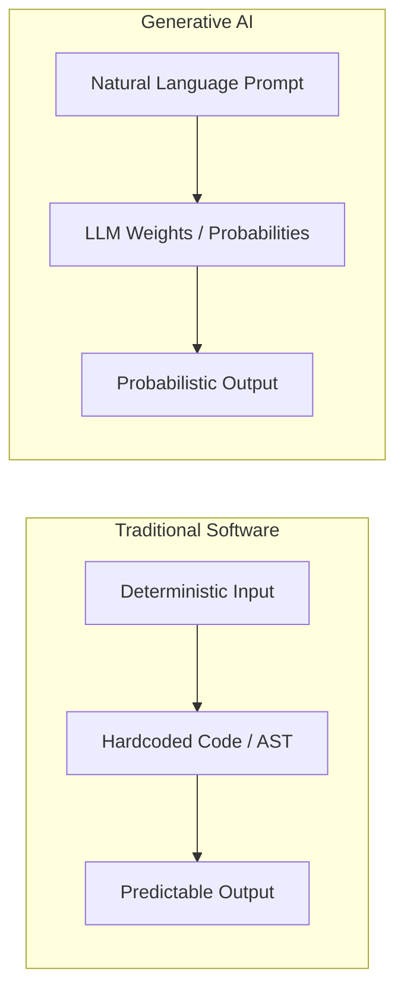

### Deterministic Programs
In classical software engineering, every execution path is explicitly mapped by the developer:
- **Control flow:** `if / else`, `while`, functions, and explicit state machines.
- **Predictability:** Given input $x$ and state $S$, the system consistently transitions to state $S'$ and produces output $y$.
- **Strengths:** High reliability, minimal latency, low compute cost, formal verification.
- **Limitation:** Inability to handle fuzzy, unstructured inputs or open-ended reasoning tasks outside hardcoded branching.

### LLM-Based Applications
Large Language Models introduce probabilistic semantic understanding:
- **Control flow:** Prompt $\rightarrow$ Model inference $\rightarrow$ Completion.
- **Predictability:** Given prompt $p$, the model samples tokens based on learned statistical weights $P(w_t \mid w_{<t})$.
- **Strengths:** Excellent at summarization, translation, extraction, synthesis, and creative generation over unstructured text.
- **Limitation:** Stateless, prone to hallucinations, bounded by context window size, and incapable of executing actions in the real world on its own.

### The Single LLM Call Paradigm
The simplest AI integration is the **single turn (prompt-in / response-out)**:

```python
# Single-turn LLM Call: Stateless and isolated
response = client.chat.completions.create(
    model="gpt-4o",
    messages=[
        {"role": "system", "content": "Extract the company names and funding amounts from this text."},
        {"role": "user", "content": raw_press_release}
    ]
)
extracted_data = response.choices[0].message.content
```

While powerful, a single call has fundamental boundaries:
- It cannot verify whether its output is correct.
- It cannot interact with external environments (databases, APIs, filesystem).
- It cannot self-correct if the problem requires dynamic exploratory steps.

---

## 2. From Generation to Goal-Driven Execution

### Answer Generation vs. Accomplishing a Goal
There is a fundamental difference between **generating text about a task** and **executing that task**:

| Dimension | Text Generation (Single Call) | Goal-Driven Execution (Agentic) |
| :--- | :--- | :--- |
| **Objective** | Produce a coherent linguistic response to a prompt | Drive the external environment to a target end-state |
| **Execution** | Single forward pass ($1$ inference call) | Multi-step loop with feedback ($N$ calls) |
| **Feedback** | Open loop (no environmental validation) | Closed loop (observations inform next steps) |
| **Outcome** | Text stream / JSON payload | State change in database, ticket resolved, code tested |

### Why Multi-Step Tasks Break Single-Shot Prompting
Consider asking an LLM: *"Find why customer #4029 was overcharged last month, refund the difference, and update their account notes."*

A single prompt cannot solve this reliably because:
1. **Unknown State:** The model does not know what charges exist until it queries the billing database.
2. **Dynamic Branching:** The refund calculation depends on the query results, discount tier, and tax rules.
3. **Action Execution:** The model cannot directly issue refund API calls or write database notes within a single pure generation step.
4. **Error Recovery:** If an API endpoint fails or returns a `404 Not Found`, a single call cannot inspect the error and formulate an alternative strategy.

To accomplish goals with unknown intermediate states, systems need **iteration, environmental feedback, and dynamic decision-making**.

---

## 3. What Is an Agent? — High-Level Definition

An **Agent** is an autonomous or semi-autonomous software system where a language model actively drives an iterative execution loop to achieve a specified goal by interacting with an external environment.

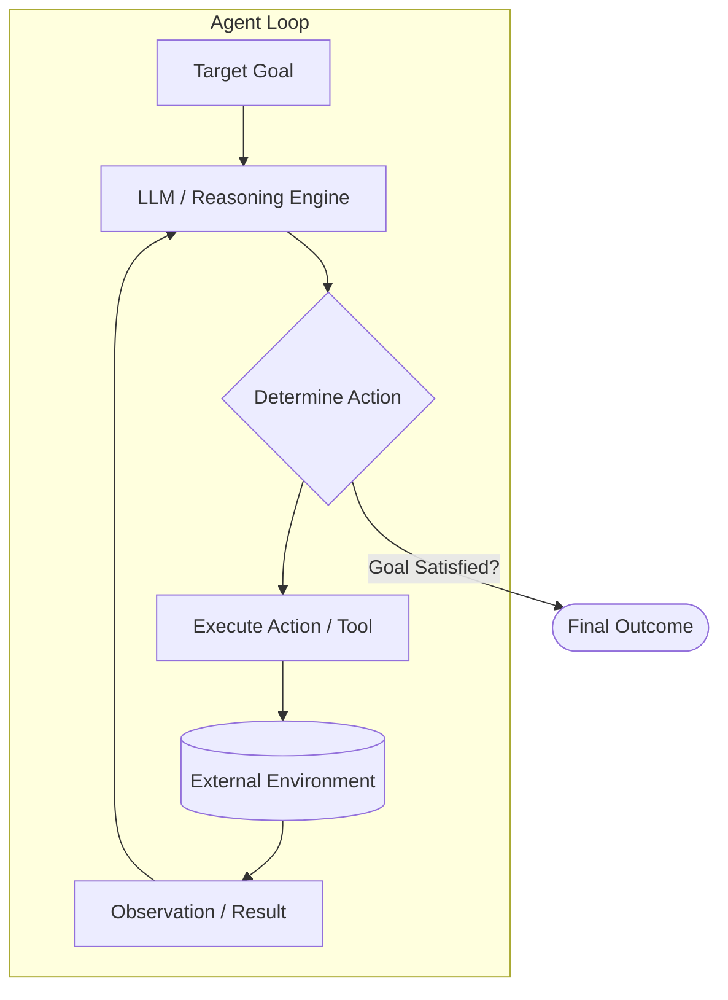

### The 5 Core Pillars of an Agent

1. **Goal:** A clear, high-level objective defined by the user or system (e.g., *"Debug the failing unit tests in the repository"*).
2. **Dynamic Decision-Making:** The model chooses what step to take next based on the current context and accumulated history.
3. **Actions (Tools):** Defined capabilities allowing the agent to interact with the environment (e.g., file reading, web search, database querying, API execution).
4. **Environment:** The external reality in which the agent operates (filesystem, cloud APIs, shell, databases).
5. **Iteration:** A repeating loop where the agent proposes an action, observes the result, updates its context, and decides the subsequent action until the goal is satisfied.

---

## 4. Workflows vs. Agents

The AI engineering ecosystem is broadly divided into two structural categories: **Workflows** and **Agents**.

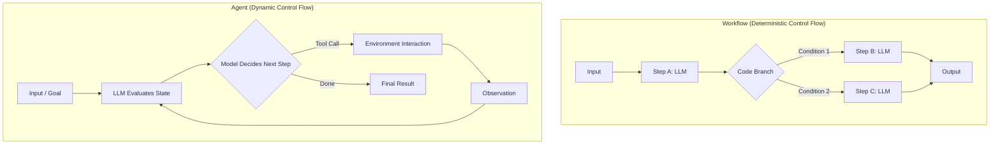

### Comparative Analysis

| Feature | Workflows | Agents |
| :--- | :--- | :--- |
| **Control Flow** | Hardcoded by developer (DAG / Graph) | Dynamically decided by the model at runtime |
| **Execution Path** | Deterministic and predictable | Emergent based on intermediate observations |
| **Flexibility** | Low to moderate (handles anticipated branches) | High (adapts to unexpected data and errors) |
| **Debugging** | Easy (reproducible trace through fixed steps) | Complex (non-deterministic trajectory) |
| **Cost & Latency** | Bounded and predictable | Variable (can loop $N$ times) |
| **Primary Risk** | Inflexibility when edge cases occur | Infinite loops, compounding errors, high cost |

---

## 5. The "Who Determines the Next Step?" Principle

When evaluating or designing any compound AI system, use this single operational heuristic:

$$\Large \text{Who determines the next step?}$$

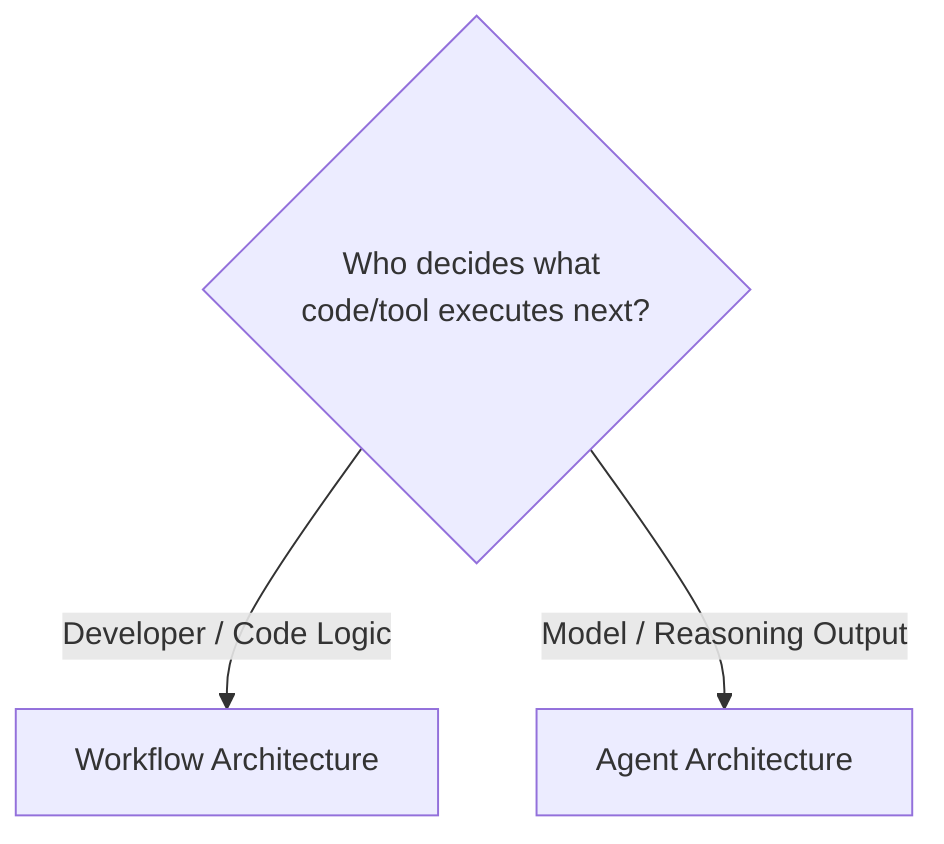

* **If the Developer determines the sequence:**
  * The control flow is written in Python/TypeScript (`if condition == 'refund': call_refund_llm()`).
  * The LLM is used as a pure data processor or structured extractor within a predefined pipeline.
  * **Classification:** **Workflow** (Prompt Chaining, Routing, Parallelization, Map-Reduce).

* **If the Model determines the sequence:**
  * The model inspects the current state, selects a tool from an available action space, inspects the result, and decides whether to continue or terminate.
  * The developer writes the framework and boundary guards, but the trajectory is model-driven.
  * **Classification:** **Agent**.

---

## 6. Anthropic's Common Workflow Patterns

Anthropic's seminal paper *"Building Effective Agents"* formalizes four standard workflow patterns where control flow remains developer-governed:

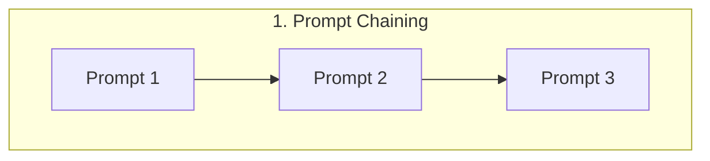
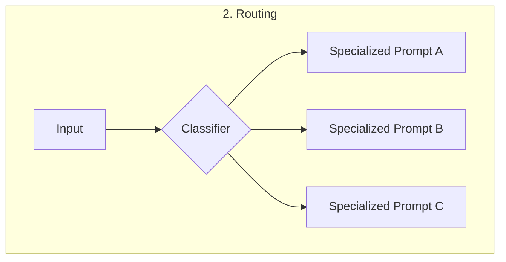
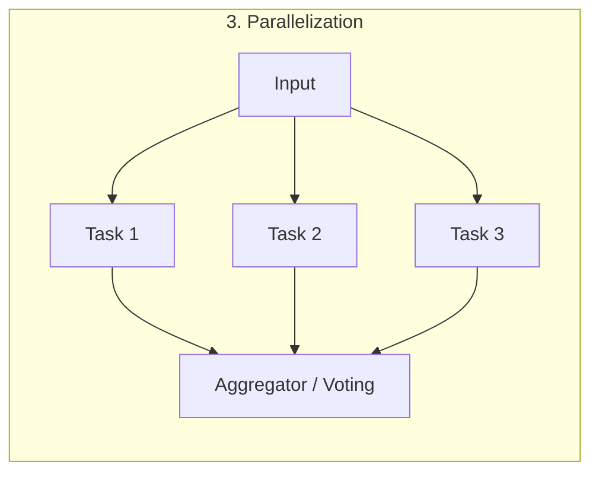
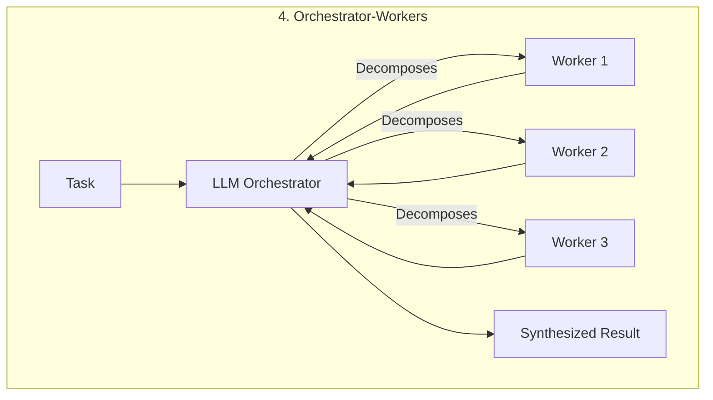

### 1. Prompt Chaining
Decomposes a complex task into a fixed sequence of LLM steps, where the output of step $N$ is the input to step $N+1$.
- **Best for:** Multi-stage transformations (e.g., Translate $\rightarrow$ Check Quality $\rightarrow$ Format as Markdown).
- **Control:** Purely sequential, deterministic order.

### 2. Routing
Classifies an input and dispatches it to a specialized downstream task or prompt.
- **Best for:** Customer service triage, domain-specific query handling (e.g., Billing vs. Technical Support vs. Sales).
- **Control:** Single classification branch.

### 3. Parallelization
Runs multiple LLM calls simultaneously. Two primary variations:
- **Sectioning:** Breaking an input into independent pieces (e.g., translating 10 chapters in parallel).
- **Voting:** Generating $N$ candidate answers to the same prompt and using majority voting or an evaluator to select the best output.
- **Control:** Fan-out / Fan-in deterministic joins.

### 4. Orchestrator-Workers
A central LLM orchestrator breaks down a high-level task into subtasks, assigns them to dedicated worker LLM calls in parallel or sequence, and synthesizes the results.
- **Best for:** Complex document creation, multi-source competitive analysis.
- **Control:** The orchestrator defines subtasks dynamically, but workers execute within a bounded, structured lifecycle without open-ended action loops.

---

## 7. Autonomous Agents

An **Autonomous Agent** steps beyond predefined workflow graphs into dynamic, iterative loops:

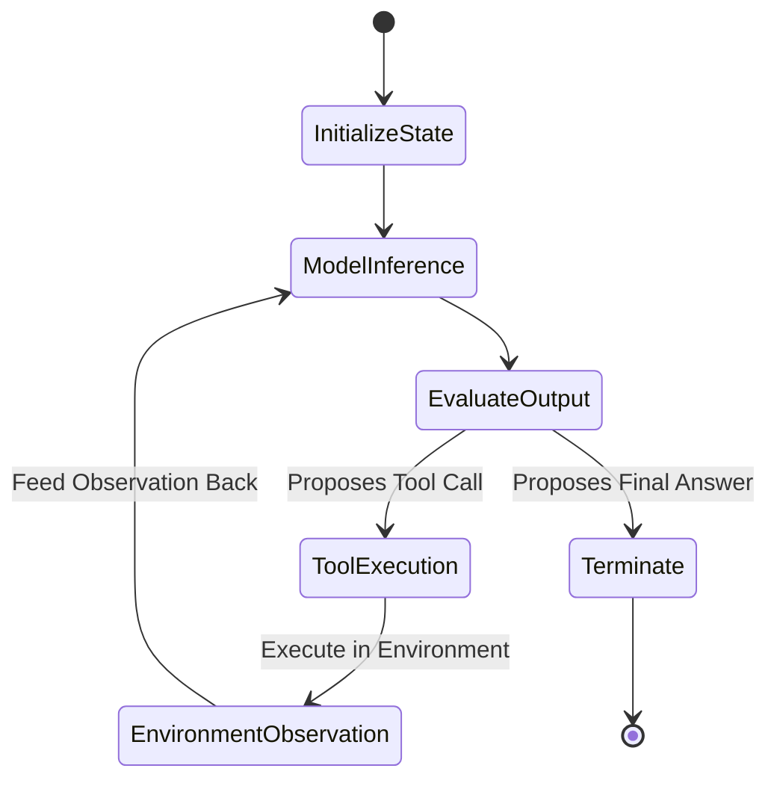

### Key Characteristics of Autonomous Agents:
1. **Dynamic Next-Step Selection:** The agent is given a toolbox (e.g., `bash`, `python_repl`, `search_db`, `web_scrape`). It decides which tool to invoke, with which parameters, in response to real-time observations.
2. **Iterative Environmental Interaction:** If a tool produces a stack trace, the agent reads the error, refines its reasoning, and attempts an alternative approach.
3. **Open-Ended Trajectories:** The exact sequence and number of steps cannot be predicted ahead of time.

### The Trade-Off Matrix

```
   High  ▲
         │                                       [Autonomous Agents]
         │                                        • Dynamic exploration
F        │                                        • Open-ended tasks
L        │                                        • High cost / latency
E        │
X        │                    [Orchestrator-Workers]
I        │                     • Semi-structured
B        │                     • Dynamic subtasks
I        │
L        │      [Prompt Chaining & Routing]
I        │       • High determinism
T        │       • Low latency & cost
Y        │       • Fixed pathways
   Low   ▼────────────────────────────────────────────────────────►
         Low                     CONTROL & PREDICTABILITY        High
```

---

## 8. Choosing the Right Architecture

Engineering discipline requires choosing the **simplest architecture that reliably solves the problem**.

### Architecture Comparison Matrix

| Criteria | Single LLM Call | Workflow | Autonomous Agent |
| :--- | :--- | :--- | :--- |
| **Task Complexity** | Single transformation / extraction | Multi-stage with known steps | Open-ended exploration |
| **Path Determinism** | 100% fixed | 100% developer-defined paths | Model-discovered path |
| **Tool / Action Usage** | None | Bounded, pre-scheduled | Unbounded, dynamic calls |
| **Execution Latency** | Sub-second to 2s | 2s – 10s | 10s – 120s+ |
| **Cost per Run** | $\$$ | $\$ - \$\$$ | $\$$\$ |
| **Reliability / Verification** | Medium (single-pass) | Very High (guardrails at each node) | Variable (compounding error risk) |

### 4-Question Decision Tree

When architecting a solution, ask these four questions in order:

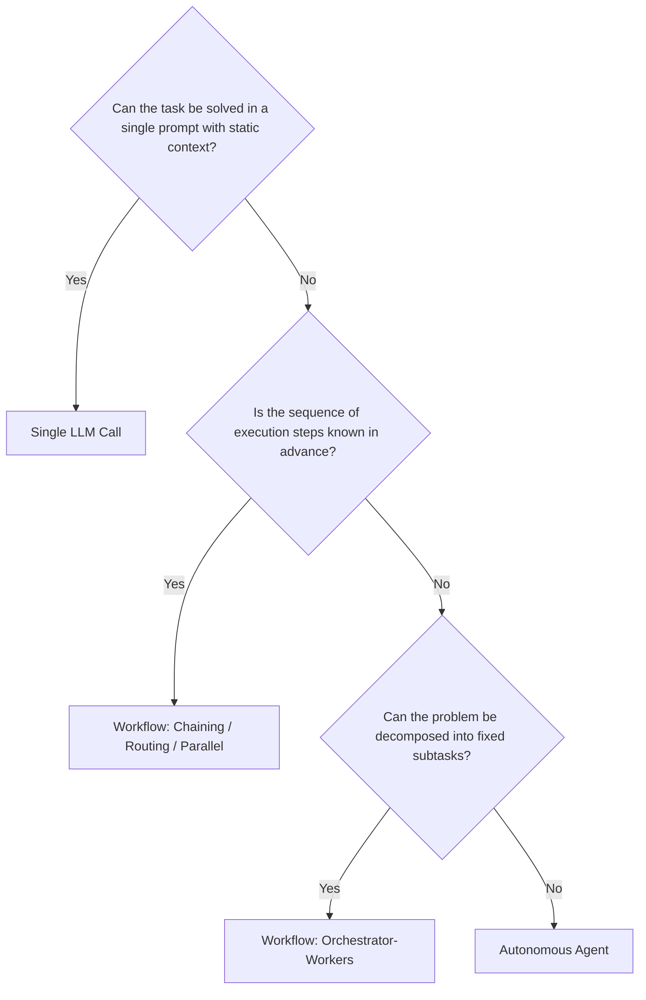

### When an Agent Is Unnecessary (Anti-Patterns)

> [!WARNING]
> **Avoid the "Agent Trap":** Do not use an autonomous agent when a workflow or deterministic code suffices. Agents introduce non-determinism, latency, and unpredictable token consumption.

* ❌ **Fixed Data Pipelines:** If you are scraping a website, cleaning text, extracting JSON, and inserting into SQL, write a deterministic pipeline with structured LLM calls.
* ❌ **Strict SLA / Real-time APIs:** If your endpoint must respond in $< 1.5\text{s}$, dynamic agent loops will frequently violate SLA constraints.
* ❌ **Regulatory & Compliance-Critical Paths:** If every step must strictly follow a certified decision tree, do not let an LLM dynamically choose its next action.

---

## 9. Case Study: Customer Billing Inquiry & Dispute

To see the architectural difference in practice, consider a real-world enterprise problem:

> **Scenario:** A SaaS customer submits the ticket: *"I was double charged on invoice #INV-8831 and my discount code 'FALL20' wasn't applied. Please fix this."*

---

### Solution Architecture A: Deterministic Workflow (Router + Chaining)

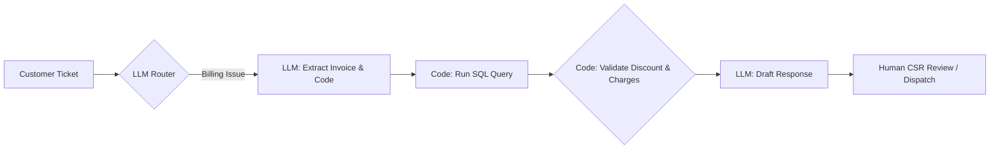

* **How it works:**
  1. An LLM classifies the ticket intent as `BILLING_DISPUTE`.
  2. An LLM extracts entities: `{"invoice": "INV-8831", "discount_code": "FALL20"}`.
  3. Deterministic Python code executes a SQL query against Stripe / PostgreSQL.
  4. Deterministic business logic checks if the invoice was indeed billed twice and verifies promo code validity.
  5. An LLM generates a personalized explanation email incorporating the hard data.
* **Characteristics:**
  - **Pros:** Fast ($< 3\text{s}$), 100% predictable business rules, deterministic security checks.
  - **Cons:** If the customer mentions an unusual edge case not handled by the extractor (e.g., *"My subsidiary company paid via wire transfer under a different entity"*), the workflow cannot independently investigate.

---

### Solution Architecture B: Autonomous Agent

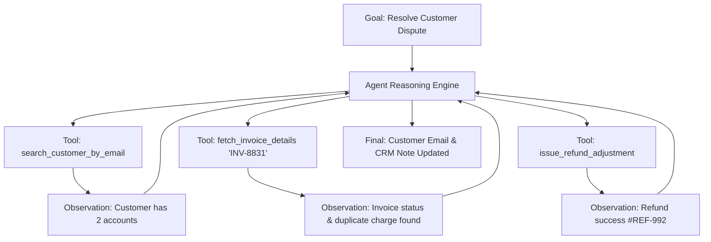

* **How it works:**
  1. The agent receives the ticket as a broad goal: *"Investigate ticket #8941, verify legitimacy, perform remediation, and notify customer."*
  2. The agent analyzes the ticket, inspects available tools, and decides to look up the customer record.
  3. Discovering two linked accounts under the same domain, it dynamically queries both account ledgers.
  4. It calculates the discrepancy, verifies with a policy document tool, issues a refund tool call, and drafts the completion response.
* **Characteristics:**
  - **Pros:** Highly adaptable; handles cross-account anomalies, partial payments, and multi-tier ambiguity without custom code for every edge case.
  - **Cons:** Higher cost ($5$–$8$ LLM calls), higher latency ($15$–$30\text{s}$), requires robust tool authorization and guardrails.

### Comparison Summary

| Dimension | Workflow Implementation | Agent Implementation |
| :--- | :--- | :--- |
| **Control Flow** | Code controls sequence (`if/else` DAG) | LLM controls sequence via tool loop |
| **Edge Case Handling** | Drops to human review if path unmapped | Investigates dynamically within tool permissions |
| **Safety & Auditability** | Trivial (every path is static) | Requires granular tool permissions & audit logs |
| **Recommended Usage** | Standard 80-90% high-volume ticket types | Complex tier-3 escalations & open-ended investigation |

---

## 10. Summary & Unit Cheat Sheet

```
┌────────────────────────────────────────────────────────────────────────┐
│                        THE SPECTRUM OF AGENCY                          │
├───────────────────┬───────────────────────────────┬────────────────────┤
│ Single Call       │ Workflow Patterns             │ Autonomous Agent   │
├───────────────────┼───────────────────────────────┼────────────────────┤
│ • Prompt -> Text  │ • Chaining (Seq)              │ • Dynamic actions  │
│ • No Environment  │ • Routing (Branch)            │ • Closed loop      │
│ • 1 Step          │ • Parallel (Fan-out)          │ • Model decides    │
│ • Developer rules │ • Orchestrator-Workers        │   next step        │
│                   │ • Developer controls path     │ • Variable steps   │
└───────────────────┴───────────────────────────────┴────────────────────┘
```

### Key Rules of Thumb for AI Engineers:
1. **The "Who Determines the Next Step?" Rule:** If Python code determines what runs next, it is a **Workflow**. If the LLM determines what runs next, it is an **Agent**.
2. **The Principle of Least Agency:** Always choose the lowest degree of agency necessary to reliably solve the problem.
3. **The Feedback Requirement:** You only need an agent when the intermediate steps are not known upfront and require dynamic observation from an environment.

---

## Next Unit Preview

In **Unit 1.2: Anatomy of an Agent and State**, we will open up the internal engine of an agent:
- How **Agent State** differs from **Runtime / Workflow State**.
- Memory architectures (Short-term conversation scratchpads vs. Long-term persistent stores).
- The fundamental mechanics of the Agent Control Loop.
