# Unit 1.1: From Generative AI to Agentic Control Loops

> **Core Question:**  
> *"What makes a system agentic, and when should I choose an agent instead of a deterministic workflow?"*

---

## Learning Objectives

By the end of this unit, you will be able to:
1. Distinguish between deterministic software, single-turn LLM generation, compound workflows, and autonomous agents using industry-standard definitions from Anthropic and OpenAI.
2. Apply the **"Who Determines the Next Step?"** principle to categorize any AI system.
3. Identify, architect, and compare Anthropic's five core workflow design patterns (*Prompt Chaining*, *Routing*, *Parallelization*, *Orchestrator-Workers*, and *Evaluator-Optimizer*).
4. Understand the foundational building blocks of agentic systems (*The Augmented LLM*, *Models*, *Tools*, and *Instructions*).
5. Evaluate real-world system requirements using a structured decision framework to select the minimal sufficient architecture (Single Call vs. Workflow vs. Agent).
6. Apply core design principles: **Simplicity**, **Transparency**, and **Agent-Computer Interface (ACI)** optimization.

---

## 1. Traditional Software vs. Generative AI

To understand why agentic systems exist, we must analyze how software paradigms have evolved across three distinct eras:

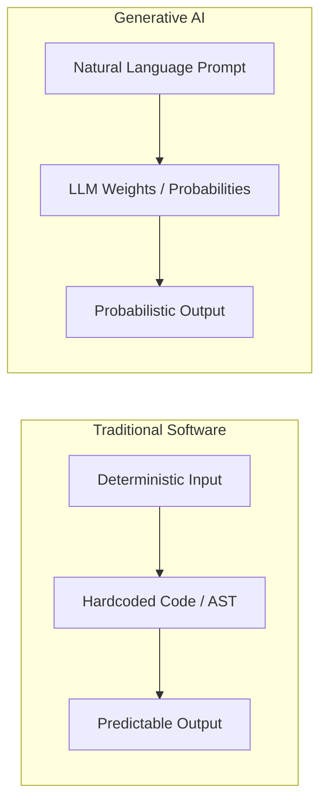

### Deterministic Programs
In classical software engineering, every execution path is explicitly mapped by the software engineer:
- **Control flow:** `if / else`, `while`, state machines, and relational transactions.
- **Predictability:** Given input $x$ and system state $S$, the system deterministically transitions to state $S'$ and produces output $y$.
- **Strengths:** High reliability, minimal latency ($< 10\text{ms}$), zero hallucination risk, formal verification.
- **Limitation:** Rigid; cannot process unstructured inputs, open-ended ambiguity, or novel edge cases outside predefined rules.

### LLM-Based Applications
Large Language Models introduce probabilistic semantic understanding:
- **Control flow:** Natural Language Prompt $\rightarrow$ Attention Mechanism / Model Inference $\rightarrow$ Completion.
- **Predictability:** Given prompt $p$, the model samples tokens from a probability distribution $P(w_t \mid w_{<t})$.
- **Strengths:** Exceptional at summarization, translation, information extraction, semantic synthesis, and unstructured text parsing.
- **Limitation:** Stateless, prone to hallucinations, bounded by context window limits, and incapable of natively mutating external systems.

### The Single LLM Call Paradigm
The simplest AI integration is the **single turn (prompt-in / response-out)**:

```python
# Single-turn LLM Call: Stateless, isolated, single forward pass
response = client.chat.completions.create(
    model="gpt-4o",
    messages=[
        {"role": "system", "content": "Extract the invoice number and total amount from this receipt text."},
        {"role": "user", "content": raw_receipt_text}
    ]
)
extracted_data = response.choices[0].message.content
```

While sufficient for many text transformation tasks, a single call has strict operational boundaries:
- **No Verification:** It cannot check if its output is factually or mathematically accurate.
- **No Environmental Grounding:** It cannot query a live database, check an inventory API, or inspect a server filesystem.
- **No Self-Correction:** If an extraction or assumption is invalid, it cannot inspect the error and adjust its strategy.

---

## 2. From Text Generation to Goal-Driven Execution

### Answer Generation vs. Accomplishing a Goal
Industry research from Anthropic and OpenAI highlights a critical transition: **moving from informational text generation to active, goal-driven execution**.

| Dimension | Text Generation (Single Call) | Goal-Driven Execution (Agentic System) |
| :--- | :--- | :--- |
| **Primary Objective** | Produce a linguistically coherent response to a prompt | Drive an external system to a desired target end-state |
| **Execution Horizon** | Single forward pass ($1$ inference call) | Multi-turn loop with dynamic actions ($N$ calls) |
| **Feedback Mechanism** | Open loop (zero environmental verification) | Closed loop (observations inform next action) |
| **System Mutation** | Read-only / Pure text emission | Read/Write (mutates databases, files, APIs, ticketing systems) |
| **Verification** | In-context generation only | Ground truth feedback (unit test results, API status codes) |

### Why Multi-Step Tasks Break Single-Shot Prompting
Consider the enterprise objective:  
> *"Find why customer #4029 was overcharged last month, issue the appropriate refund credit, and update their CRM record."*

A single prompt cannot solve this reliably due to four structural bottlenecks:
1. **Hidden & Latent State:** The model cannot know what invoices exist, what discount codes were active, or what payment gateway transactions were settled without dynamic querying.
2. **Conditional Branching:** The exact sequence of calculations depends entirely on what intermediate data is returned from external systems.
3. **Execution & Side Effects:** The model must execute concrete mutations (e.g., calling Stripe API, updating Salesforce records), not just generate prose about refunds.
4. **Error Recovery & Ground Truth:** If an API endpoint returns `429 Rate Limit` or `404 Not Found`, the system must catch the error, re-plan, and choose an alternative resolution path.

To accomplish goals with unknown intermediate states, systems require **iteration, environment interaction, and dynamic decision-making**.

---

## 3. What Is an Agent? — High-Level Definition

Both **Anthropic** and **OpenAI** define **Agentic Systems** as an overarching continuum, but draw a clear architectural distinction between **Workflows** and **Autonomous Agents**.

### The Foundational Building Block: The Augmented LLM
At the base of all agentic systems is the **Augmented LLM**—a language model enhanced with three core capabilities:
- **Retrieval:** Dynamic context injection via search or vector databases.
- **Tools:** Defined interfaces (APIs, code interpreters, function calls) that the model can actively invoke.
- **Memory:** Context management across interactions.

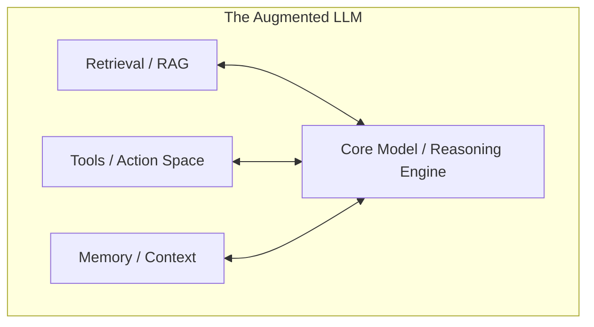

### The 3 Foundational Pillars (OpenAI Taxonomy)
OpenAI's agent framework structures an agent around three components:
1. **Model (The Brain):** The reasoning engine that parses instructions, evaluates observations, and decides actions.
2. **Tools (The Hands):** Defined interfaces allowing the model to retrieve information and create side effects in the real world.
3. **Instructions (The Steering):** System prompts and behavioral guardrails that define the operational scope, persona, constraints, and edge-case policies.

### The 5 Functional Characteristics of an Agent
1. **Goal:** A clear high-level objective (e.g., *"Fix the broken test suite in repo X"*).
2. **Dynamic Decision-Making:** The model determines what step to take next based on real-time observations.
3. **Action Space (Tools):** Structured interfaces enabling environment interaction.
4. **Environment:** The external system providing feedback (APIs, shell, database, web).
5. **Iterative Control Loop:** A closed loop where the model proposes an action, receives an observation, evaluates progress, and continues until termination.

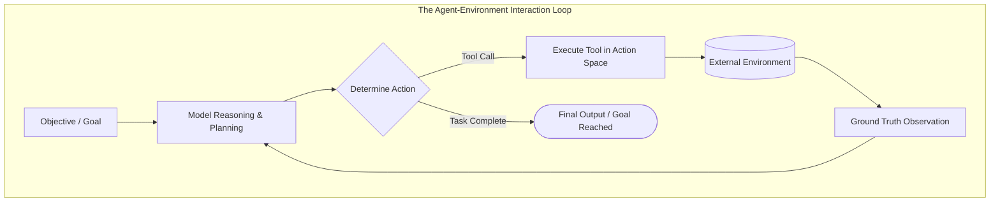

---

## 4. Workflows vs. Agents

Anthropic's research (*Building Effective Agents*) establishes the standard industry taxonomy:

> * **Workflows:** Systems where LLMs and tools are orchestrated through **predefined, hardcoded code paths**.
> * **Agents:** Systems where LLMs **dynamically direct their own processes and tool usage**, maintaining runtime control over how tasks are accomplished.

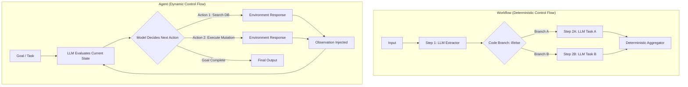

### Architectural Comparison

| Dimension | Workflows | Agents |
| :--- | :--- | :--- |
| **Control Flow** | Hardcoded in Python/TypeScript (DAG / StateGraph) | Emergent at runtime; model chooses next step |
| **Execution Path** | 100% deterministic and predictable | Dynamic; path adapts to intermediate tool outputs |
| **Tool Orchestration** | Pre-scheduled calls triggered by developer logic | Model selects tools and constructs arguments dynamically |
| **Debugging & Tracing** | Straightforward; reproducible linear or branching graph | Complex; non-deterministic execution trajectories |
| **Latency & Cost** | Bounded and predictable ($1$–$3$ calls per run) | Variable and unbounded without strict step caps ($2$–$30+$ calls) |
| **Primary Failure Mode** | Unhandled edge cases crashing the workflow | Hallucinated parameters, infinite loops, compounding error drift |

---

## 5. The "Who Determines the Next Step?" Principle

When evaluating or designing any compound AI system, use this single operational heuristic:

$$\Large \text{Who determines the next step?}$$

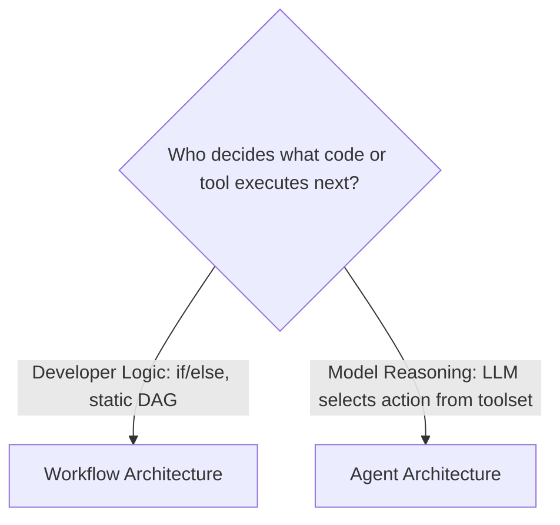

### The Spectrum of Agency

Agency is not binary; it exists on a spectrum from purely deterministic code to open-ended autonomy:

```
[Level 0: Pure Code] ──► [Level 1: Single LLM Call] ──► [Level 2: Chaining & Routing] ──► [Level 3: Evaluator-Optimizer] ──► [Level 4: Orchestrator-Workers] ──► [Level 5: Autonomous Agent]
  (Deterministic)           (Text Generation)               (Static Workflows)               (Iterative Refinement)             (Dynamic Subtasking)            (Open-Ended Control Loop)
```

1. **Deterministic Logic:** Pure Python/SQL code, zero AI.
2. **Single LLM Call:** Pure text processing, no tools, no feedback loop.
3. **Static Workflows (Chaining / Routing / Parallelization):** Hardcoded graphs where LLMs perform discrete tasks at defined steps.
4. **Iterative Workflows (Evaluator-Optimizer):** Structured loops with fixed roles (generator vs. judge), bounded iteration.
5. **Dynamic Subtasking (Orchestrator-Workers):** Central LLM defines subtasks dynamically, but workers execute within bounded, structured boundaries.
6. **Autonomous Agents:** Full dynamic control loop; model chooses tools, interprets results, self-corrects, and determines when the goal is met.

---

## 6. Anthropic's Core Workflow Patterns

Anthropic formalizes **five common workflow patterns** that solve the vast majority of enterprise LLM applications without the non-deterministic overhead of full agents:

### 1. Prompt Chaining
Decomposes a task into a fixed linear sequence of LLM steps, where each call consumes the output of the previous one. Programmatic "gates" validate intermediate data.

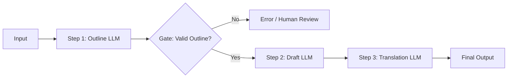

* **When to use:** Multi-stage document generation, data extraction followed by transformation, document synthesis.
* **Benefit:** Higher accuracy by making each individual LLM call smaller and simpler.

---

### 2. Routing
Classifies an incoming query and dispatches it to a specialized downstream prompt, model tier, or deterministic tool.

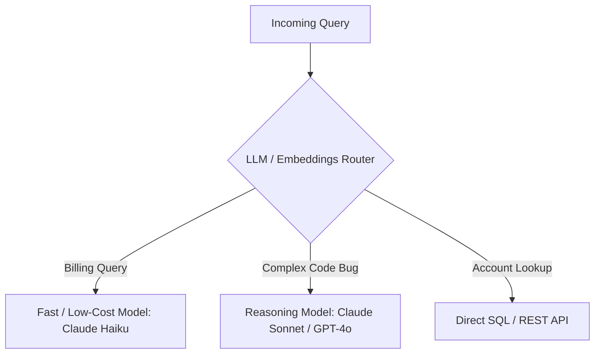

* **When to use:** Separation of concerns, optimizing cost/latency (routing simple queries to cheaper models, complex ones to frontier models), domain-specific prompt specialization.

---

### 3. Parallelization
Executes multiple LLM calls simultaneously and aggregates their outputs programmatically. Operates in two primary modes:

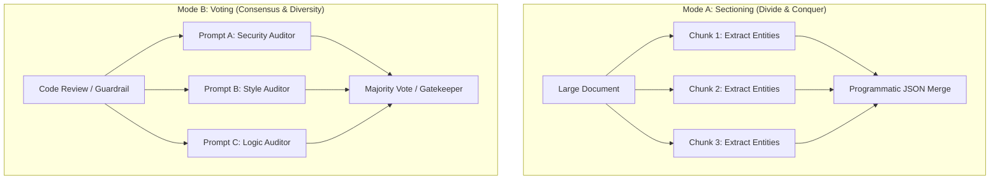

* **Sectioning:** Speeds up large tasks by splitting them into independent concurrent operations.
* **Voting:** Improves reliability on critical decisions (e.g., vulnerability scanning, content moderation) by aggregating multiple independent perspectives.

---

### 4. Orchestrator-Workers
A central **Orchestrator LLM** analyzes a complex task, dynamically determines what subtasks are required, delegates them to independent **Worker LLMs**, and synthesizes the final result.

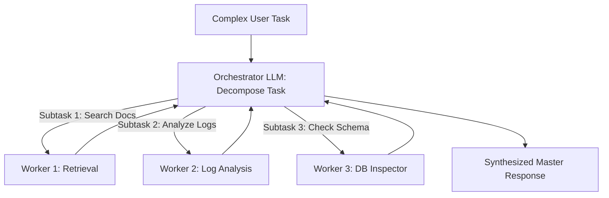

* **When to use:** Complex tasks where the exact subtasks cannot be predicted in advance (e.g., a coding task requiring modifications to an unknown number of files).
* **Key Distinction from Agents:** Workers execute bounded, predefined tasks; they do not run arbitrary, open-ended tool loops.

---

### 5. Evaluator-Optimizer
One LLM (the **Generator**) produces a candidate response, while a second LLM (the **Evaluator/Critic**) assesses it against defined rubric criteria and provides feedback in an iterative loop.

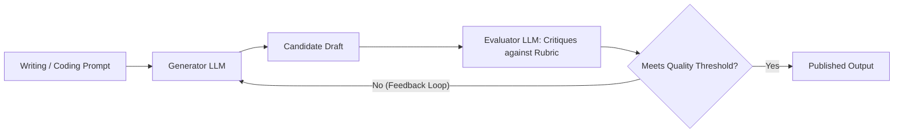

* **When to use:** Literary translation, high-stakes copywriting, complex code generation with unit-test feedback, tasks with clear objective evaluation criteria.

---

## 7. Autonomous Agents in Production

An **Autonomous Agent** is deployed when the system must navigate an open-ended problem space via dynamic runtime experimentation:

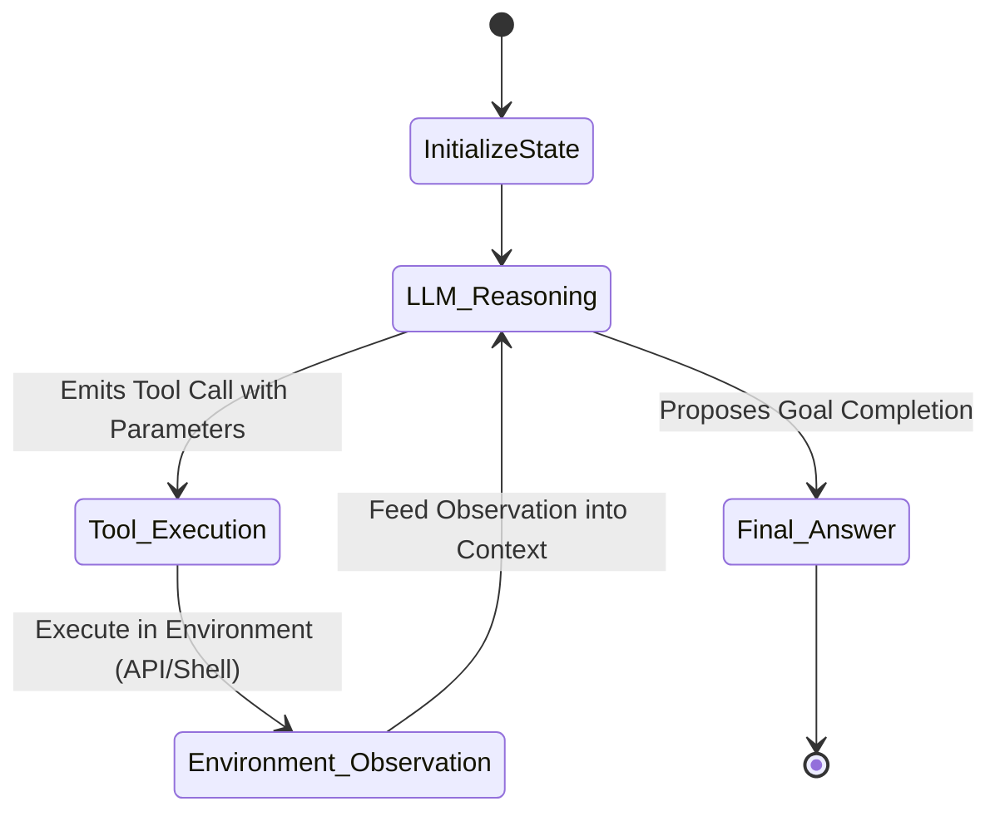

### The Two Most Mature Production Domains (Anthropic Findings)
Anthropic's production research highlights two domains where autonomous agents deliver measurable ROI:

1. **Customer Support Operations:**
   - Combines natural conversational flow with structured actions (fetching order history, issuing refunds, modifying reservations).
   - Clear success criteria and bounded API capabilities.
2. **Coding Agents (e.g., SWE-bench Verified):**
   - Can inspect repository code, run unit tests, read stack traces, formulate bug fixes, and re-test.
   - **Ground truth verification:** Automated test suites provide immediate objective feedback to the agent loop.

### Trade-offs: Flexibility vs. Predictability

```
   HIGH ▲
        │                                         [Autonomous Agents]
        │                                          • Dynamic exploration
        │                                          • Open-ended error recovery
F       │                                          • High latency ($10s - 120s+$)
L       │                                          • Non-deterministic cost
E       │
X       │                      [Orchestrator-Workers / Evaluator-Optimizer]
I       │                       • Semi-structured
B       │                       • Bounded dynamic subtasks
I       │
L       │        [Prompt Chaining & Routing]
I       │         • Highly deterministic
T       │         • Low latency ($< 2s$)
Y       │         • Predictable cost
   LOW  ▼───────────────────────────────────────────────────────────────►
        LOW                      CONTROL & RELIABILITY                 HIGH
```

---

## 8. Choosing the Right Architecture: Decision Framework

Engineering discipline requires adhering to the **Principle of Least Agency**:

> [!IMPORTANT]
> **The Principle of Least Agency:**  
> Always select the simplest, most deterministic architecture that reliably accomplishes the goal. Introduce agency only when deterministic workflows fail to handle the required flexibility.

### Architecture Comparison Matrix

| Architectural Tier | Control Flow | Path Predictability | Latency | Cost per Run | Best For |
| :--- | :--- | :--- | :--- | :--- | :--- |
| **Single LLM Call** | Static | 100% Deterministic | $< 1\text{s}$ | $\$$ | Extraction, classification, summarization |
| **Workflow (Chain / Route)** | Developer DAG | 100% Deterministic | $1\text{s} - 5\text{s}$ | $\$ - \$\$$ | Multi-stage content generation, support triage |
| **Evaluator-Optimizer** | Fixed Loop | Structured Iteration | $5\text{s} - 15\text{s}$ | $\$ \$$ | Polished copy, code refinement with unit tests |
| **Orchestrator-Workers** | Dynamic Subtasks | Bounded Delegation | $5\text{s} - 20\text{s}$ | $\$ \$ \$$ | Multi-file code edits, deep research synthesis |
| **Autonomous Agent** | Dynamic Tool Loop | Model-Discovered | $15\text{s} - 120\text{s}+$ | $\$ \$ \$ \$$ | Open-ended investigation, complex coding, computer use |

### 4-Question Decision Tree

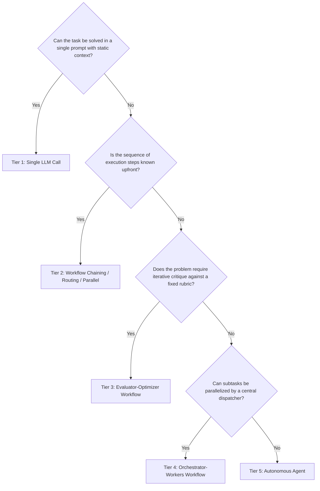

### When an Agent Is Unnecessary (Anti-Patterns)

> [!WARNING]
> **Avoid "The Agent Trap":** Building an autonomous agent when a deterministic workflow suffices adds unnecessary cost, latency, and failure vectors.

* ❌ **Fixed ETL / Data Ingestion Pipelines:** If you are scraping a website, parsing fields into JSON, and writing to PostgreSQL, use deterministic code with structured LLM extraction.
* ❌ **Strict SLA APIs ($< 2\text{s}$):** Agent loops that iterate $4$–$10$ times cannot meet hard latency requirements.
* ❌ **Regulated & Audit-Critical Decisions:** If compliance requires that every step follow an approved decision tree, do not allow an LLM to dynamically invent its action trajectory.

---

## 9. Core Engineering Principles from Industry Practice

Both Anthropic and OpenAI emphasize three practical tenets for building production-grade agentic systems:

### 1. Maintain Simplicity in Architecture
- Start with direct LLM API calls and simple prompt engineering.
- Avoid heavyweight multi-agent frameworks until you hit concrete architectural limits. Complex abstractions often obscure prompts, raw responses, and token costs, making debugging difficult.

### 2. Prioritize Transparency & Inspectability
- Explicitly log and display the agent’s intermediate reasoning steps, tool proposals, and observations.
- Ensure human operators can inspect the trace at every step of the trajectory.

### 3. Invest in the Agent-Computer Interface (ACI)
- **Treat tools like APIs designed for models:** Just as software engineers spend significant effort designing clean Human-Computer Interfaces (HCI), AI engineers must design clean **Agent-Computer Interfaces (ACI)**.
- Document tool names, parameter schemas, and descriptions with extreme clarity.
- Ensure error responses from tools are informative and guide the model toward self-correction rather than returning opaque error codes.

---

## 10. Case Study: Customer Dispute Resolution

To ground these concepts in practice, let us examine how the same enterprise problem is approached across architectures:

> **Scenario:** A SaaS customer submits the ticket: *"I was double-billed on invoice #INV-8831 and my promo code 'FALL20' wasn't applied. Please fix this."*

---

### Implementation A: Deterministic Workflow (Router + Chaining)

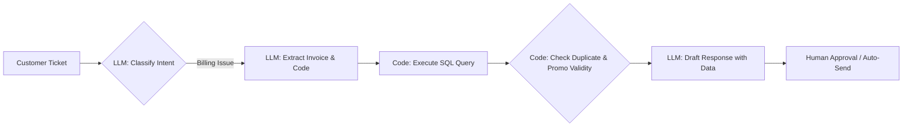

* **How it works:**
  1. An LLM classifies the ticket intent as `BILLING_DISPUTE`.
  2. A structured LLM call extracts `{"invoice_id": "INV-8831", "promo_code": "FALL20"}`.
  3. Hardcoded Python code executes queries against the billing database and applies company discount rules.
  4. An LLM synthesizes the verified outcome into an email draft.
* **Assessment:**
  - **Latency:** $\sim 2.5\text{s}$.
  - **Cost:** $2$ small LLM calls ($\approx \$0.003$).
  - **Reliability:** $99.9\%$ on standard cases. Fails if the dispute involves unusual edge cases outside the SQL script's logic.

---

### Implementation B: Autonomous Agent

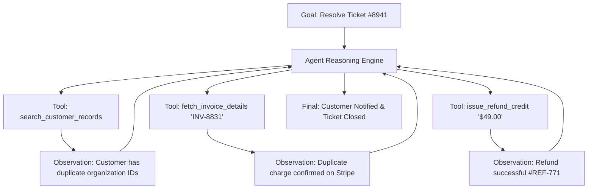

* **How it works:**
  1. The agent receives the high-level goal: *"Investigate ticket #8941, verify legitimacy, remediate, and notify customer."*
  2. The agent queries customer records, discovers an anomaly (two subsidiary accounts sharing an email domain), inspects both ledgers, and identifies the duplicate charge.
  3. It executes the refund tool and writes an audit note.
* **Assessment:**
  - **Latency:** $\sim 22\text{s}$.
  - **Cost:** $6$ LLM calls with tool schema overhead ($\approx \$0.08$).
  - **Reliability:** Exceptionally adaptable to novel edge cases; requires strict tool authorization and spend limits.

---

## 11. Summary & Unit Cheat Sheet

```
┌──────────────────────────────────────────────────────────────────────────────────────────┐
│                                 THE SPECTRUM OF AGENCY                                   │
├────────────────────┬───────────────────────────────────────────┬─────────────────────────┤
│ Single LLM Call    │ Workflows (Anthropic Patterns)            │ Autonomous Agents       │
├────────────────────┼───────────────────────────────────────────┼─────────────────────────┤
│ • Prompt -> Output │ • Prompt Chaining (Sequential + Gates)    │ • Dynamic Tool Loop     │
│ • Zero Environment │ • Routing (Classifier + Specialized paths)│ • Closed feedback loop  │
│ • Stateless        │ • Parallelization (Sectioning / Voting)   │ • Model decides next    │
│ • Developer writes │ • Orchestrator-Workers (Dynamic subtasks) │   action at runtime     │
│   entire path      │ • Evaluator-Optimizer (Critique loop)     │ • Emergent trajectory   │
│                    │ • Developer controls execution DAG        │ • Open-ended problems   │
└────────────────────┴───────────────────────────────────────────┴─────────────────────────┘
```

### Core Takeaways:
1. **The Dividing Line:** If developer code governs the execution path, it is a **Workflow**. If the model determines its next action dynamically based on environmental feedback, it is an **Agent**.
2. **Start Simple:** Optimize single-turn prompts and deterministic workflows first. Escalate to autonomous agents only when the problem space demands dynamic runtime exploration.
3. **Focus on ACI:** Clear tool definitions and informative error messages are just as critical as system prompt engineering.

---

## Next Unit Preview

In **Unit 1.2: Anatomy of an Agent and State**, we will dissect the internal components of an agent:
- How **Agent State** differs from **Runtime / Workflow State**.
- The anatomy of the **Agent Control Loop**.
- Short-term context memory vs. persistent external memory.
