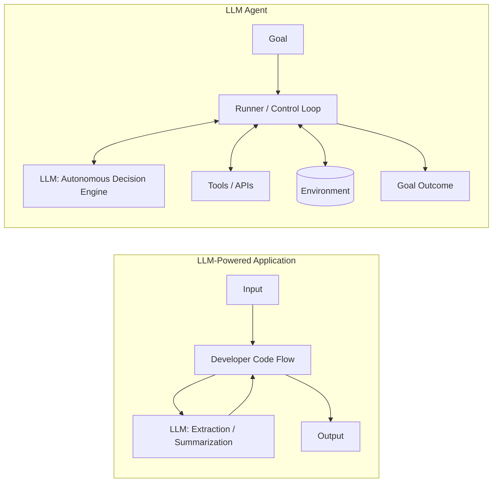
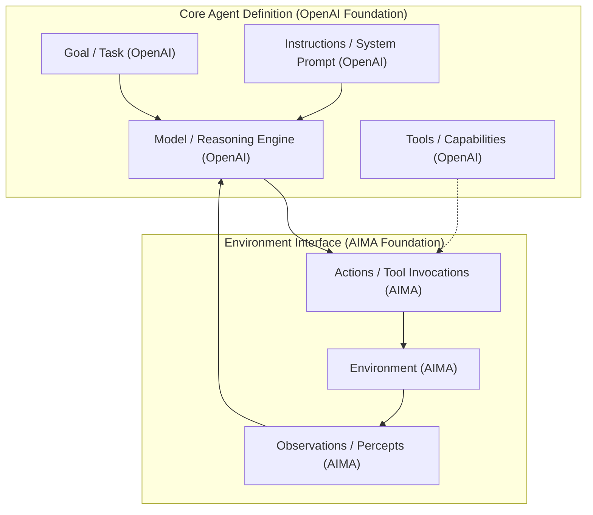
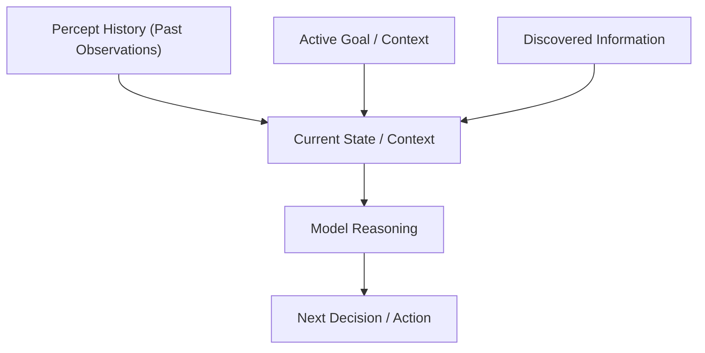
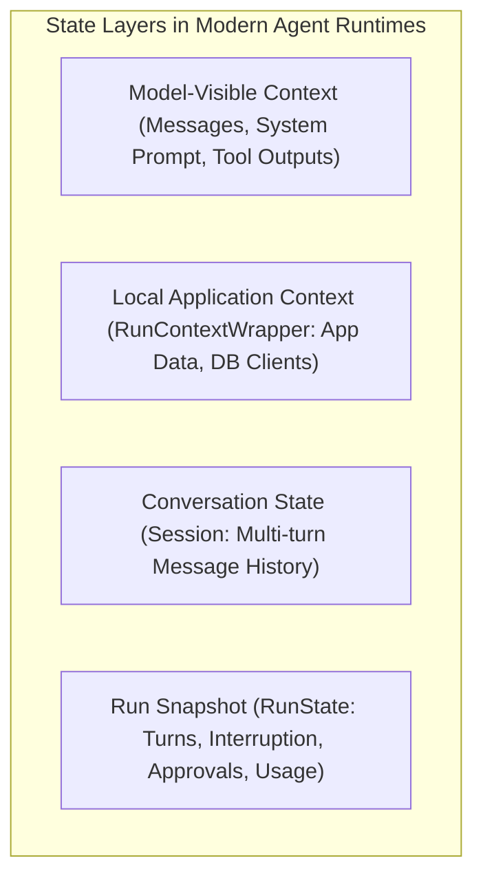
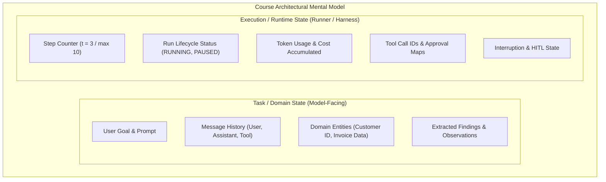
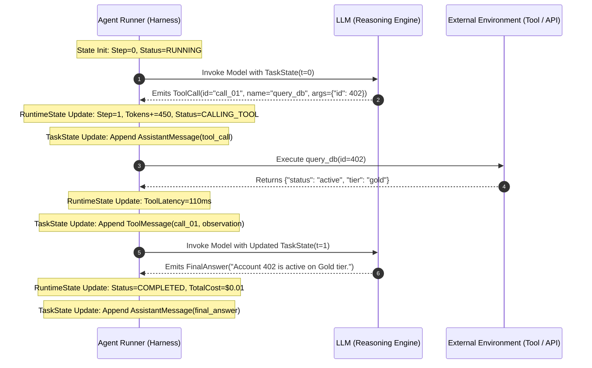

# Unit 1.2: Anatomy of an Agent and State

> **Core Question:**  
> *"What is an agent made of, why does an agent require state, and how do we distinguish task/domain state from execution/runtime state?"*

---

## Learning Objectives

By the end of this unit, you will be able to:
1. Explain the classical **Agent ↔ Environment** interaction model from Russell & Norvig (*Artificial Intelligence: A Modern Approach*).
2. Deconstruct an LLM agent using our **Unified Mental Model** (a pedagogical synthesis of AIMA and OpenAI frameworks).
3. Explain why an agent requires state using the mathematical concept of percept sequences ($f: P^* \rightarrow A$).
4. Understand how modern agent runtimes manage context, sessions, and execution snapshots.
5. Apply the course's engineering distinction between **Task/Domain State** and **Execution/Runtime State**.
6. Trace how state transitions during an agent's execution cycle.

---

## 1. Classical Foundation: Agent ↔ Environment (AIMA)

Before Large Language Models existed, the foundational theory of artificial intelligence established what constitutes an "agent." The canonical formulation comes from **Stuart Russell and Peter Norvig** in *Artificial Intelligence: A Modern Approach (AIMA)*, Chapter 2:

```mermaid
flowchart TD
    subgraph Environment ["Environment (The World / External System)"]
        State[(Environment State)]
    end

    subgraph Agent ["Agent Program"]
        Sensors[Sensors / Perception]
        Decision["Agent Function: f: P* -> A"]
        Actuators[Actuators / Action Mechanism]
    end

    State -->|Percept / Observation (p_t)| Sensors
    Sensors --> Decision
    Decision --> Actuators
    Actuators -->|Action / Mutation (a_t)| State
```

### Core Concepts from Classical AI:
1. **Agent:** Anything that can be viewed as perceiving its environment through **sensors** and acting upon that environment through **actuators**.
2. **Environment:** The external world, system, or software surface with which the agent interacts.
3. **Percept (Observation):** The agent's perceptual input at any given instant ($p_t$).
4. **Action:** The discrete intervention emitted by the agent that can alter the environment's state ($a_t$).
5. **The Agent Function vs. Agent Program:**
   * **Agent Function ($f$):** An abstract mathematical description mapping any given sequence of percepts to an action:
     $$f: P^* \rightarrow A$$
     *(where $P^* = \langle p_0, p_1, \dots, p_t \rangle$ represents the history of all percepts received up to the current time, and $A$ is the set of possible actions).*
   * **Agent Program:** The concrete, physical software implementation that executes the agent function on a computing architecture ($\text{Agent} = \text{Architecture} + \text{Program}$).

---

## 2. The Modern LLM Agent (Engineering Foundation)

Modern AI engineering adapts this classical formulation by utilizing a Large Language Model as the primary reasoning and decision-making engine.

According to OpenAI's *A Practical Guide to Building Agents*, an agent system is fundamentally constructed around **three primary building blocks**:

1. **Model:** The core reasoning engine (LLM) that interprets context, evaluates observations, and plans decisions.
2. **Instructions:** The behavioral specification, system prompt, operational constraints, and domain policies that guide model execution.
3. **Tools:** Callable functions, APIs, databases, or code execution environments that grant the model capabilities beyond pure text generation.

In addition, an agent is activated by a **Goal / Task**—the high-level prompt or objective supplied by the user or upstream system.



### Why an LLM Application Isn't Automatically an Agent
* **LLM Application:** Developer code dictates the entire control flow. The model is called as an isolated text transformation function (e.g., classifying a ticket). The model has no control over what execution path is chosen next.
* **LLM Agent:** The model is placed inside an iterative loop (`Agent → Runner → run`) where its output directly determines whether to invoke tools, query systems, ask clarifying questions, or terminate. The model **dynamically influences its own execution trajectory**.

---

## 3. A Unified Mental Model of an Agent — Course Synthesis

To bridge classical AI theory with modern LLM engineering, this course provides a **synthesized 7-component mental model**:

> [!NOTE]
> **Pedagogical Synthesis Note:**  
> This 7-component model is our course's structured synthesis combining established classical concepts (Russell & Norvig, AIMA) with modern LLM engineering frameworks (OpenAI). Neither AIMA nor OpenAI alone presents this exact seven-part list; rather, each component maps directly to its cited source foundation.



### Component Mapping

| Component | Primary Grounding | Role in LLM Agent Systems |
| :--- | :--- | :--- |
| **Goal / Task** | OpenAI | The objective, query, or desired end-state assigned to the agent. |
| **Model** | OpenAI | The language model providing reasoning, planning, and semantic evaluation. |
| **Instructions** | OpenAI | System prompts, behavioral guardrails, and operational constraints. |
| **Tools** | OpenAI | Structured capabilities available to the agent (e.g., database queries, REST APIs). *(Formal action spaces and schemas are detailed in Unit 1.3).* |
| **Environment** | AIMA | The external system or reality where actions produce real-world results. |
| **Observations** | AIMA | The data, return values, or error feedback returned by the environment. |
| **Actions** | AIMA | The concrete commands or tool invocations emitted by the model. |

---

## 4. Why State Matters in Agentic Systems

A fundamental operational property of model inference is:

> **An individual model invocation does not automatically retain application state from previous invocations. Stateful behavior must be provided through the input/context or through mechanisms outside the model invocation.**

When you make an API call to an LLM, the model computes a forward pass over the supplied input tokens. It retains no memory of previous API calls.

### The Percept History Requirement ($P^* \rightarrow A$)
As formalized in AIMA, an agent operating across multiple steps cannot make rational decisions based solely on the latest observation $p_t$. It requires access to relevant information from the **percept history**:

$$P^* = \langle p_0, p_1, p_2, \dots, p_t \rangle$$



### Consequences of Operating Without State:
Without retaining relevant information from previous steps, an agent may:
1. **Lose Track of Progress:** Forget which subtasks have already succeeded.
2. **Fail to Ground Reasoning:** Be unable to incorporate facts discovered during earlier tool calls.
3. **Repeat Actions:** Re-issue identical tool requests because it does not know it already ran them.
4. **Fail Error Recovery:** Be unable to adjust strategy after receiving an error from an earlier attempt.

---

## 5. State in Modern Agent Runtimes

Modern agent frameworks (such as the **OpenAI Agents SDK**) structure state across several specific engineering abstractions:



### Modern Runtime Concepts (OpenAI Agents SDK Mapping):

| Architecture Layer | OpenAI SDK Implementation | Description & Visibility |
| :--- | :--- | :--- |
| **Model-Visible Context** | Input Messages / Context | The prompt context serialized and sent directly to the LLM (system prompt, user query, tool call messages, tool observations). |
| **Local Application Context** | `RunContextWrapper` | Typed dependencies, configuration, and data (e.g., user IDs, DB connections) injected into tools and hooks. **Not sent to the LLM**, avoiding token waste and data leakage. |
| **Conversation State** | `Session` | Persistent multi-turn message history maintained across separate agent executions. |
| **Execution Snapshot** | `RunState` | A JSON-serializable snapshot of an active run (capturing turn progress, usage, tool approvals, and interruptions) used to pause and resume runs. |
| **Execution Controller** | `Runner` | The runtime harness managing the agent loop, tool execution, handoffs, and iteration limits (`Runner.run`). |

*(Note: Orchestration frameworks like **LangGraph** similarly manage state via explicit graph schemas and persist execution snapshots across supersteps using **Checkpointers** for durability and human-in-the-loop pauses. Framework orchestration is explored in depth in Unit 1.9).*

---

## 6. Task/Domain State vs. Execution/Runtime State

To provide clear system boundaries when designing agent architectures, this course establishes a practical engineering distinction:

> **Course Engineering Abstraction:**  
> We distinguish two useful categories of state:  
> 1. **Task / Domain State:** What the *model* needs to reason and solve the domain problem.  
> 2. **Execution / Runtime State:** What the *runner / execution harness* needs to govern, execute, and safeguard the run.



### Side-by-Side Comparison

| Dimension | Task / Domain State | Execution / Runtime State |
| :--- | :--- | :--- |
| **Primary Consumer** | The Large Language Model (Reasoning Engine) | The Execution Harness / Agent Runner |
| **Prompt Visibility** | Serialized directly into the model's context window | Kept outside the context window (harness metadata) |
| **Typical Contents** | Messages, entity schemas, JSON payloads, scratchpad facts | Step counters, execution status enums, usage metrics, timers |
| **Primary Purpose** | Solves the user's domain problem | Enforces safety budgets, limits, timeouts, and execution control |
| **Failure If Lost** | Agent loses domain context, repeats questions, or hallucinates | Runner cannot enforce iteration limits or handle resumption |

---

## 7. State Evolution During an Agent Run

Let us trace how both state layers evolve synchronously through a single turn in a modern `Agent → Runner` loop:



### Lifecycle Progression:
1. **Invocation ($t=0$):**
   * *Task State:* Contains the user goal and system instructions.
   * *Runtime State:* Sets status to `RUNNING` and verifies iteration limits.
2. **Action Proposal ($t=1$):**
   * Model evaluates Task State and emits a tool call.
   * *Task State:* Records the tool proposal message.
   * *Runtime State:* Records token usage and tracks the pending tool call ID.
3. **Environment Execution ($t=1.5$):**
   * Runner executes the tool in the environment. Local application context (`RunContextWrapper`) provides necessary database handles without exposing them to the LLM.
4. **Observation Ingestion ($t=2$):**
   * Tool output returns from the environment.
   * *Task State:* Observation is appended as a tool message.
   * *Runtime State:* Step counter increments ($t \leftarrow t + 1$).
5. **Goal Completion:**
   * Model outputs the final answer. Runner marks runtime status as `COMPLETED`.

---

## 8. Summary & Scope Boundaries

```
┌─────────────────────────────────────────────────────────────────────────────────────────┐
│                                 UNIT 1.2 CORE SUMMARY                                   │
├─────────────────────────────────────────────────────────────────────────────────────────┤
│ 1. Classical Foundation (AIMA):                                                         │
│    Agent receives Percepts from Environment; executes Actions via Actuators.            │
│    Agent function: f: P* -> A (maps percept sequences to actions).                      │
│                                                                                         │
│ 2. Unified Mental Model (Course Synthesis):                                             │
│    Goal • Model • Instructions • Tools • Environment • Observations • Actions           │
│                                                                                         │
│ 3. State in Agent Systems:                                                              │
│    Stateful behavior must be provided through context or external mechanisms.           │
│    • Task / Domain State: Model-facing problem-solving context and history.             │
│    • Execution / Runtime State: Runner-facing execution metadata, limits, and control.  │
└─────────────────────────────────────────────────────────────────────────────────────────┘
```

### Looking Ahead to Subsequent Units
This unit established the anatomy of an agent and the fundamentals of state. The upcoming units will dive into the operational mechanics:

* **Unit 1.3:** Tool schemas, parameter validation, action spaces, and authorization boundaries.
* **Unit 1.4:** Observation processing, extraction, and context window management.
* **Unit 1.5:** Execution patterns (ReAct: Thought $\rightarrow$ Action $\rightarrow$ Observation).
* **Unit 1.6:** Preconditions, postconditions, and environment grounding.
* **Unit 1.7:** Deterministic termination states and safety harnesses.
* **Unit 1.8:** Agent failure taxonomy and error recovery.
* **Unit 1.9:** Orchestration frameworks (LangGraph, multi-agent runtimes).

---

## Research & Reference Foundations

### Academic Foundation
* **Russell & Norvig — *Artificial Intelligence: A Modern Approach (AIMA)*:**  
  [Chapter 2: Intelligent Agents (PDF)](https://aima.cs.berkeley.edu/4th-ed/pdfs/newchap02.pdf) — Sections 2.1 (*Agents and Environments*), 2.2 (*Good Behavior: The Concept of Rationality*), and 2.4 (*Structure of Agents*).

### Modern Industry Foundations
* **OpenAI — *A Practical Guide to Building Agents*:**  
  [OpenAI Practical Guide to Building Agents](https://openai.com/business/guides-and-resources/a-practical-guide-to-building-ai-agents/) — Foundational building blocks: Model, Tools, Instructions, and Orchestration.
* **Anthropic — *Building Effective Agents*:**  
  [Anthropic Engineering Guide](https://www.anthropic.com/engineering/building-effective-agents) — Distinction between workflows and agents.
* **OpenAI Agents SDK Documentation:**  
  * [Agents & Configuration](https://openai.github.io/openai-agents-python/agents/)
  * [Context Management (`RunContextWrapper`)](https://openai.github.io/openai-agents-python/context/)
  * [Running Agents (`Runner`)](https://openai.github.io/openai-agents-python/running_agents/)
  * [Run State Snapshots (`RunState`)](https://openai.github.io/openai-agents-python/ref/run_state/)
  * [Session Persistence (`Session`)](https://openai.github.io/openai-agents-python/sessions/)
