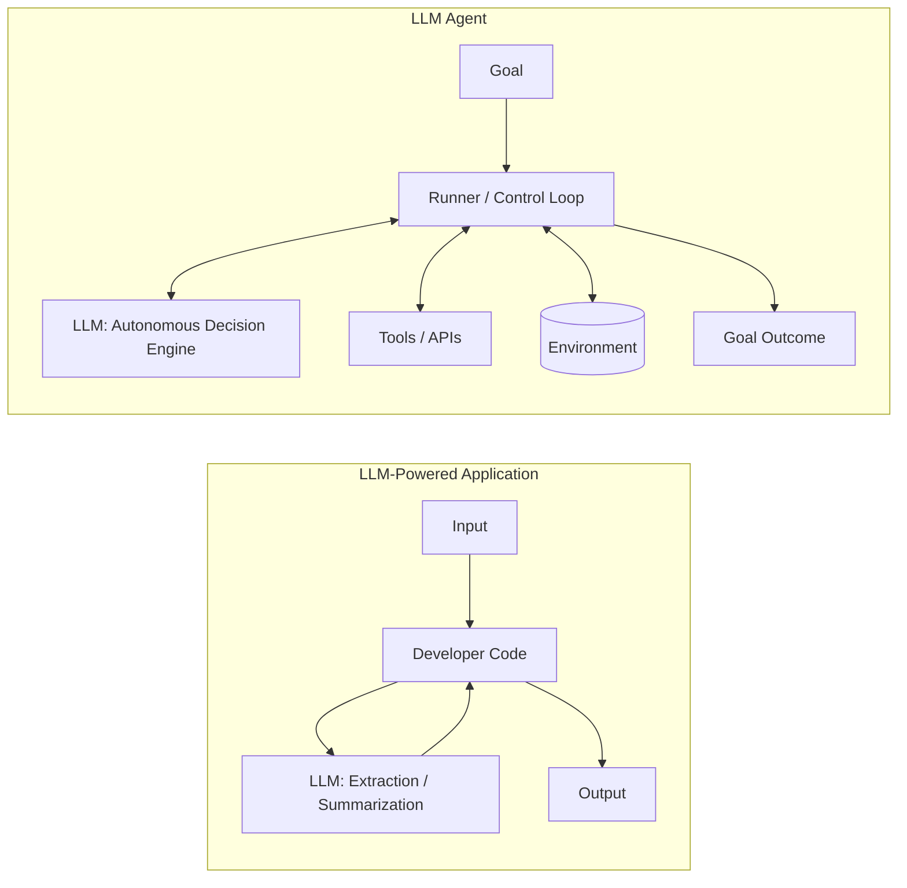
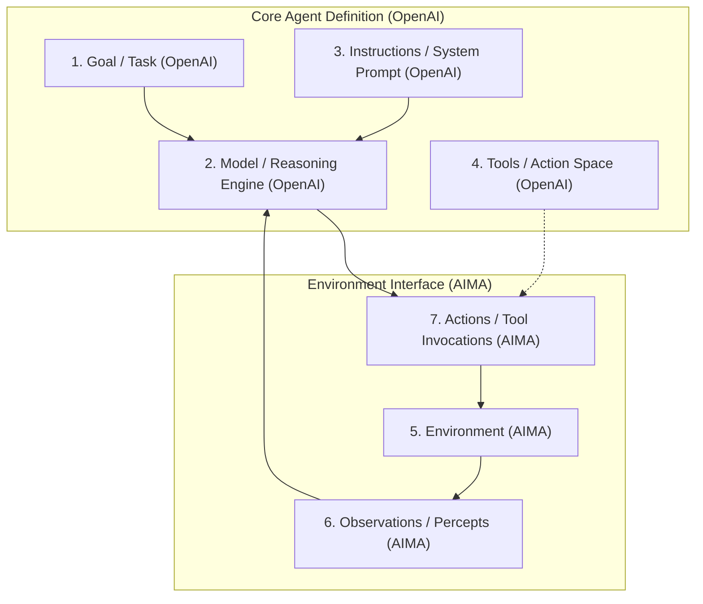
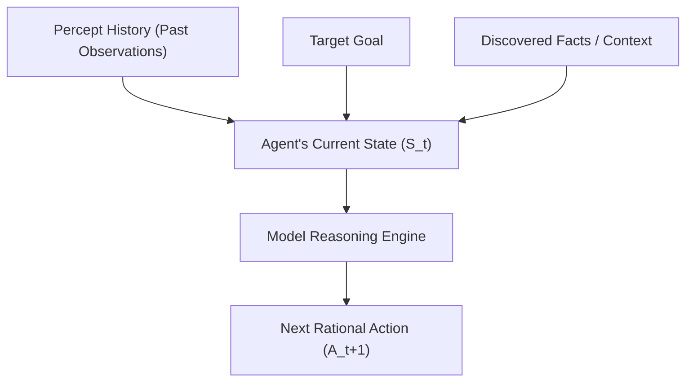
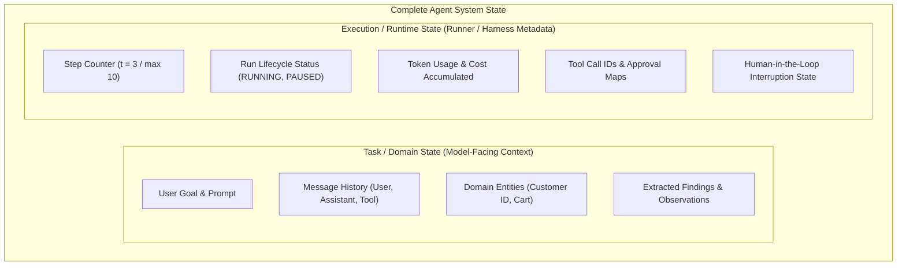
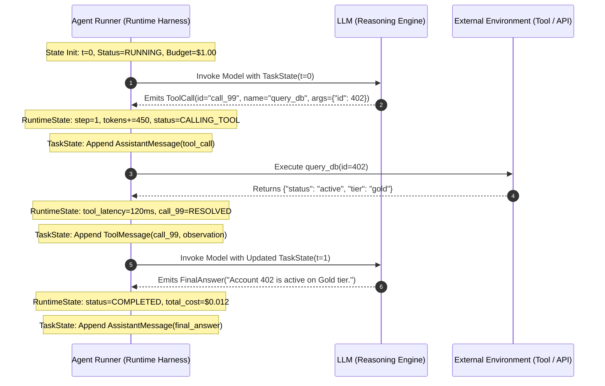

# Unit 1.2: Anatomy of an Agent and State

> **Core Question:**  
> *"What are the constituent parts of an LLM agent, why does an agent require state, and how do we distinguish task/domain state from execution/runtime state?"*

---

## Learning Objectives

By the end of this unit, you will be able to:
1. Explain the classical **Agent ↔ Environment** interaction model from Russell & Norvig (*Artificial Intelligence: A Modern Approach*).
2. Deconstruct any LLM agent into the **7 Core Components** (our course's structured synthesis of AIMA and OpenAI frameworks).
3. Articulate why an agent requires state using the mathematical concept of percept sequences ($f: P^* \rightarrow A$).
4. Distinguish between **Task / Domain State** and **Execution / Runtime State**, grounded in modern runtime implementations (e.g., OpenAI Agents SDK, LangGraph).
5. Trace how both state layers evolve synchronously during a multi-turn agent execution loop.

---

## 1. The Classical Foundation: Agent ↔ Environment (AIMA)

Before Large Language Models existed, the foundational theory of artificial intelligence established what constitutes an "agent." The canonical formulation comes from **Stuart Russell and Peter Norvig** in *Artificial Intelligence: A Modern Approach (AIMA)*, Chapter 2:

```mermaid
flowchart TD
    subgraph Environment ["Environment (The World / External System)"]
        State[(Environment State)]
    end

    subgraph Agent ["Agent Program"]
        Sensors[Sensors / Perception]
        Decision[Agent Function: f: P* -> A]
        Actuators[Actuators / Action Mechanism]
    end

    State -->|Percept / Observation (p_t)| Sensors
    Sensors --> Decision
    Decision --> Actuators
    Actuators -->|Action / Mutation (a_t)| State
```

### Core Concepts from Classical AI:
1. **Agent:** Anything that can be viewed as perceiving its environment through **sensors** and acting upon that environment through **actuators**.
2. **Environment:** The external world, system, or software surface with which the agent interacts.
3. **Percept (Observation):** The agent's perceptual input at any given instant ($p_t$).
4. **Action:** The discrete intervention emitted by the agent that can alter the environment's state ($a_t$).
5. **The Agent Function vs. Agent Program:**
   * **Agent Function ($f$):** An abstract mathematical description mapping any given sequence of percepts to an action:
     $$f: P^* \rightarrow A$$
     *(where $P^* = \langle p_0, p_1, \dots, p_t \rangle$ represents the history of all percepts received up to the current time, and $A$ is the set of possible actions).*
   * **Agent Program:** The concrete, physical software implementation that executes the agent function on a computing architecture.

---

## 2. What Is an LLM Agent? (Modern Engineering Perspective)

Modern AI engineering adapts this classical formulation by utilizing a Large Language Model as the primary reasoning and decision-making engine.

According to OpenAI's *A Practical Guide to Building Agents*:

> An **AI Agent** is an autonomous or semi-autonomous software system where a language model independently directs its own execution path, reasons through ambiguity, and uses tools to accomplish high-level tasks.



### Why an LLM Application Isn't Automatically an Agent
* **LLM Application:** The developer hardcodes the entire control flow. The model is merely an informational transformation function (e.g., extracting structured JSON from an email). The LLM has no authority over what code executes next.
* **LLM Agent:** The model is placed inside an iterative loop (`Agent → Runner → run`) where the model's semantic reasoning dictates whether to invoke tools, query external systems, ask clarifying questions, or terminate the run. The model **dynamically determines its own trajectory**.

---

## 3. The 7 Core Components of an Agent (Course Synthesis)

To provide a unified mental model for AI engineering, our course synthesizes the classical foundations of **Russell & Norvig (AIMA)** with modern industry frameworks from **OpenAI**:

> [!NOTE]
> **Pedagogical Synthesis Note:**  
> This 7-component model is our course's structured synthesis of established concepts. AIMA provides the classical *Environment / Action / Percept* paradigm, while OpenAI formalizes the modern *Model / Tools / Instructions / Goal* implementation architecture.



### Detailed Component Breakdown

| # | Component | Primary Source Grounding | Definition & Role in LLM Systems |
| :- | :--- | :--- | :--- |
| **1** | **Goal / Task** | OpenAI | The high-level objective, query, or desired end-state assigned to the agent (e.g., *"Resolve bug #204 in repository"*). |
| **2** | **Model** | OpenAI | The neural network (LLM) serving as the reasoning engine to interpret context, plan, and select actions. |
| **3** | **Instructions** | OpenAI | System prompts, behavioral guardrails, domain constraints, and operational policies that guide model behavior. |
| **4** | **Tools** | OpenAI | Structured specifications of callable functions, REST APIs, databases, or shell commands available to the agent. |
| **5** | **Environment** | AIMA | The external system or reality where actions produce real-world side effects (filesystem, database, cloud infrastructure). |
| **6** | **Observations** | AIMA | The structured or unstructured feedback returned by the environment after an action is executed. |
| **7** | **Actions** | AIMA | The specific tool calls or operations emitted by the model to interact with the environment. |

---

## 4. Why an Agent Needs State

Large Language Models are inherently **stateless mathematical functions**:
$$\text{Output} = \text{ForwardPass}(\text{Input Tokens})$$

Between separate API calls, an LLM retains **zero memory**. If you ask a model to inspect a database in Step 1, it will have no recollection of the database results in Step 2 unless that information is explicitly recorded and passed into its context.

### The Percept Sequence Requirement ($P^* \rightarrow A$)
As established in AIMA, an agent operating in a complex or partially observable environment cannot make rational decisions based solely on the current immediate observation $p_t$. It must have access to the **percept history**:

$$P^* = \langle p_0, p_1, p_2, \dots, p_t \rangle$$



Without state:
- The agent would repeat the same tool call in an infinite loop.
- The agent could not track progress toward its goal.
- The agent could not recover from errors or adjust its strategy based on previous failures.

---

## 5. Task/Domain State vs. Runtime/Execution State

In professional AI engineering, we distinguish between two distinct layers of state:

> **Important Engineering Abstraction:**  
> We distinguish two useful categories of state:  
> 1. **Task / Domain State** (what the *model* needs to reason and solve the domain problem).  
> 2. **Execution / Runtime State** (what the *orchestration framework / runner* needs to govern, execute, and safeguard the run).



### Grounding in Modern Agent Frameworks

To see how industry implementations separate these concerns, consider the **OpenAI Agents SDK** and **LangGraph**:

1. **OpenAI Agents SDK (`openai-agents-python`):**
   * **`RunContext` (Local App / Dependency State):** Manages typed dependencies, user IDs, and database clients injected directly into tools and hooks. This state is **never sent to the LLM**, avoiding token waste and security leakage.
   * **`RunState` (Execution Snapshot):** A JSON-serializable snapshot capturing the active run lifecycle (turns, token usage, tool approvals, and interruption state) used for pausing, resuming, and Human-in-the-Loop (HITL) workflows.
   * **`Session` (Conversation State):** Persistent multi-turn message history maintained across repeated agent runs.

2. **LangGraph:**
   * **`State` (Graph Schema):** The central data structure passed between nodes in the graph.
   * **`Checkpointer` (Runtime Durability):** Saves execution state snapshots at every superstep, enabling time-travel debugging and pause/resume.

### Side-by-Side Architectural Comparison

| Dimension | Task / Domain State | Execution / Runtime State |
| :--- | :--- | :--- |
| **Primary Consumer** | The Large Language Model (Reasoning Engine) | The Execution Harness / Agent Runner |
| **Prompt Injection** | Serialized directly into the model's context window | Kept outside the context window (harness metadata) |
| **Data Types** | Messages, entity schemas, JSON payloads, strings | Enums, integers (counters), timestamps, process IDs |
| **SDK Examples** | `Session` messages, Prompt context, Tool outputs | `RunState`, `RunContext`, iteration counters, usage metrics |
| **Purpose** | Solves the user's business problem | Enforces safety, budgets, timeouts, and execution flow |
| **Failure If Lost** | Agent loses context, hallucinates, or repeats steps | System loses cost tracking, infinite loop guards fail |

---

## 6. How State Evolves During an Agent Run

Let us trace a concrete execution step showing how both state layers transition in unison within a modern `Agent → Runner` loop:



### The State Transition Lifecycle:
1. **Turn Start ($t=0$):**
   * *Runtime State:* Sets status to `RUNNING`, verifies step budget ($0 < \text{max\_steps}$).
   * *Task State:* Contains system instructions, initial user goal.
2. **Model Planning ($t=1$):**
   * Model evaluates Task State and emits an action (tool proposal).
   * *Runtime State:* Records token consumption and tracks the proposed tool ID.
   * *Task State:* Records the model's tool proposal message.
3. **Environment Execution ($t=1.5$):**
   * Runner executes the tool against the external environment.
   * *Runtime State:* Measures execution latency and catches any network exceptions.
4. **Observation Ingestion ($t=2$):**
   * Tool output is returned from the environment.
   * *Task State:* Observation is appended as a `ToolMessage`.
   * *Runtime State:* Step counter increments ($t \leftarrow t + 1$).
5. **Termination Check:**
   * Runner evaluates termination rules (Unit 1.7) and hands execution back to the model or delivers the final response.

---

## 7. Scope Boundaries: What We Leave for Subsequent Units

To maintain clean abstraction boundaries across Module 1, the following mechanics are intentionally reserved for subsequent units:

| Topic | Unit | Detailed Scope |
| :--- | :---: | :--- |
| **Tool Schemas & Authorization** | **Unit 1.3** | JSONSchema definition, parameter validation, security boundaries, and action spaces. |
| **Observation Processing** | **Unit 1.4** | Truncation, parsing, structuring, and context window optimization. |
| **Execution Patterns (ReAct)** | **Unit 1.5** | Explicit Thought $\rightarrow$ Action $\rightarrow$ Observation reasoning traces. |
| **Preconditions & Postconditions** | **Unit 1.6** | Validating environmental state before and after tool execution. |
| **Deterministic Termination** | **Unit 1.7** | Max step limits, budget exhaustion, and termination state handlers. |
| **Failure Taxonomy** | **Unit 1.8** | Systematic classification of agentic errors and grounding drift. |
| **Orchestration Frameworks** | **Unit 1.9** | Implementation architectures in LangGraph, CrewAI, and custom runtimes. |

---

## 8. Summary & Key Takeaways

```
┌─────────────────────────────────────────────────────────────────────────────────────────┐
│                                 UNIT 1.2 CORE SUMMARY                                   │
├─────────────────────────────────────────────────────────────────────────────────────────┤
│ 1. Classical Foundation (AIMA):                                                         │
│    Agent receives Percepts from Environment via Sensors; executes Actions via Actuators.│
│    Agent function: f: P* -> A (requires history of percepts).                           │
│                                                                                         │
│ 2. The 7 Core Components (Synthesis):                                                   │
│    Goal • Model • Instructions • Tools • Environment • Observations • Actions           │
│                                                                                         │
│ 3. Two Categories of State:                                                             │
│    • Task / Domain State: Context, messages, and entities needed by the Model.          │
│    • Runtime / Execution State: Counters, tokens, status, and budgets needed by Runner. │
└─────────────────────────────────────────────────────────────────────────────────────────┘
```

---

## Research & Reference Foundations

### Academic Foundation
* **Russell & Norvig — *Artificial Intelligence: A Modern Approach (AIMA)*:**  
  [Chapter 2: Intelligent Agents (PDF)](https://aima.cs.berkeley.edu/4th-ed/pdfs/newchap02.pdf) — Sections 2.1 (*Agents and Environments*), 2.2 (*Good Behavior: The Concept of Rationality*), and 2.4 (*Structure of Agents*).

### Modern Industry Foundations
* **OpenAI — *A Practical Guide to Building Agents*:**  
  [OpenAI Practical Guide to Building Agents](https://openai.com/business/guides-and-resources/a-practical-guide-to-building-ai-agents/) — Foundational concepts of models, tools, instructions, and orchestration.
* **Anthropic — *Building Effective Agents*:**  
  [Anthropic Engineering Guide](https://www.anthropic.com/engineering/building-effective-agents) — Workflows vs. Agents and composable patterns.
* **OpenAI Agents SDK Documentation:**  
  * [Agents & Configuration](https://openai.github.io/openai-agents-python/agents/)
  * [Context Management (`RunContext`)](https://openai.github.io/openai-agents-python/context/)
  * [Running Agents & Loops (`Runner`)](https://openai.github.io/openai-agents-python/running_agents/)
  * [Run State & Serialization (`RunState`)](https://openai.github.io/openai-agents-python/ref/run_state/)
  * [Sessions & Persistence (`Session`)](https://openai.github.io/openai-agents-python/sessions/)
