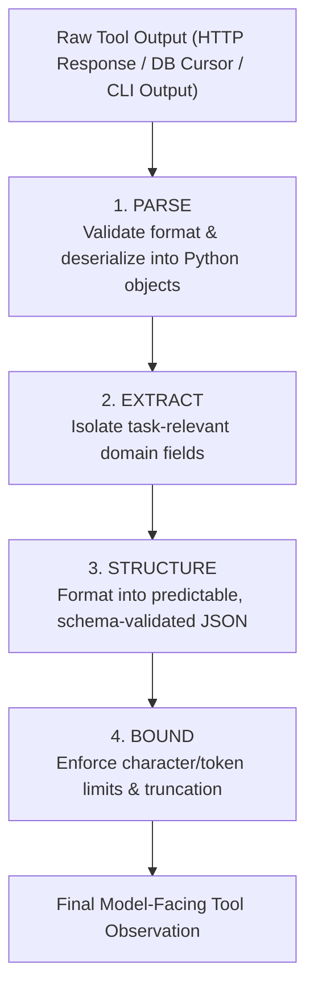
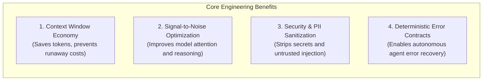
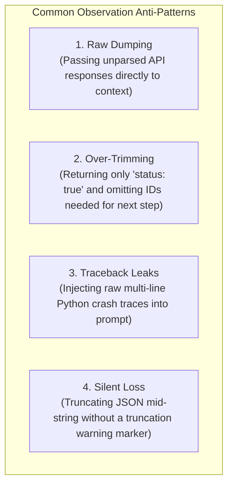

# Unit 1.4: Observation Processing & Context Formatting

> **Core Question:**  
> *"How should an agent runtime transform raw environment payloads into the smallest, most informative representation for the model's next decision?"*

---

## Learning Objectives

By the end of this unit, you will be able to:
1. Explain why forwarding raw tool outputs directly to an LLM degrades reasoning, blows up token costs, and creates security vulnerabilities.
2. Implement the 4-stage **Observation Processing Pipeline** (*Parse $\rightarrow$ Extract $\rightarrow$ Structure $\rightarrow$ Bound*).
3. Design structured, schema-validated observation payloads for both successful tool runs and recoverable errors.
4. Distinguish between **Observation Processing** (context economy) and **Environment Grounding** (state verification).
5. Apply context-window bounding techniques (field filtering, pagination, structured truncation) to maintain high signal-to-noise ratios.

---

## 1. What Is an Observation?

An **observation** is the structured information returned to the agent's context window following a tool execution or environment query.

```mermaid
flowchart LR
    Model["LLM (Model Decision)"] -->|1. Tool Call Proposal| Runtime["Application Runtime"]
    Runtime -->|2. Executes Function| Tool["Tool Execution"]
    Tool -->|3. Raw Result (JSON/HTML/Logs)| ObsEngine["Observation Engine<br/><i>(Parse → Extract → Structure → Bound)</i>"]
    ObsEngine -->|4. Clean Observation| Runtime
    Runtime -->|5. Tool Message Context| Model
```

An observation is **not** simply whatever string or JSON object the external API happens to return. Raw environment outputs are designed for backend services and debugging, whereas agent observations must be optimized specifically to support the model's next reasoning step.

### Example: Raw Output vs. Agent Observation

Consider querying an enterprise billing service:

#### Raw API Response ($1.2\text{ KB}$, $350\text{ tokens}$):
```json
{
  "status": 200,
  "headers": {
    "x-request-id": "req_99214b_east",
    "x-ratelimit-remaining": 492,
    "server": "nginx/1.24.0",
    "set-cookie": ["session_id=abc9821; Secure; HttpOnly"]
  },
  "body": {
    "customer_id": "CUS-402",
    "invoice_id": "INV-8831",
    "status": "PAID",
    "amount_cents": 14999,
    "currency": "USD",
    "created_at": "2026-08-10T14:22:31Z",
    "settlement_batch_id": "batch_98124_shard_3",
    "internal_routing_key": "prod_v4_cluster_b"
  }
}
```

#### Processed Agent Observation ($120\text{ bytes}$, $35\text{ tokens}$):
```json
{
  "status": "success",
  "data": {
    "invoice_id": "INV-8831",
    "status": "PAID",
    "amount": 149.99,
    "currency": "USD"
  }
}
```

By filtering out HTTP headers, internal shard keys, and cookie metadata, the observation engine achieved a **$90\%$ token reduction** while increasing the model's reasoning clarity.

---

## 2. Raw Output vs. Agent Observation

| Dimension | Raw Environment Output | Processed Agent Observation |
| :--- | :--- | :--- |
| **Primary Audience** | Software engineers, network proxies, debuggers | The LLM's next reasoning step |
| **Field Scope** | Every field in the database table or API schema | Only fields relevant to the agent's current task |
| **Size & Limits** | Unbounded (could be $10\text{ MB}$ logs or $5,000$ rows) | Strictly bounded (capped character/token budgets) |
| **Noise Level** | High (infrastructure IDs, headers, timestamps) | Minimal (high signal-to-noise ratio) |
| **Security Surface** | May leak API keys, PII, or internal network topologies | Sanitized of credentials and private metadata |

> [!IMPORTANT]
> **Observation Design Principle:**  
> *"Don't send the entire raw tool result to the LLM just because you received it. Parse the response, extract task-relevant fields, structure the payload, and enforce strict size bounds."*

---

## 3. The 4-Stage Observation Pipeline

A production observation engine processes raw environment output through four sequential stages:



### Stage 1: Parse
Safely convert raw bytes, strings, or HTTP status codes into deserialized runtime objects. Never assume external APIs return valid JSON:
```python
try:
    payload = response.json()
except Exception as e:
    return format_error_observation("PARSING_ERROR", f"Failed to decode API JSON: {str(e)}")
```

### Stage 2: Extract
Select only the specific fields required for subsequent decisions. Strip out routing headers, debug traces, and irrelevant relationships:
```python
TARGET_FIELDS = ["order_id", "status", "tracking_number", "estimated_delivery"]
extracted = {k: payload["data"][k] for k in TARGET_FIELDS if k in payload.get("data", {})}
```

### Stage 3: Structure
Map the extracted fields into a consistent, predictable schema (e.g., standardizing currency amounts from cents to decimal dollars).

### Stage 4: Bound
Enforce hard character or token limits on the serialized string to prevent context window explosion:
```python
MAX_OBSERVATION_CHARS = 1500
serialized = json.dumps({"status": "success", "data": extracted})
if len(serialized) > MAX_OBSERVATION_CHARS:
    serialized = serialized[:MAX_OBSERVATION_CHARS] + "... [Observation Truncated]"
```

---

## 4. Why Observation Processing Matters



### 1. Context Window Economy
In multi-turn agent loops (e.g., $5$ turns), prompt tokens accumulate quadratically:

$$\text{Total Tokens} \approx \sum_{t=1}^{T} (\text{Prompt}_0 + t \times \text{Turn Overhead})$$

Sending raw $5\text{ KB}$ API payloads on every turn causes the context window to inflate rapidly, triggering rate limits and skyrocketing API costs.

### 2. Signal-to-Noise Ratio & Attention Degradation
Research on LLM needle-in-a-haystack retrieval shows that as irrelevant context increases, model reasoning accuracy on specific constraints drops significantly. Concise observations keep the model focused on relevant facts.

### 3. Security Boundary & PII Filtering
External systems may inadvertently return access tokens, passwords, database connection strings, or customer PII. The observation engine acts as an egress security filter before data enters the model context.

---

## 5. Standardized Observation Schema

Production agents must receive observations formatted according to a predictable, strongly-typed schema for both successes and errors:

```python
from pydantic import BaseModel
from typing import Dict, Any, Optional

class ObservationPayload(BaseModel):
    status: str  # "success" or "error"
    data: Optional[Dict[str, Any]] = None
    error_type: Optional[str] = None
    message: Optional[str] = None

# Success Payload Example:
# {"status": "success", "data": {"order_id": "ORD-9921", "status": "SHIPPED"}}

# Error Payload Example:
# {"status": "error", "error_type": "RESOURCE_NOT_FOUND", "message": "Order ORD-9921 was not found in database."}
```

### Why Structured Errors Are Essential:
When a tool fails (e.g., database timeout or record not found), never pass a raw Python traceback (`Traceback (most recent call last)...`) to the model. Structured error observations allow the model to autonomously determine whether to:
1. Re-try with different arguments.
2. Ask the user for clarification.
3. Fall back to an alternative tool.

---

## 6. Complete Python Observation Engine Implementation

Here is a complete, framework-free implementation of the *Parse $\rightarrow$ Extract $\rightarrow$ Structure $\rightarrow$ Bound* pipeline:

```python
import json
from typing import Dict, Any, List, Optional

def process_environment_observation(
    raw_api_payload: Dict[str, Any],
    target_fields: List[str],
    max_chars: int = 1200
) -> str:
    """
    Production Observation Processing Engine:
    Parse -> Extract -> Structure -> Bound
    """
    
    # 1. Parse & Check Transport Status
    http_status = raw_api_payload.get("status", 200)
    if http_status >= 400:
        error_msg = raw_api_payload.get("error", {}).get("message", "Upstream API error")
        return json.dumps({
            "status": "error",
            "error_type": f"HTTP_{http_status}",
            "message": error_msg
        })

    # 2. Extract Task-Relevant Fields
    body = raw_api_payload.get("body", raw_api_payload)
    extracted_data = {}
    
    for field in target_fields:
        if field in body:
            extracted_data[field] = body[field]

    # Handle case where none of the target fields matched
    if not extracted_data and body:
        # Fallback: preserve top-level keys if within reasonable length
        extracted_data = {k: v for k, v in list(body.items())[:5]}

    # 3. Structure Observation
    structured_payload = {
        "status": "success",
        "data": extracted_data
    }

    # 4. Bound Payload
    serialized = json.dumps(structured_payload)
    if len(serialized) > max_chars:
        serialized = serialized[:max_chars] + "... [Observation Truncated]"

    return serialized
```

---

## 7. Common Observation Processing Anti-Patterns



1. **The Raw Dump:** Passing `json.dumps(api_response)` directly into `messages.append({"role": "tool", "content": ...})`.
2. **The Information Black Hole:** Returning only `{"success": true}` when the model needs the resulting `tracking_id` to complete the next step.
3. **Traceback Pollution:** Injecting 50 lines of Python stack traces into the model context when a tool raises an unhandled exception.
4. **Unmarked Truncation:** Chopping a string at 500 characters without appending `[Truncated]`, causing the model to mistake truncated JSON for malformed syntax.

---

## 8. Summary & Unit Cheat Sheet

```
┌──────────────────────────────────────────────────────────────────────────────────────────┐
│                           OBSERVATION PROCESSING CHEAT SHEET                             │
├──────────────────────────┬───────────────────────────────────────────────────────────────┤
│ The Cardinal Rule        │ "Don't send raw tool results to the model; parse, extract,    │
│                          │  structure, and bound all environment observations."          │
├──────────────────────────┼───────────────────────────────────────────────────────────────┤
│ 4-Stage Pipeline         │ 1. Parse (Validate types & deserialization)                   │
│                          │ 2. Extract (Select task-relevant domain fields)               │
│                          │ 3. Structure (Format into standard success/error schemas)     │
│                          │ 4. Bound (Enforce hard character & token size limits)         │
├──────────────────────────┼───────────────────────────────────────────────────────────────┤
│ Standard Success Schema  │ {"status": "success", "data": {...}}                          │
│ Standard Error Schema    │ {"status": "error", "error_type": "...", "message": "..."}   │
└──────────────────────────┴───────────────────────────────────────────────────────────────┘
```

---

## Research & Reference Foundations

* **Anthropic — *Building Effective Agents*:**  
  [Agent-Computer Interface & Tool Design](https://www.anthropic.com/engineering/building-effective-agents) — Best practices for concise tool descriptions and structured error observations.
* **OpenAI — *A Practical Guide to Building AI Agents*:**  
  [Context & Tool Response Handling](https://openai.com/business/guides-and-resources/a-practical-guide-to-building-ai-agents/) — Managing token budgets and context boundaries during multi-turn agent runs.
