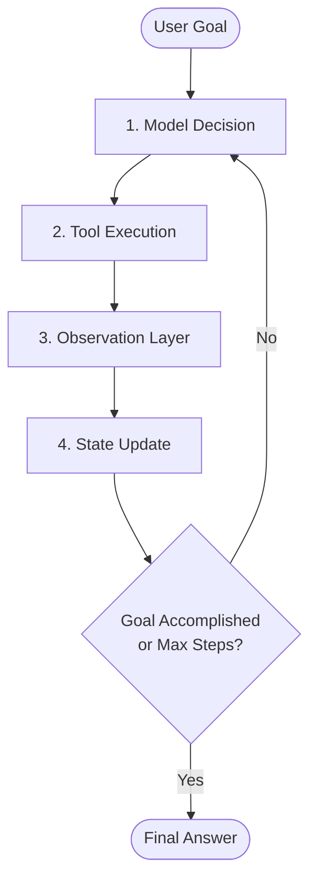
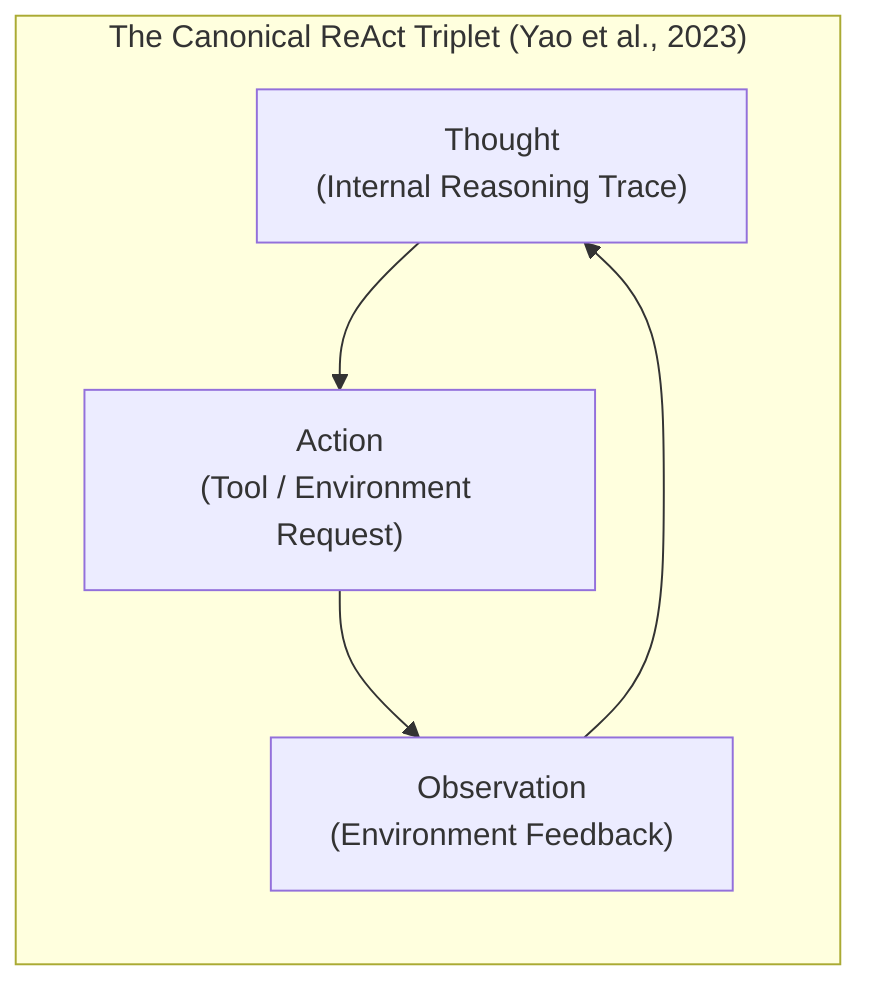
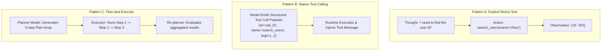
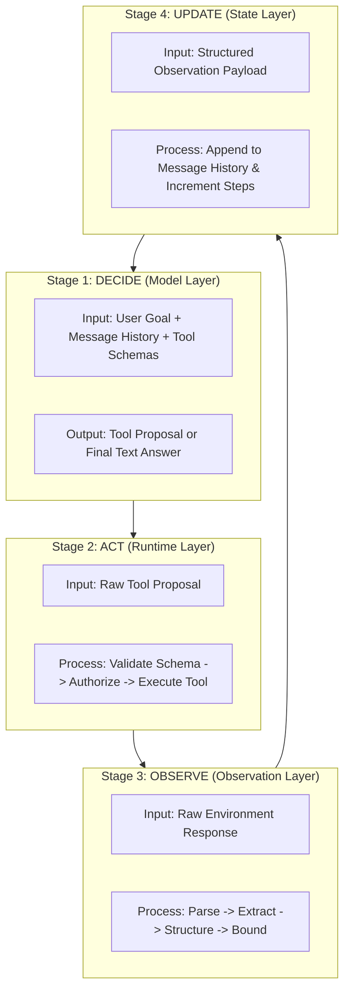

# Unit 1.5: Execution Patterns — ReAct & Beyond

> **Core Question:**  
> *"How do agents interleave reasoning and acting, and what are the major architectural execution patterns in modern agentic systems?"*

---

## Learning Objectives

By the end of this unit, you will be able to:
1. Explain the theoretical foundations of the **ReAct** prompting architecture (Yao et al., ICLR 2023).
2. Compare the three primary agent execution patterns: **Pattern A (Explicit ReAct Text)**, **Pattern B (Native Tool Calling)**, and **Pattern C (Plan-and-Execute)**.
3. Understand why modern models with native function-calling achieve ReAct dynamics without mandatory text `Thought:` tokens.
4. Implement a framework-free **Decide $\rightarrow$ Act $\rightarrow$ Observe $\rightarrow$ Update** control loop in pure Python 3.11+.
5. Structure observable execution traces for debugging, evaluation, and trajectory inspection.

---

## 1. Why We Need Iterative Execution

A single-shot LLM invocation follows a static input-to-output pipeline:

$$\text{User Prompt} \longrightarrow \mathbf{LLM} \longrightarrow \text{Final Output}$$

This works well when all required information is already present in the prompt. However, for multi-step tasks that require inspecting external state (e.g., *“Find order ORD-402, check if it has shipped, and if not, update the shipping address”*), the model cannot solve the problem in a single pass.

The system requires an iterative control loop where the model can:
1. Formulate an action.
2. Execute the action in the environment.
3. Receive the environment's observation.
4. Use that observation to decide the next step.



---

## 2. ReAct: Synergizing Reasoning and Acting

Introduced by Yao et al. at ICLR 2023, **ReAct** (*Reasoning + Acting*) is a prompting framework that unified two previously separate lines of AI research:

1. **Reasoning-Only (Chain-of-Thought):** The model generates internal reasoning traces (`Thought: ...`), but has no access to external tools or real-time environment data, leading to factual hallucinations.
2. **Acting-Only:** The model emits API calls directly without explaining its rationale, resulting in brittle plans that cannot adjust when unexpected errors occur.



### The Primary Contribution of ReAct:
By interleaving reasoning traces with environment actions, the model dynamically grounds its reasoning in external facts discovered during execution. The original ReAct research demonstrated significant improvements in task accuracy and substantial reductions in hallucination across complex benchmarks (HotpotQA, FEVER, ALFWorld, WebShop).

> [!NOTE]
> **Course Engineering Model vs. Academic Paper:**  
> The original ReAct paper specifies a 3-step loop: `Thought → Action → Observation`.  
> In production software engineering, we represent this as a 4-stage lifecycle: **Decide $\rightarrow$ Act $\rightarrow$ Observe $\rightarrow$ Update**, explicitly acknowledging the runtime's role in state management.

---

## 3. The 3 Primary Execution Patterns

Modern agent architectures implement one of three distinct execution patterns depending on task complexity and model capabilities:



### Comparative Execution Pattern Matrix

| Dimension | Pattern A: Explicit ReAct Text | Pattern B: Native Tool Calling | Pattern C: Plan-and-Execute |
| :--- | :--- | :--- | :--- |
| **Mechanics** | Model outputs explicit text tokens: `Thought: ... Action: ...` | Model outputs structured tool call JSON via API grammar constraints | Planner creates full plan array; Worker executes steps sequentially |
| **Reasoning Visibility** | Exposed in prompt text stream | Hidden within model or exposed via reasoning tokens | Explicit high-level plan decomposition |
| **Parsing Complexity** | High (Regex parsing of `Thought:` and `Action:` strings) | Low (Native API JSON deserialization) | Moderate (Plan schema + execution tracking) |
| **Tool Calling Reliability** | Moderate (Prone to markdown formatting errors) | High (Guaranteed structured JSON parameters) | High for deterministic sub-tasks |
| **Best Used For** | Text-only models, legacy models, prompt-based agents | Modern enterprise production agents (OpenAI, Claude, Gemini) | Complex multi-step tasks with predictable dependencies |

> [!IMPORTANT]
> **Modern Industry Standard:**  
> *"In production systems with modern LLMs (GPT-4o, Claude 3.5, Gemini 1.5/2.0), **Pattern B (Native Tool Calling)** is the industry standard. The model performs internal reasoning and directly emits structured JSON tool calls, eliminating fragile text regex parsing while preserving the exact iterative feedback benefits of ReAct."*

---

## 4. The 4 Stages of the Agent Control Loop



### Stage 1: Decide (Model Layer)
The model receives the cumulative context (system prompt, user goal, past tool calls, and observations) and determines whether to request another tool or emit a final response.

### Stage 2: Act (Runtime Layer)
The runtime validates arguments against Pydantic schemas, verifies caller authorization, and executes the underlying tool code against the environment.

### Stage 3: Observe (Observation Layer)
The observation engine converts the raw environment payload into a bounded, structured observation (`{"status": "success", "data": {...}}`).

### Stage 4: Update (State Layer)
The runtime appends the observation message to the conversation history, updates step counters, and passes the updated state into the next turn.

---

## 5. Pure Python 3.11+ Framework-Free Control Loop

Here is a clean, production-ready implementation of a native tool-calling control loop without third-party agent frameworks:

```python
import json
import logging
from typing import List, Dict, Any, Optional
from pydantic import BaseModel, Field

logging.basicConfig(level=logging.INFO)
logger = logging.getLogger("ReActLoop")

class ToolExecutionResult(BaseModel):
    status: str
    data: Optional[Dict[str, Any]] = None
    error_type: Optional[str] = None
    message: Optional[str] = None

class MinimalAgentRunner:
    """Framework-free agent runtime implementing the Decide-Act-Observe-Update loop."""
    
    def __init__(self, model_client, tool_registry: Dict[str, Any], max_steps: int = 5):
        self.client = model_client
        self.tool_registry = tool_registry
        self.max_steps = max_steps

    def run(self, user_goal: str) -> str:
        messages: List[Dict[str, Any]] = [
            {"role": "system", "content": "You are a helpful assistant. Solve the user's task step-by-step using tools."},
            {"role": "user", "content": user_goal}
        ]

        step = 0
        while step < self.max_steps:
            step += 1
            logger.info(f"--- Iteration {step}/{self.max_steps} ---")

            # 1. DECIDE: Invoke Model
            response = self.client.chat_completion(messages=messages)
            messages.append(response.message_dict)

            # Check if model reached terminal answer
            tool_calls = response.message_dict.get("tool_calls", [])
            if not tool_calls:
                logger.info("Model produced final answer. Terminating run.")
                return response.message_dict.get("content", "")

            # 2. ACT & 3. OBSERVE: Process Tool Proposals
            for call in tool_calls:
                tool_name = call["function"]["name"]
                raw_args = call["function"]["arguments"]

                if tool_name not in self.tool_registry:
                    obs_payload = ToolExecutionResult(
                        status="error",
                        error_type="UNKNOWN_TOOL",
                        message=f"Tool '{tool_name}' does not exist."
                    )
                else:
                    # Execute tool in runtime
                    obs_payload = self.tool_registry[tool_name](raw_args)

                # 4. UPDATE: Append observation to message history
                messages.append({
                    "role": "tool",
                    "tool_call_id": call["id"],
                    "content": obs_payload.model_dump_json()
                })

        return f"Halted: Reached maximum turn limit ({self.max_steps})."
```

> [!NOTE]
> **Validation of Architecture:**  
> The framework-free control loop implemented above is the exact architectural pattern codified by modern enterprise SDKs (such as the OpenAI Agents SDK and LangGraph's `ToolNode` cycle). Building it from scratch gives you full mastery over the mechanics before adopting higher-level orchestration tools.

---

## 6. Structuring Observable Execution Traces

To debug and evaluate agent performance in production, every run should emit a structured **Execution Trajectory**:

```json
{
  "run_id": "run_0912a",
  "goal": "Check invoice INV-8831 and return payment status",
  "trajectory": [
    {
      "step": 1,
      "phase": "DECIDE",
      "model_decision": "Call get_invoice(invoice_id='INV-8831')"
    },
    {
      "step": 1,
      "phase": "ACT",
      "tool_name": "get_invoice",
      "arguments": {"invoice_id": "INV-8831"}
    },
    {
      "step": 1,
      "phase": "OBSERVE",
      "observation": {"status": "success", "data": {"invoice_id": "INV-8831", "status": "PAID", "amount": 149.99}}
    },
    {
      "step": 2,
      "phase": "DECIDE",
      "model_decision": "Emit final answer: Invoice INV-8831 has been paid in full ($149.99)."
    }
  ],
  "final_status": "SUCCESS"
}
```

---

## 7. Summary & Unit Cheat Sheet

```
┌──────────────────────────────────────────────────────────────────────────────────────────┐
│                             EXECUTION PATTERNS CHEAT SHEET                               │
├──────────────────────────┬───────────────────────────────────────────────────────────────┤
│ The ReAct Principle      │ Interleaving reasoning with environment actions grounds the   │
│                          │ model in external truth and dramatically cuts hallucinations. │
├──────────────────────────┼───────────────────────────────────────────────────────────────┤
│ Pattern A (ReAct Text)   │ Explicit Thought: -> Action: -> Observation: text tokens.     │
│ Pattern B (Native Tools) │ Modern standard: Structured JSON tool calling via API.        │
│ Pattern C (Plan & Exec)  │ Upfront plan array generation -> Sequential execution.        │
├──────────────────────────┼───────────────────────────────────────────────────────────────┤
│ 4-Stage Control Loop     │ 1. DECIDE: Model selects next action based on context.        │
│                          │ 2. ACT: Runtime validates, authorizes, & executes tool.       │
│                          │ 3. OBSERVE: Observation engine parses & bounds output.        │
│                          │ 4. UPDATE: State updates & message history accumulates.       │
└──────────────────────────┴───────────────────────────────────────────────────────────────┘
```

---

## Research & Reference Foundations

* **Yao et al. (ICLR 2023):**  
  [*ReAct: Synergizing Reasoning and Acting in Language Models*](https://arxiv.org/abs/2210.03629) — The original research establishing interleaved reasoning traces and actions for interactive decision making.
* **Anthropic Engineering:**  
  [*Building Effective Agents*](https://www.anthropic.com/engineering/building-effective-agents) — Workflows vs. autonomous agents, tool use, and evaluation-driven design.
* **OpenAI Developer Guides:**  
  [*Function Calling & Tool Use*](https://platform.openai.com/docs/guides/function-calling) — Native tool calling mechanics and structured outputs.
