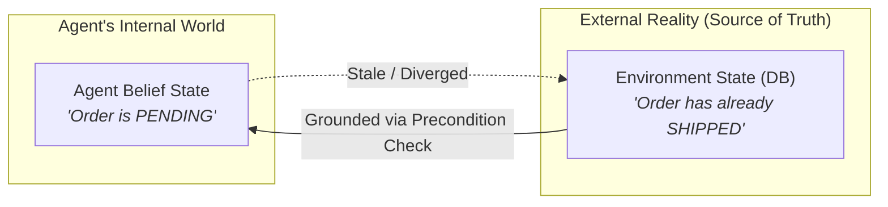
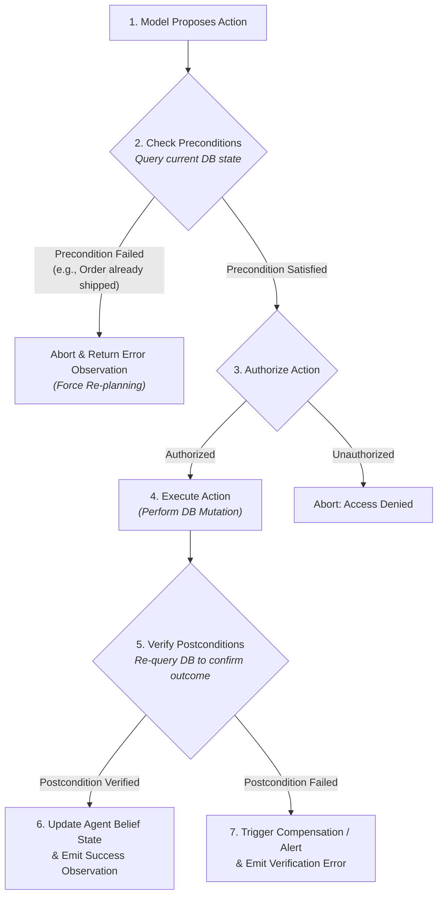
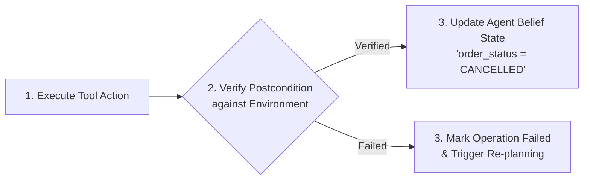
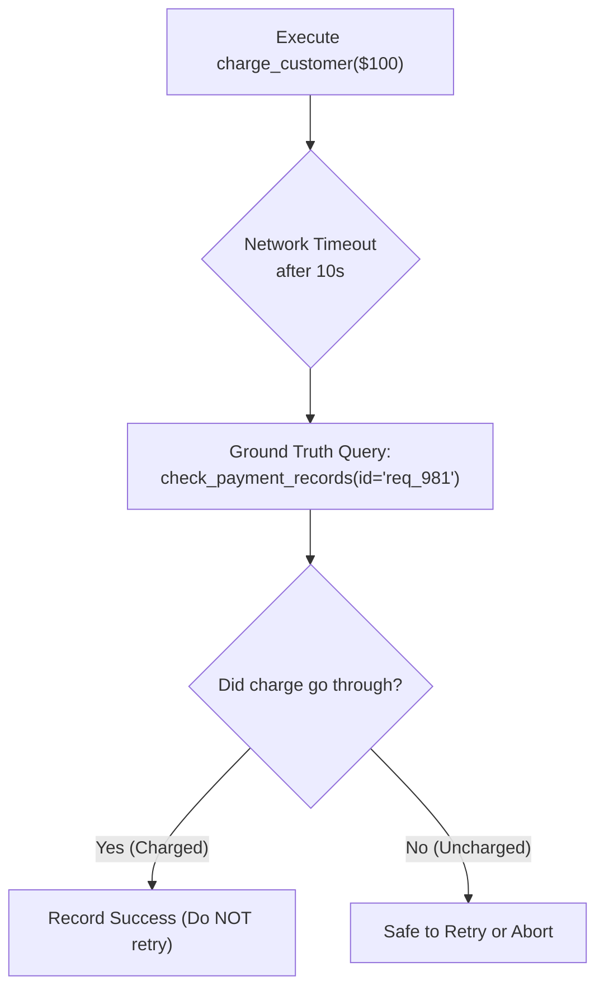

# Unit 1.6: Precondition $\rightarrow$ Action $\rightarrow$ Postcondition Verification

> **Core Question:**  
> *"How does an agent ensure that an action is valid before execution, and how does it verify that the intended state change actually occurred afterward?"*

---

## Learning Objectives

By the end of this unit, you will be able to:
1. Explain why relying on stale agent beliefs causes invalid, destructive, or redundant state mutations.
2. Implement the **Precondition $\rightarrow$ Action $\rightarrow$ Postcondition Verification Cycle** for state-mutating tools.
3. Differentiate between transport-level success (HTTP `200 OK`) and business-level outcome verification.
4. Design environment grounding checks for idempotent vs. non-idempotent operations (handling timeouts safely).
5. Update agent belief state strictly upon receiving verified postcondition evidence.

---

## 1. Agent Belief vs. Environment Truth

An autonomous agent maintains an internal representation of the task in its context window (its **Belief State**):

```python
# Internal Agent Belief (in context window):
agent_belief = {
    "order_id": "ORD-9921",
    "status": "PENDING"
}
```

However, internal beliefs carry **zero guarantee** of external reality. In production systems:
* A customer may have cancelled the order on a mobile app 30 seconds ago.
* A payment processor may have flagged the account for fraud.
* A background cron worker may have already shipped the inventory item.



> [!IMPORTANT]
> **The Cardinal Grounding Principle:**  
> *"Agent state is an internal belief; external environment state is the source of truth. An agent must never execute state-mutating actions based solely on cached or assumed beliefs without validating current ground truth."*

*(Note: While Anthropic's engineering guidelines emphasize tool use and simple auditable traces, the specific Precondition $\rightarrow$ Action $\rightarrow$ Postcondition pattern taught here is a **course engineering practice** designed for high-reliability systems).*

---

## 2. The Verification Cycle

For any state-mutating operation, the runtime must execute the **Precondition $\rightarrow$ Action $\rightarrow$ Postcondition Verification Cycle**:



---

## 3. Step 1: Precondition Checks

A **precondition** is a logical predicate that must evaluate to `True` in the external environment immediately prior to executing an action.

### Common Preconditions by Domain:
* **Order Management:** The order exists, is in `PENDING` state, and has not yet been marked `SHIPPED`.
* **Inventory Allocation:** Available quantity in the warehouse is $\ge$ requested quantity.
* **Financial Transfers:** Source account balance $\ge$ transfer amount + transaction fee.

```python
def check_order_cancellation_preconditions(order_id: str, db_client) -> tuple[bool, str]:
    """Precondition Check: Queries ground truth before executing mutation."""
    actual_order = db_client.get_order(order_id)
    
    if not actual_order:
        return False, f"Precondition Error: Order '{order_id}' does not exist in database."
        
    if actual_order["status"] == "CANCELLED":
        return False, f"Precondition Notice: Order '{order_id}' is already CANCELLED. No action needed."
        
    if actual_order["status"] == "SHIPPED":
        return False, f"Precondition Abort: Order '{order_id}' has already SHIPPED. Initiate return workflow instead."
        
    return True, ""
```

> [!WARNING]
> **Prompt Instructions Are Not Precondition Checks:**  
> Never rely on a system prompt like *"Do not cancel shipped orders"* as your safety mechanism. The model may hallucinate that an order is pending. Preconditions must be enforced in deterministic Python by querying the database directly.

---

## 4. Step 2: Tool Action Execution

Once preconditions are verified and authorization is confirmed, the runtime executes the actual mutation:

```python
# Execute mutation
db_client.update_order_status(order_id=order_id, new_status="CANCELLED")
```

---

## 5. Step 3: Postcondition Verification

A **postcondition** is a state assertion that must evaluate to `True` in the environment after the action has executed.

### Why HTTP 200 OK Is Insufficient:
A common pitfall is assuming that receiving an HTTP `200 OK` or `{"status": "success"}` from an API proves that the desired business outcome occurred. In distributed systems:
* The API may have merely accepted the request into an asynchronous message queue.
* A downstream database trigger may have rolled back the transaction.
* An eventual consistency delay may mean the record has not yet updated.

```python
def verify_order_cancellation_postcondition(order_id: str, db_client) -> tuple[bool, str]:
    """Postcondition Verification: Re-queries ground truth to confirm mutation."""
    refreshed_order = db_client.get_order(order_id)
    
    if refreshed_order and refreshed_order.get("status") == "CANCELLED":
        return True, "Postcondition Verified: Order status is confirmed CANCELLED in database."
    
    return False, "Postcondition Failure: Order status in database remains uncommitted or unchanged."
```

---

## 6. Updating Belief State Follows Verification

Never update the agent's internal belief state before postcondition verification succeeds:



### The Three Operational Outcomes:

| Outcome | Technical Status | Postcondition Result | Agent Belief State Update |
| :--- | :--- | :--- | :--- |
| **1. Verified Success** | Tool execution succeeded | Postcondition verified `True` | Update belief state to reflect new state |
| **2. Execution Failure** | Tool threw exception / timed out | Not executed | Keep previous belief state; record tool error |
| **3. Verification Failure** | Tool returned `200 OK` | Postcondition returned `False` | Retain original belief; alert operator / re-plan |

---

## 7. Handling Non-Idempotent Operations & Timeouts

Handling timeouts on state-mutating actions requires special care:



If a payment call times out, the agent must **never blindly retry** the charge. It must query the payment gateway for recent transactions to verify ground truth before deciding whether to retry or halt.

---

## 8. Complete Python 3.11+ Grounded Tool Implementation

Here is a complete, production-ready implementation of a grounded order cancellation tool:

```python
from typing import Dict, Any, Tuple
import json

class GroundedOrderManager:
    """Demonstrates Precondition -> Action -> Postcondition verification."""
    
    def __init__(self, database_client):
        self.db = database_client

    def cancel_order(self, order_id: str) -> str:
        # 1. Precondition Verification Gate
        order = self.db.get_order(order_id)
        if not order:
            return json.dumps({
                "status": "error",
                "error_type": "RESOURCE_NOT_FOUND",
                "message": f"Order '{order_id}' does not exist."
            })
            
        if order["status"] == "CANCELLED":
            return json.dumps({
                "status": "error",
                "error_type": "PRECONDITION_FAILED",
                "message": f"Order '{order_id}' is already CANCELLED."
            })
            
        if order["status"] == "SHIPPED":
            return json.dumps({
                "status": "error",
                "error_type": "PRECONDITION_FAILED",
                "message": f"Order '{order_id}' has already SHIPPED and cannot be cancelled."
            })

        # 2. Execute Action
        try:
            self.db.set_status(order_id, "CANCELLED")
        except Exception as e:
            return json.dumps({
                "status": "error",
                "error_type": "EXECUTION_FAILURE",
                "message": f"Database mutation failed: {str(e)}"
            })

        # 3. Postcondition Verification Gate
        verified_order = self.db.get_order(order_id)
        if verified_order and verified_order.get("status") == "CANCELLED":
            return json.dumps({
                "status": "success",
                "data": {
                    "order_id": order_id,
                    "status": "CANCELLED",
                    "verification": "POSTCONDITION_VERIFIED"
                }
            })
        else:
            return json.dumps({
                "status": "error",
                "error_type": "POSTCONDITION_VERIFICATION_FAILED",
                "message": f"Cancellation request sent, but database state verification failed for '{order_id}'."
            })
```

---

## 9. Summary & Unit Cheat Sheet

```
┌──────────────────────────────────────────────────────────────────────────────────────────┐
│                             ENVIRONMENT GROUNDING CHEAT SHEET                            │
├──────────────────────────┬───────────────────────────────────────────────────────────────┤
│ The Cardinal Rule        │ "Agent state is an internal belief; the environment is the   │
│                          │  source of truth."                                            │
├──────────────────────────┼───────────────────────────────────────────────────────────────┤
│ Precondition Gate        │ Check ground truth BEFORE executing any mutation.             │
│ Postcondition Gate       │ Verify ground truth AFTER executing before updating belief.  │
├──────────────────────────┼───────────────────────────────────────────────────────────────┤
│ 3 Operational Outcomes   │ 1. Verified Success (Postcondition True -> Update State)      │
│                          │ 2. Action Failure (API error / Timeout)                       │
│                          │ 3. Verification Failure (API success, but state unverified)   │
├──────────────────────────┼───────────────────────────────────────────────────────────────┤
│ Timeout Recovery         │ On timeout, re-query ground truth; NEVER blindly retry        │
│                          │ non-idempotent operations.                                    │
└──────────────────────────┴───────────────────────────────────────────────────────────────┘
```

---

## Research & Reference Foundations

* **Russell & Norvig — *AIMA* (Chapter 2 & 11):**  
  [Intelligent Agents & Classical Planning](https://aima.cs.berkeley.edu/) — Preconditions and effects in action schemas (STRIPS / PDDL foundations).
* **Anthropic — *Building Effective Agents*:**  
  [Engineering Reliable Agents](https://www.anthropic.com/engineering/building-effective-agents) — Importance of environment feedback, tool contracts, and verifiable execution.
