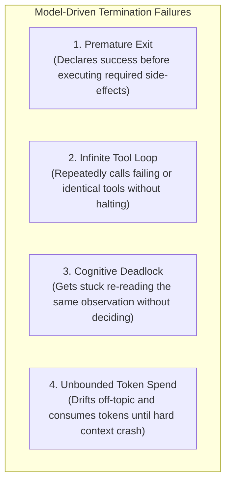
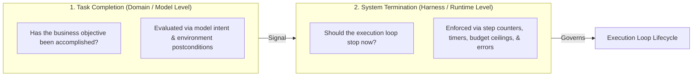
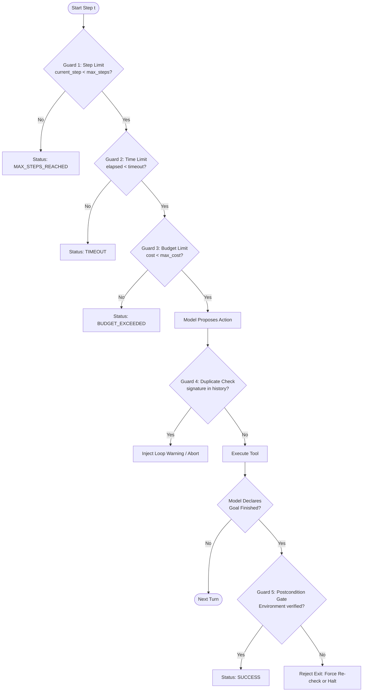
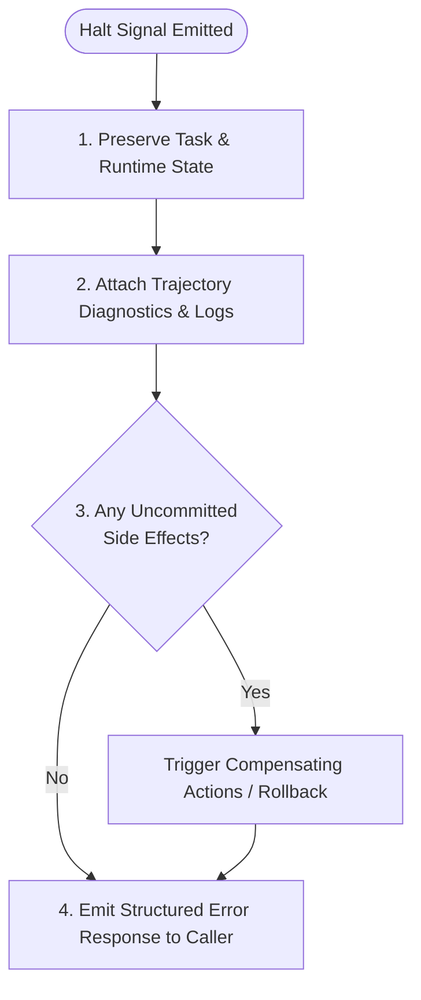

# Unit 1.7: First-Class Deterministic Termination Controls

> **Core Question:**  
> *"Why is 'the LLM said I'm done' an insufficient termination mechanism, and how do we build deterministic runtime exit controls?"*

---

## Learning Objectives

By the end of this unit, you will be able to:
1. Explain why model-driven self-termination fails in production environments (premature completion, infinite loops, and cognitive deadlocks).
2. Distinguish between **Task Completion** (semantic goal satisfaction) and **System Termination** (runtime lifecycle management).
3. Implement a complete set of **First-Class Termination Status Enums** (`RUNNING`, `SUCCESS`, `MAX_STEPS_REACHED`, `TIMEOUT`, `BUDGET_EXCEEDED`, `UNRECOVERABLE_ERROR`, `USER_ABORTED`).
4. Engineer the **5 Deterministic Termination Guards** in pure Python (step caps, wall-clock timeouts, cost budgets, action signature deduplication, and postcondition verification gates).
5. Structure agent return payloads to preserve partial state, execution diagnostics, and recovery context when runs terminate abnormally.

---

## 1. The Fallacy of Model-Driven Self-Termination

A common anti-pattern in early agent design is delegating termination control entirely to the language model:

```python
# ANTI-PATTERN: Relying exclusively on model output for termination
while True:
    response = call_llm(messages)
    if "I have finished the task" in response.text:
        break  # DANGEROUS: Fragile, non-deterministic, unbounded
    execute_tool(response.tool_call)
```

In production, models exhibit several failure modes when tasked with managing their own termination:



### Key Failure Modes in Detail:
1. **Premature Exit (Hallucinated Completion):** The model emits text asserting that an order was cancelled or an invoice was updated, even though it never executed the underlying tool or the tool returned an error.
2. **Infinite Tool Loops (Action Cycling):** When a tool returns an unexpected error (e.g., `404 Not Found` or `429 Rate Limit`), the model may re-issue the exact same tool call with identical arguments on every subsequent turn.
3. **Cognitive Deadlock (Observation Paralysis):** When given complex or contradictory observations, the model may oscillate between alternative actions without ever reaching a terminal state.
4. **Context Window Exhaustion:** Without hard turn boundaries, an agent can iterate until it exceeds the model's context window, causing an abrupt runtime crash without clean state preservation.

> [!IMPORTANT]
> **Engineering Rule:**  
> *"The LLM proposes actions and semantic conclusions; deterministic software enforces lifecycle termination, execution limits, and ground truth verification."*

---

## 2. Task Completion vs. System Termination

To design robust agent runtimes, we must decouple two distinct concepts:



### Comparison Matrix

| Dimension | Task Completion (Domain Level) | System Termination (Runtime Level) |
| :--- | :--- | :--- |
| **Governing Layer** | Model semantic reasoning & environment state | Deterministic execution harness (Python runtime) |
| **Evaluation Criteria** | Was the order refunded? Was the bug fixed? Was the report generated? | Have we hit step 10? Did we time out at 30s? Did a tool crash? |
| **Possible States** | `SATISFIED`, `UNSATISFIED`, `PARTIALLY_SATISFIED` | `RUNNING`, `SUCCESS`, `MAX_STEPS_REACHED`, `TIMEOUT`, `ERROR` |
| **Authority** | Model proposes; postcondition validator checks | Runtime unconditionally halts execution |

---

## 3. First-Class Termination Status Enums

Never use raw strings or generic booleans (`is_done: bool`) to represent run termination. Use an explicit, strongly-typed **Termination Status Enum**:

```python
from enum import Enum

class TerminationStatus(str, Enum):
    """Explicit lifecycle status for an agent run."""
    RUNNING = "RUNNING"
    SUCCESS = "SUCCESS"
    MAX_ITERATIONS_REACHED = "MAX_ITERATIONS_REACHED"  # Also referred to as MAX_STEPS_REACHED
    TIMEOUT = "TIMEOUT"
    BUDGET_EXCEEDED = "BUDGET_EXCEEDED"
    UNRECOVERABLE_ERROR = "UNRECOVERABLE_ERROR"
    USER_CANCELLED = "USER_CANCELLED"  # Also referred to as USER_ABORTED
```

### Status Descriptions & Triggers

| Status Enum | Classification | Trigger Condition |
| :--- | :--- | :--- |
| `RUNNING` | Active | The control loop is currently executing. |
| `SUCCESS` | Normal Exit | The model completed its goal AND external postconditions (if required) were verified. |
| `MAX_ITERATIONS_REACHED` | Bounded Halt | The loop reached `current_step >= max_steps` without final completion. |
| `TIMEOUT` | Bounded Halt | The wall-clock duration exceeded `timeout_seconds`. |
| `BUDGET_EXCEEDED` | Bounded Halt | Total accumulated token count or financial cost exceeded predefined threshold. |
| `UNRECOVERABLE_ERROR` | Error Exit | An unhandled system exception, schema corruption, or authentication failure occurred. |
| `USER_CANCELLED` | External Halt | A human operator or upstream service cancelled the execution run. |

---

## 4. The 5 Deterministic Termination Guards

A production agent runtime must implement **five defense-in-depth termination guards** inside the control loop:



### Guard 1: Step & Iteration Caps
Every autonomous loop must have a hard maximum turn limit (typically $3$ to $10$ for single-agent tasks):
```python
if runtime_state.current_step >= runtime_state.max_steps:
    runtime_state.status = TerminationStatus.MAX_ITERATIONS_REACHED
```

### Guard 2: Wall-Clock Execution Deadlines
Prevent network hangs or slow APIs from keeping threads alive indefinitely:
```python
elapsed = time.monotonic() - runtime_state.start_time
if elapsed > runtime_state.timeout_seconds:
    runtime_state.status = TerminationStatus.TIMEOUT
```

### Guard 3: Token & Cost Budget Ceilings
Track cumulative prompt and completion tokens across every model invocation:
```python
if runtime_state.total_tokens > runtime_state.max_token_budget:
    runtime_state.status = TerminationStatus.BUDGET_EXCEEDED
```

### Guard 4: Action Signature Deduplication
To break infinite cycles where an agent calls the identical tool with identical parameters repeatedly:
```python
action_signature = f"{tool_name}:{json.dumps(tool_args, sort_keys=True)}"
if action_signature in runtime_state.action_signature_history:
    # Option A: Inject error observation into context
    # Option B: Abort after N identical attempts
    runtime_state.duplicate_count += 1
    if runtime_state.duplicate_count >= 3:
        runtime_state.status = TerminationStatus.UNRECOVERABLE_ERROR
else:
    runtime_state.action_signature_history.add(action_signature)
```

### Guard 5: Ground Truth Postcondition Verification Gate
If a task requires an external mutation (e.g., updating a database record), the harness must check the database before accepting `SUCCESS`:
```python
if not message.tool_calls:
    if required_postcondition_checker and not required_postcondition_checker():
        # Model claims it is done, but external reality disagrees
        task_state.messages.append({
            "role": "user", 
            "content": "Verification Error: Target state is not reflected in database. Please verify and complete the task."
        })
        continue  # Force another turn or halt
    runtime_state.status = TerminationStatus.SUCCESS
```

---

## 5. Pure Python 3.11+ Deterministic Termination Harness

Here is a complete, framework-free implementation demonstrating all five termination guards:

```python
import time
import json
import logging
from typing import List, Dict, Any, Optional, Callable
from pydantic import BaseModel, Field
from enum import Enum

logging.basicConfig(level=logging.INFO)
logger = logging.getLogger("TerminationHarness")

class TerminationStatus(str, Enum):
    RUNNING = "RUNNING"
    SUCCESS = "SUCCESS"
    MAX_ITERATIONS_REACHED = "MAX_ITERATIONS_REACHED"
    TIMEOUT = "TIMEOUT"
    BUDGET_EXCEEDED = "BUDGET_EXCEEDED"
    UNRECOVERABLE_ERROR = "UNRECOVERABLE_ERROR"
    USER_CANCELLED = "USER_CANCELLED"

class RuntimeExecutionState(BaseModel):
    current_step: int = 0
    max_steps: int = 5
    timeout_seconds: float = 30.0
    start_time: float = Field(default_factory=time.monotonic)
    total_tokens: int = 0
    max_token_budget: int = 8000
    status: TerminationStatus = TerminationStatus.RUNNING
    action_signature_history: set[str] = Field(default_factory=set)
    termination_reason: Optional[str] = None

class AgentTaskState(BaseModel):
    user_goal: str
    messages: List[Dict[str, Any]] = Field(default_factory=list)
    final_answer: Optional[str] = None

class DeterministicTerminationHarness:
    """Production runtime harness enforcing deterministic lifecycle bounds."""
    
    def __init__(self, model_caller: Callable, tool_executor: Callable):
        self.model_caller = model_caller
        self.tool_executor = tool_executor

    def run(
        self, 
        user_goal: str, 
        max_steps: int = 5, 
        timeout_seconds: float = 30.0,
        postcondition_verifier: Optional[Callable[[], bool]] = None
    ) -> tuple[AgentTaskState, RuntimeExecutionState]:
        
        task_state = AgentTaskState(user_goal=user_goal)
        runtime_state = RuntimeExecutionState(
            max_steps=max_steps, 
            timeout_seconds=timeout_seconds,
            start_time=time.monotonic()
        )
        
        task_state.messages = [
            {"role": "system", "content": "You are a helpful assistant. Use tools when needed."},
            {"role": "user", "content": user_goal}
        ]

        logger.info(f"Starting agent run for goal: '{user_goal}'")

        # Deterministic Control Loop
        while runtime_state.status == TerminationStatus.RUNNING:
            
            # Guard 1: Step Limit Check
            if runtime_state.current_step >= runtime_state.max_steps:
                runtime_state.status = TerminationStatus.MAX_ITERATIONS_REACHED
                runtime_state.termination_reason = f"Halted: Reached maximum step limit ({runtime_state.max_steps})."
                break

            # Guard 2: Wall-Clock Timeout Check
            elapsed_time = time.monotonic() - runtime_state.start_time
            if elapsed_time >= runtime_state.timeout_seconds:
                runtime_state.status = TerminationStatus.TIMEOUT
                runtime_state.termination_reason = f"Halted: Exceeded timeout threshold ({runtime_state.timeout_seconds}s)."
                break

            # Guard 3: Budget Check
            if runtime_state.total_tokens >= runtime_state.max_token_budget:
                runtime_state.status = TerminationStatus.BUDGET_EXCEEDED
                runtime_state.termination_reason = f"Halted: Exceeded token budget ({runtime_state.max_token_budget} tokens)."
                break

            runtime_state.current_step += 1
            logger.info(f"--- Iteration {runtime_state.current_step}/{runtime_state.max_steps} (Elapsed: {elapsed_time:.2f}s) ---")

            try:
                # Invoke Model
                response_message, usage_tokens = self.model_caller(task_state.messages)
                runtime_state.total_tokens += usage_tokens
                task_state.messages.append(response_message)

                # Check if model returned final text (no tool calls)
                tool_calls = response_message.get("tool_calls", [])
                if not tool_calls:
                    # Guard 5: Postcondition Gate
                    if postcondition_verifier and not postcondition_verifier():
                        logger.warning("Postcondition failed. Model claimed success, but ground truth unverified.")
                        task_state.messages.append({
                            "role": "user",
                            "content": "Verification Notice: Postconditions are not satisfied in the system. Please verify."
                        })
                        continue
                    
                    task_state.final_answer = response_message.get("content")
                    runtime_state.status = TerminationStatus.SUCCESS
                    runtime_state.termination_reason = "Task successfully completed and verified."
                    break

                # Process Tool Proposals
                for call in tool_calls:
                    fn_name = call["function"]["name"]
                    fn_args = call["function"]["arguments"]

                    # Guard 4: Action Deduplication Check
                    sig = f"{fn_name}:{fn_args}"
                    if sig in runtime_state.action_signature_history:
                        obs = f"Observation Error: Duplicate action '{fn_name}' with identical arguments detected. Re-plan."
                        logger.warning(f"Duplicate tool proposal suppressed: {sig}")
                    else:
                        runtime_state.action_signature_history.add(sig)
                        obs = self.tool_executor(fn_name, fn_args)

                    task_state.messages.append({
                        "role": "tool",
                        "tool_call_id": call["id"],
                        "content": obs
                    })

            except Exception as e:
                logger.error(f"Unhandled runtime exception during step {runtime_state.current_step}: {str(e)}")
                runtime_state.status = TerminationStatus.UNRECOVERABLE_ERROR
                runtime_state.termination_reason = f"Runtime Crash: {str(e)}"
                break

        if not task_state.final_answer and runtime_state.status != TerminationStatus.SUCCESS:
            task_state.final_answer = f"Agent stopped due to: {runtime_state.termination_reason}"

        logger.info(f"Agent finished with status: {runtime_state.status.value}")
        return task_state, runtime_state
```

---

## 6. Production Handling of Non-Success Terminations

When an agent halts due to `TIMEOUT`, `MAX_ITERATIONS_REACHED`, or `BUDGET_EXCEEDED`, production architectures must handle the termination gracefully:



### Production Checklist for Aborted Runs:
1. **Preserve Complete Trajectory:** Never discard the message history or intermediate observations. Store `task_state.model_dump()` for debugging and offline evaluation.
2. **Expose Termination Status Code:** Return the typed `TerminationStatus` enum to calling clients (e.g., HTTP `504 Gateway Timeout` on `TIMEOUT`, HTTP `422 Unprocessable Entity` on `MAX_ITERATIONS_REACHED`).
3. **Trigger Compensating Transactions:** If the agent performed partial mutations (e.g., reserved an item but failed to charge payment before timing out), trigger deterministic compensation handlers.
4. **Human-in-the-Loop Handoff:** Pass the preserved state snapshot into an escalation queue for human review.

---

## 7. Summary & Unit Cheat Sheet

```
┌──────────────────────────────────────────────────────────────────────────────────────────┐
│                           DETERMINISTIC TERMINATION CHEAT SHEET                          │
├──────────────────────────┬───────────────────────────────────────────────────────────────┤
│ The Cardinal Rule        │ "The model proposes actions; software enforces termination."  │
├──────────────────────────┼───────────────────────────────────────────────────────────────┤
│ Guard 1: Step Limits     │ current_step >= max_steps -> MAX_ITERATIONS_REACHED          │
│ Guard 2: Timeouts        │ elapsed_time >= timeout_seconds -> TIMEOUT                    │
│ Guard 3: Token Budgets   │ total_tokens >= max_token_budget -> BUDGET_EXCEEDED          │
│ Guard 4: Action Dedup    │ signature in action_history -> Suppress Loop / Force Re-plan  │
│ Guard 5: Postconditions  │ Verify environment ground truth before accepting SUCCESS      │
├──────────────────────────┼───────────────────────────────────────────────────────────────┤
│ Status Types             │ RUNNING | SUCCESS | MAX_ITERATIONS_REACHED | TIMEOUT |        │
│                          │ BUDGET_EXCEEDED | UNRECOVERABLE_ERROR | USER_CANCELLED        │
└──────────────────────────┴───────────────────────────────────────────────────────────────┘
```

---

## Research & Reference Foundations

* **Russell & Norvig — *AIMA* (Chapter 2):** Rational agents and performance measures under bounded computation.
* **Anthropic — *Building Effective Agents*:** Importance of guardrails, bounded iterations, and observability.
* **SWE-bench Research:** Empirical analysis of agent run termination and cyclic failure patterns in autonomous coding benchmarks.
