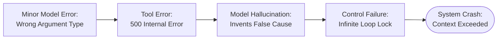
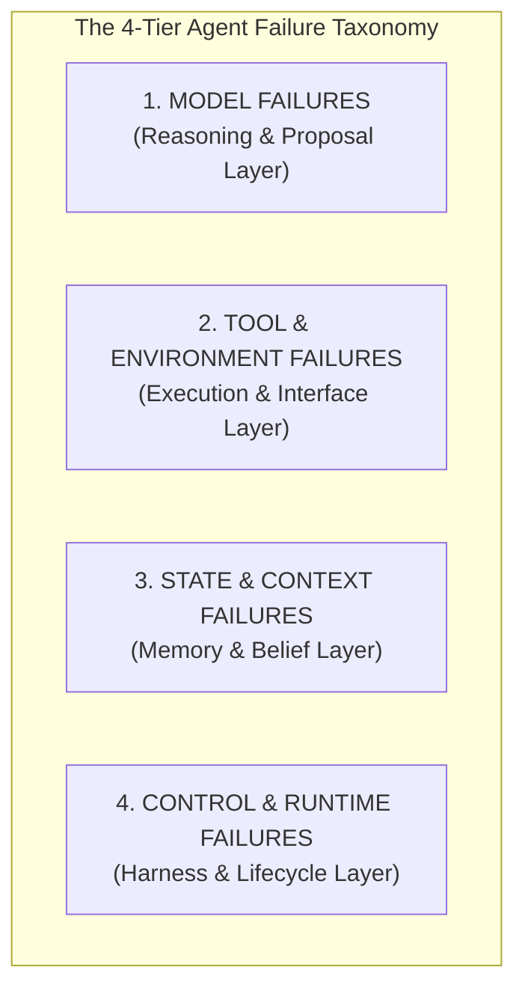
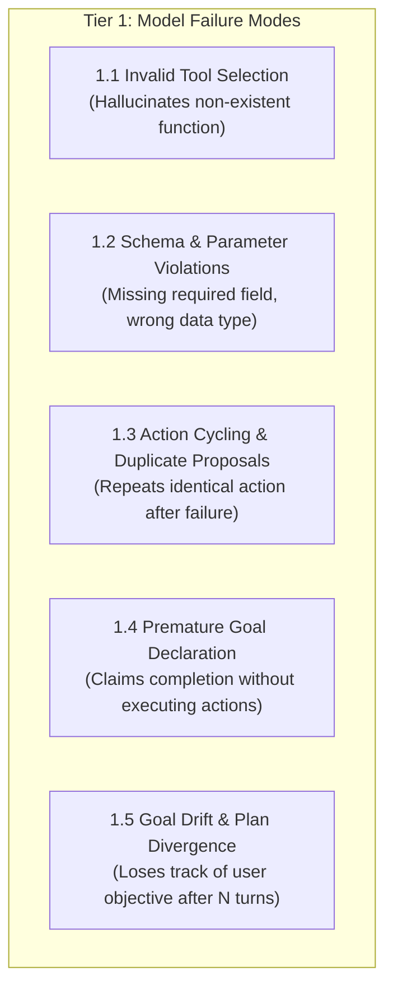
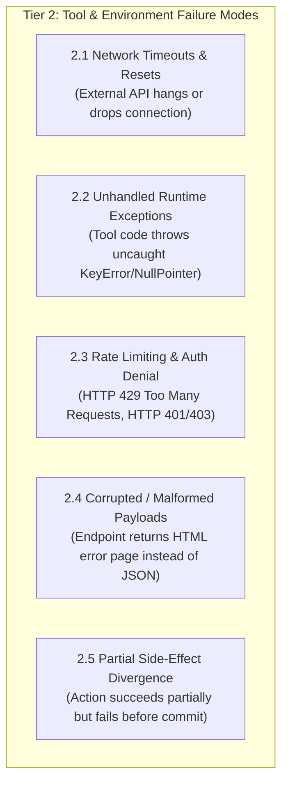
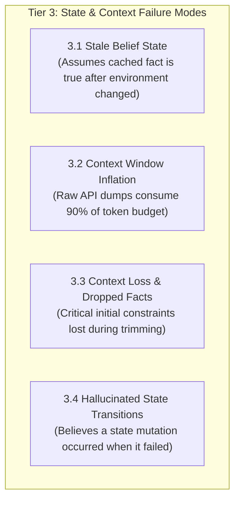
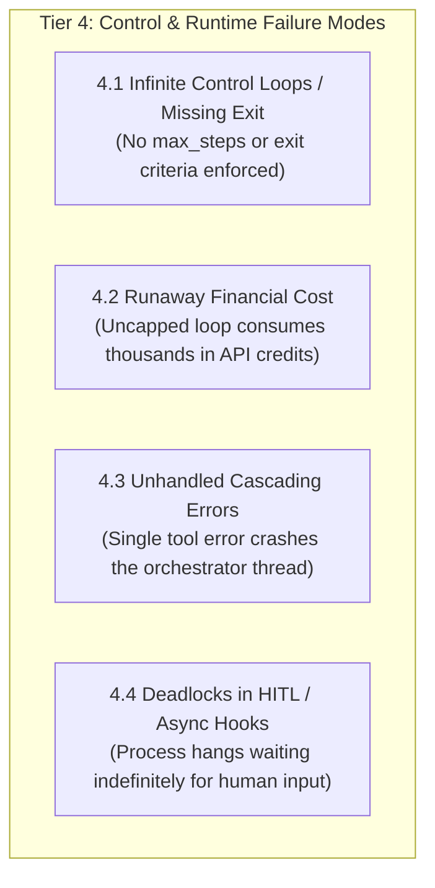
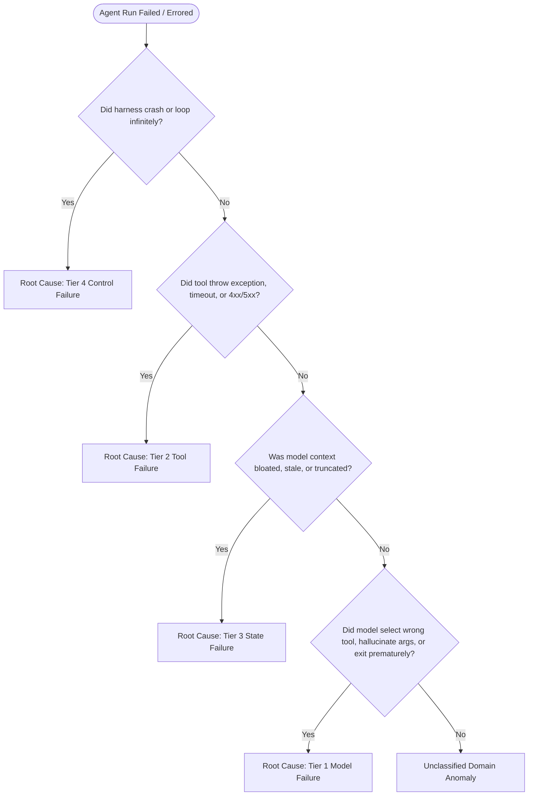

# Unit 1.8: Reusable Agent Failure Taxonomy

> **Core Question:**  
> *"How do we systematically categorize, diagnose, and mitigate agent failures across model, tool, state, and control layers?"*

---

## Learning Objectives

By the end of this unit, you will be able to:
1. Explain why aggregate "pass/fail" evaluations are insufficient for debugging production agents and why root-cause trajectory analysis is necessary.
2. Identify and classify errors using the **4-Tier Agent Failure Taxonomy** (*Model*, *Tool/Environment*, *State/Context*, and *Control/Runtime* failures).
3. Diagnose how small errors in lower layers cascade into catastrophic failures in higher layers.
4. Implement specific engineering mitigations for each failure class (Pydantic schema feedback, action deduplication, precondition grounding, and circuit breakers).
5. Instrument agent execution traces to attribute failures to the exact layer responsible.

---

## 1. Why We Need an Agent Failure Taxonomy

In traditional software, debugging typically isolates deterministic bugs using stack traces, unit tests, and repeatable breakpoints.

In agentic systems, failures are non-deterministic, multi-step, and compounding:
* A model can make an imperfect tool call.
* The tool returns an unhelpful error message.
* The model misinterprets the error and invents a false explanation.
* The agent attempts an invalid recovery action, gets stuck in a loop, and eventually crashes due to context exhaustion.



Without a structured taxonomy, engineers default to superficial fixes—such as tweaking the system prompt—when the actual root cause was an unhandled tool schema error or a stale state cache.

> [!IMPORTANT]
> **Engineering Principle:**  
> *"Do not fix a tool, state, or control failure by tweaking the model prompt. Diagnose the failure at its originating architectural layer and apply the appropriate software mitigation."*

---

## 2. The 4-Tier Agent Failure Taxonomy

Based on empirical agent benchmarks (such as SWE-bench and ToolBench) and production engineering practice, agent failures fall into four distinct architectural tiers:



### Taxonomy Overview Matrix

| Failure Tier | Primary Origin | Manifestation | Primary Mitigation |
| :--- | :--- | :--- | :--- |
| **1. Model Failures** | LLM Reasoning Engine | Hallucinated tools, invalid arguments, action cycling, premature exit | Schema feedback via ACI, action deduplication |
| **2. Tool Failures** | External APIs & Code | Network timeouts, schema mismatches, rate limits (429), partial side-effects | Retries, circuit breakers, idempotency keys |
| **3. State Failures** | Context & Memory Layer | Stale beliefs, context window bloat, dropped facts, belief-truth divergence | Precondition grounding, observation filtering |
| **4. Control Failures** | Runtime Harness | Infinite loops, missing step limits, runaway costs, deadlocks | Deterministic termination harness, budget caps |

---

## 3. Tier 1: Model Failures (Reasoning & Proposal Layer)

Model failures occur when the LLM makes an erroneous semantic decision or generates an invalid action proposal.



### Breakdown & Mitigation Strategies:

#### 1.1 Invalid Tool Selection
* **Problem:** The model emits a tool call for `query_user_account()` when only `fetch_customer()` is registered in the schema.
* **Mitigation:** Strict schema registration. If an unregistered tool is requested, the runtime intercepts the proposal and returns an informative observation:  
  `"Observation Error: Tool 'query_user_account' does not exist. Available tools: [fetch_customer, search_orders]."`

#### 1.2 Parameter & Schema Violations
* **Problem:** The model passes a string for an integer field, omits required parameters, or hallucinates extra arguments.
* **Mitigation:** Pydantic schema validation. Catch `ValidationError` and feed the structured validation error directly back to the model as a tool observation so it can self-correct on the next turn.

#### 1.3 Action Cycling & Duplicate Proposals
* **Problem:** The model calls `get_invoice(id="INV-001")`, receives an error, and repeats the exact same call on step $t+1, t+2$.
* **Mitigation:** Maintain an `action_signature_history` set in the runtime harness. When a duplicate signature is detected, suppress execution and inject a warning observation.

#### 1.4 Premature Goal Declaration
* **Problem:** The model asserts `"I have refunded customer #102"` without ever invoking `issue_refund()`.
* **Mitigation:** Postcondition verification gates. Enforce ground truth checks against the database before accepting terminal status.

---

## 4. Tier 2: Tool & Environment Failures (Execution & Interface Layer)

Tool failures occur within the tool execution environment, external APIs, or network infrastructure.



### Breakdown & Mitigation Strategies:

#### 2.1 Network Timeouts & Connection Errors
* **Mitigation:** Wrap all external tool invocations in timeout wrappers and exponential backoff retry policies (e.g., `tenacity` library in Python).

#### 2.2 Unhandled Tool Exceptions
* **Problem:** A Python tool throws an uncaught `ZeroDivisionError` or `KeyError`, crashing the entire agent process.
* **Mitigation:** The tool execution harness must wrap every tool call in a universal `try/except Exception` block, translating exceptions into structured error observations rather than crashing:
  ```python
  try:
      result = tool_function(**args)
      return f"Observation: {result}", True
  except Exception as e:
      logger.error(f"Tool execution exception in {tool_name}: {e}")
      return f"Observation Error: Tool execution failed with error: {type(e).__name__} - {str(e)}", False
  ```

#### 2.3 Partial Side-Effect Divergence
* **Problem:** An agent tool debits a balance but fails before creating the shipping label, leaving the environment in an inconsistent state.
* **Mitigation:** Enforce database transactions, atomic operations, and require idempotency keys on all state-mutating tool calls.

---

## 5. Tier 3: State & Context Failures (Memory & Belief Layer)

State failures occur when the agent's internal mental model (belief state) becomes inconsistent, corrupted, or stale relative to external reality.



### Breakdown & Mitigation Strategies:

#### 3.1 Stale Belief State (Belief vs. Truth Divergence)
* **Problem:** The agent checked order status at step $t=1$ (`PENDING`), but another background process cancelled it at step $t=3$. The agent executes a shipment based on its outdated belief.
* **Mitigation:** Enforce **Precondition Verification** immediately prior to executing any mutation (see Unit 1.6).

#### 3.2 Context Window Inflation & Noise
* **Problem:** A tool returns a $2\text{MB}$ JSON database dump. Injecting this raw payload floods the context window, dramatically degrading the model's attention and reasoning capabilities.
* **Mitigation:** Implement an **Observation Extraction Engine** (*Parse $\rightarrow$ Extract $\rightarrow$ Structure $\rightarrow$ Bound*) to strip irrelevant fields and enforce strict character/token limits (Unit 1.4).

#### 3.3 Context Loss During Truncation
* **Problem:** When context approaches token limits, naive truncation drops the system prompt or original user goal.
* **Mitigation:** Pin the system instruction and original goal permanently at the head of the context list, applying truncation or summarization only to intermediate tool observation turns.

#### 3.4 Hallucinated State Transitions (also: Inconsistent State)
* **Problem:** The agent's belief state records a successful state transition (e.g., assuming an order was cancelled or payment refunded) when the underlying environment mutation failed or was rolled back.
* **Mitigation:** Enforce strict postcondition verification against external ground truth before updating internal agent belief states (Unit 1.6).

---

## 6. Tier 4: Control & Runtime Failures (Harness & Lifecycle Layer)

Control failures occur in the software harness orchestrating the agent execution loop.



### Breakdown & Mitigation Strategies:

#### 4.1 Infinite Control Loops (also: Missing Exit Conditions)
* **Problem:** The control loop lacks bounded turn counters or termination predicates, allowing cyclic tool calling or hallucinated reasoning to iterate indefinitely.
* **Mitigation:** Always wrap the agent loop in a **Deterministic Termination Harness** enforcing hard step caps, wall-clock timeouts, duplicate action breakers, and explicit `TerminationStatus` enums (Unit 1.7).

#### 4.2 Runaway Cost Accumulation
* **Mitigation:** Implement strict cumulative token budgets in the runtime state (`max_token_budget`), halting execution immediately with `TerminationStatus.BUDGET_EXCEEDED` if breached.

#### 4.3 Human-in-the-Loop Deadlocks
* **Mitigation:** Never allow human approval pauses to block server threads synchronously. Persist execution snapshots (`RunState` / checkpoints) to storage and resume asynchronously via webhooks or event queues.

---

## 7. Diagnostic Trajectory Tracing & Root-Cause Attribution

When debugging production agent failures, use a structured diagnostic protocol to attribute the failure to its originating layer:



### Diagnostic Trace Schema (JSON Logging Best Practice):
```json
{
  "run_id": "run_9821a",
  "step": 3,
  "failure_tier": "MODEL_FAILURE",
  "failure_code": "PARAMETER_SCHEMA_VIOLATION",
  "details": {
    "tool_name": "update_inventory",
    "raw_arguments": "{\"item_id\": 1234, \"quantity\": \"ten\"}",
    "error_message": "ValidationError: 'quantity' expected integer, received string.",
    "recovery_action": "INJECT_VALIDATION_OBSERVATION"
  }
}
```

---

## 8. Summary & Unit Cheat Sheet

```
┌──────────────────────────────────────────────────────────────────────────────────────────┐
│                             AGENT FAILURE TAXONOMY CHEAT SHEET                           │
├──────────────────────┬────────────────────────────────────┬──────────────────────────────┤
│ Failure Class        │ Typical Manifestation              │ Primary Engineering Defense  │
├──────────────────────┼────────────────────────────────────┼──────────────────────────────┤
│ Tier 1: Model        │ Invalid tool, bad args, cycling    │ Pydantic validation, dedup   │
│ Tier 2: Tool         │ Timeouts, crashes, 429 rate limits │ Try/except, retries, backoff │
│ Tier 3: State        │ Stale beliefs, context bloat       │ Preconditions, extraction    │
│ Tier 4: Control      │ Infinite loops, runaway spend      │ Termination harness, budgets │
└──────────────────────┴────────────────────────────────────┴──────────────────────────────┘
```

---

## Research & Reference Foundations

* **Jimenez et al. — *SWE-bench*:**  
  [SWE-bench: Can Language Models Resolve Real-World GitHub Issues?](https://arxiv.org/abs/2310.06770) — Benchmark and taxonomy of failure modes in autonomous software engineering agents.
* **Qin et al. — *ToolLLM*:**  
  [ToolLLM: Facilitating Large Language Models to Master 16000+ Real-world APIs](https://arxiv.org/abs/2307.16789) — Empirical evaluation of tool-use error propagation in multi-turn environments.
* **Anthropic — *Building Effective Agents*:**  
  [Error Recovery & Context Management](https://www.anthropic.com/engineering/building-effective-agents) — Strategies for error recovery, transparency, and context management.
