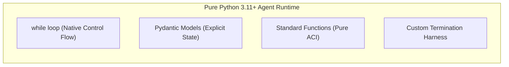
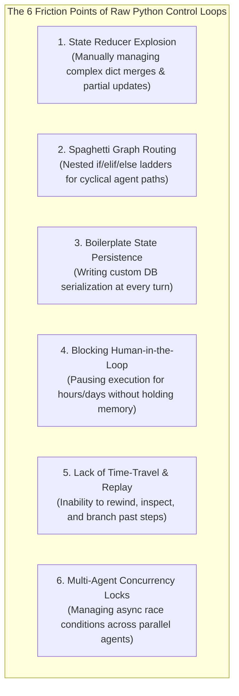
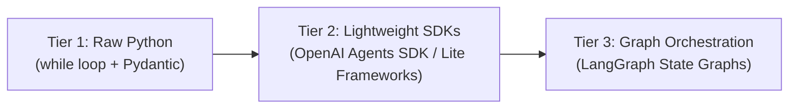
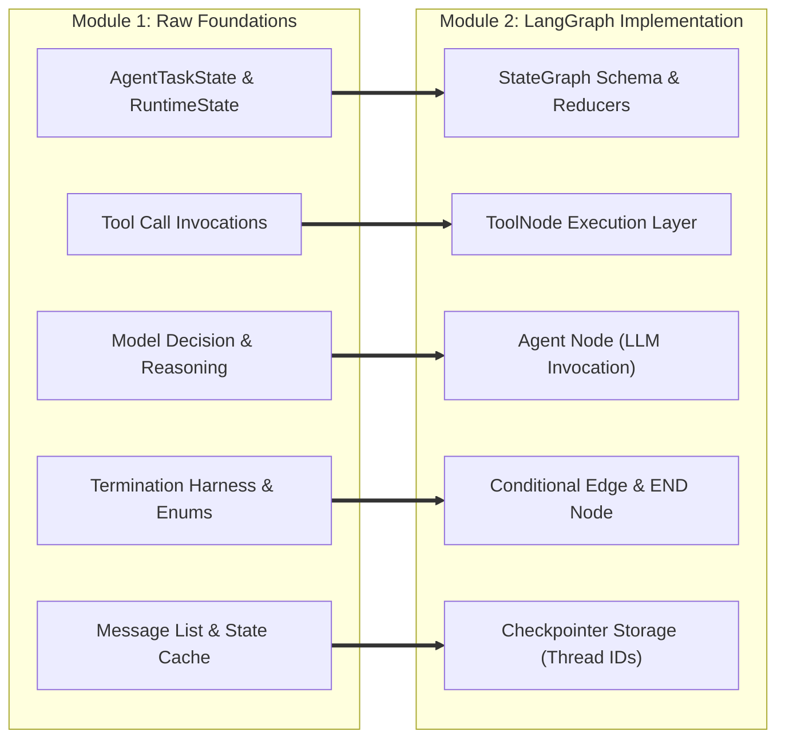

# Unit 1.9: Abstraction Boundaries — Why We Need Orchestration Frameworks

> **Core Question:**  
> *"When is raw Python the right choice for an agent, and at what architectural boundary do we need orchestration frameworks like LangGraph?"*

---

## Learning Objectives

By the end of this unit, you will be able to:
1. Articulate the distinct engineering advantages of building minimal, framework-free agents in pure Python.
2. Identify the **6 Friction Points** where raw `while` loops reach their maintainability and architectural limits.
3. Compare the three major tiers of the **Agent Abstraction Spectrum** (Raw Python, Lightweight SDKs, and Graph-Based Orchestration Frameworks).
4. Apply a structured architectural decision matrix to determine when to keep a raw Python control loop and when to migrate to **LangGraph**.
5. Map every core concept learned in Module 1 (*3-Layer Model*, *Agent State*, *Tools*, *Preconditions*, *Termination Harness*) directly to LangGraph graph primitives in preparation for Module 2.

---

## 1. The Power & Elegance of Raw Python

Throughout Module 1, we built an entire agent runtime from scratch using pure Python 3.11+:
* We implemented the control loop with a native `while` statement.
* We separated **Agent Domain State** from **Runtime Execution State** using Pydantic models.
* We validated tool proposals, enforced authorization, and extracted observations using standard functions.
* We grounded actions with precondition and postcondition checks.
* We enforced deterministic termination with step caps, timers, and typed status enums.



### Why Starting with Raw Python Is Essential:
1. **Total Transparency:** There is zero hidden prompt injection, no obscure magic callbacks, and no unexpected middleware altering your messages.
2. **Zero Abstraction Debt:** Minimal external dependencies mean fewer breaking changes, faster initialization, and smaller container footprints.
3. **Effortless Debugging:** Standard Python stack traces point directly to the exact line of code that failed, allowing standard `pytest` suites and IDE breakpoints to work out of the box.
4. **Pedagogical Clarity:** You understand every mechanical layer because you authored the loop yourself.

> [!IMPORTANT]
> **Core Principle:**  
> *"Raw Python is not 'bad' or 'primitive' code. For simple single-turn tools, deterministic chains, and bounded prototypes, a pure Python script is often the most maintainable and reliable architecture."*

---

## 2. Where Raw `while` Loops Reach Their Complexity Limit

While raw Python is ideal for simple loops, production enterprise requirements quickly introduce complex state and lifecycle demands.

As an agent grows, engineers encounter the **6 Friction Points of Manual Agent Engineering**:



### The 6 Friction Points in Detail:

#### 1. State Reducer Explosion
In complex agents, multiple nodes or tools update different subsets of the state (e.g., one tool updates customer notes, another updates cart items, a third updates error counters). In raw Python, you must manually write custom merge/reducer functions to ensure partial updates do not overwrite existing state keys.

#### 2. Spaghetti Conditional Routing
When an agent moves beyond a simple linear loop into branching workflows (e.g., *“If billing issue, route to Agent A; if tech support, route to Agent B; if error occurs twice, escalate to human supervisor”*), the body of the `while` loop devolves into an unmaintainable nest of conditional `if/elif/else` blocks.

#### 3. Boilerplate Checkpointing & Durability
In production, if a server restarts during step 4 of a 6-step agent run, the entire in-memory state is lost. Implementing durable checkpointing in raw Python requires writing hundreds of lines of boilerplate code to serialize state snapshots into PostgreSQL or Redis after every single model turn.

#### 4. Human-in-the-Loop (HITL) Asynchronous Pausing
Consider an agent that requires human manager approval before issuing a $\$500$ refund. In raw Python:
* You cannot keep the `while` loop running synchronously while waiting 4 hours for an email response (this wastes server memory and connections).
* You must manually serialize the state, store it in a database, tear down the execution context, listen for a webhook, reload the state, and manually reconstruct the loop where it left off.

#### 5. Lack of Time-Travel & Debug Replayability
When an agent fails at step 5, developers often want to "rewind" the agent back to step 3, modify the prompt or intermediate state, and fork a new trajectory to see if it fixes the bug. Hand-rolling state branching and replay trees in raw Python is notoriously difficult.

#### 6. Multi-Agent Coordination & Concurrency
When coordinating multiple specialized sub-agents running concurrently (fan-out / fan-in patterns), raw Python requires complex `asyncio` locks, task gathering, and shared state synchronization to avoid race conditions.

---

## 3. The Agent Abstraction Spectrum

To select the right tool for the job, we categorize agent architectures across three distinct abstraction tiers:



### Abstraction Comparison Matrix

| Dimension | Tier 1: Raw Python | Tier 2: Lightweight SDKs (OpenAI SDK) | Tier 3: Graph Orchestration (LangGraph) |
| :--- | :--- | :--- | :--- |
| **Core Abstraction** | Native `while` loop | `Agent`, `Runner`, `Session` | `StateGraph`, `Nodes`, `Edges`, `Checkpointers` |
| **Control Flow** | Explicit Python statements | SDK-managed execution loop | Compiled directed graph (cyclic & acyclic) |
| **State Management** | Custom Pydantic / Dicts | `RunContextWrapper`, `RunState` | Typed schema with declarative state reducers |
| **Persistence (Checkpoints)**| Manual database writes | In-memory / Basic serialization | First-class pluggable checkpointers (`PostgresSaver`, `SqliteSaver`) |
| **Human-in-the-Loop** | Manual async state machines | Approval interruption objects | Declarative `interrupt_before` / `interrupt_after` hooks |
| **Time-Travel / Replay** | Custom implementation | Not natively supported | Native `get_state_history`, state forking & replay |
| **Multi-Agent Coordination** | Complex `asyncio` code | Built-in Agent Handoffs | Hierarchical / Multi-graph supervisor networks |
| **Best Used For** | Educational mastery, simple tools, fast scripts | Model-centric agents, single-agent APIs | Complex enterprise workflows, multi-agent systems, long-running HITL |

---

## 4. Architectural Decision Matrix: When to Upgrade

Use this decision matrix when deciding whether to remain in pure Python or transition to LangGraph:

```mermaid
flowchart TD
    Q1{Does the agent require<br/>long-running Human-in-the-Loop<br/>or async approval pauses?}
    Q1 -- Yes --> LangGraph[Adopt LangGraph (Module 2)]
    Q1 -- No --> Q2{Does the system have complex<br/>branching/cyclical state graphs<br/>across multiple sub-agents?}
    
    Q2 -- Yes --> LangGraph
    Q2 -- No --> Q3{Does the application require<br/>durable superstep persistence<br/>and time-travel debugging?}
    
    Q3 -- Yes --> LangGraph
    Q3 -- No --> Q4{Is it a bounded single-agent loop<br/>with <= 10 steps and local state?}
    
    Q4 -- Yes --> RawPython[Stay with Raw Python 3.11+]
    Q4 -- No --> LangGraph
```

---

## 5. The Bridge to Module 2: Mapping Concepts to LangGraph

Everything you learned to build from scratch in Module 1 forms the foundational mechanics of **LangGraph**. When we begin Module 2, you will see that LangGraph is not a replacement for these principles—it is their formal compiled implementation:



### Direct Conceptual Mapping Table:

| Module 1 Concept (Raw Python) | Module 2 Concept (LangGraph) | Why the Abstraction Helps |
| :--- | :--- | :--- |
| `AgentTaskState` (Pydantic model) | `StateGraph(TypedDict)` | Defines the shared graph state schema with automatic validation. |
| `state.messages.append(...)` | `Annotated[list, add_messages]` | Declarative state reducers automatically handle appending messages without manual list manipulation. |
| `while` loop body | `StateGraph.add_node(...)` | Isolates each step into a pure, testable function node. |
| `if not message.tool_calls: break` | `StateGraph.add_conditional_edges(...)` | Directs execution to `END` or `tools` based on model output. |
| `validate_and_execute_tool(...)` | `ToolNode(tools)` | Pre-built node that automatically validates arguments and runs tools. |
| Custom database save loop | `checkpointer=PostgresSaver(...)` | Automatically persists a state snapshot at every graph superstep. Each conversation or task is identified by a unique `thread_id`, enabling independent state histories, multi-session resumption, replay, and forking. |
| Manual webhook state restore | `interrupt_before=["tools"]` | Native pause/resume without holding memory or active execution threads. |

---

## 6. Summary & Unit Cheat Sheet

```
┌──────────────────────────────────────────────────────────────────────────────────────────┐
│                             ABSTRACTION BOUNDARIES CHEAT SHEET                           │
├──────────────────────────┬───────────────────────────────────────────────────────────────┤
│ The Right Tool Principle │ Use raw Python when simplicity and transparency suffice.      │
│                          │ Adopt LangGraph when state, persistence, & HITL scale.        │
├──────────────────────────┼───────────────────────────────────────────────────────────────┤
│ When to Stay in Python   │ • Bounded, single-agent loops (<= 10 turns)                   │
│                          │ • Fast scripting, prototyping, & lightweight microservices    │
│                          │ • Zero-dependency environments                                │
├──────────────────────────┼───────────────────────────────────────────────────────────────┤
│ When to Adopt LangGraph  │ • Complex cyclic & multi-agent routing graphs                 │
│                          │ • Long-running Human-in-the-Loop pauses (hours / days)        │
│                          │ • Production durability & superstep database checkpointing    │
│                          │ • Time-travel debugging & state replayability                 │
└──────────────────────────┴───────────────────────────────────────────────────────────────┘
```

---

## Research & Reference Foundations

* **LangGraph Documentation:**  
  [LangGraph: Build Stateful Multi-Actor Applications](https://langchain-ai.github.io/langgraph/) — StateGraph, Checkpointers, Human-in-the-Loop interrupts, and time-travel debugging.
* **Anthropic — *Building Effective Agents*:**  
  [Simplicity & Appropriate Abstraction](https://www.anthropic.com/engineering/building-effective-agents) — Start with direct API calls; adopt frameworks only when concrete architectural limits are reached.
* **Russell & Norvig — *AIMA* (Chapter 2):**  
  [Intelligent Agents](https://aima.cs.berkeley.edu/) — Foundational agent-environment interaction model and rational agent design.

---

## Congratulations: Module 1 Foundations Complete!

You have completed the core conceptual curriculum of **Module 1: Agentic AI Foundations**.

You now possess the foundational knowledge that separates senior AI engineers from framework consumers:
* You know how the agent control loop actually functions under the hood.
* You know how to validate schemas, authorize actions, and extract observations.
* You know how to ground agent beliefs in environment truth using preconditions and postconditions.
* You know how to enforce deterministic termination and diagnose failures with a structured taxonomy.
* You understand the abstraction boundaries that justify modern orchestration frameworks.

**Next Step:** Proceed to the Module 1 Notebooks and Lab 1 to build and test these systems hands-on!
